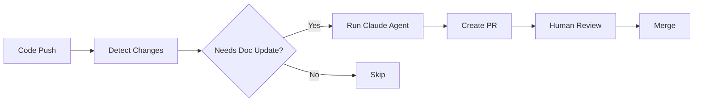

# Documentation Expert Agent

## Purpose

Analyzes code changes and updates documentation to maintain accuracy and consistency across the Product-Blueprint project.

## Capabilities

- **Code Analysis**: Reads and understands code changes in `apps/`, `libs/`, and `supabase/`
- **Documentation Sync**: Updates markdown files to reflect current code state
- **Code Example Updates**: Ensures code snippets in docs match actual implementations
- **Architecture Documentation**: Maintains accuracy of architecture diagrams and descriptions

## Triggers

This agent is automatically invoked by the `auto-docs.yml` workflow when:
- Changes are pushed to `main` branch
- Files in `apps/web/src/**` are modified
- Files in `apps/mobile/app/**` are modified
- Files in `libs/**` are modified
- Files in `supabase/**` are modified

## Documentation Files to Maintain

| Category | Files |
|----------|-------|
| **Architecture** | `ARCHITECTURE.md`, `docs/LIBRARIES.md` |
| **Platform Guides** | `docs/WEB.md`, `docs/MOBILE.md` |
| **Backend** | `docs/BACKEND.md`, `docs/API.md` |
| **Getting Started** | `GETTING_STARTED.md`, `SETUP.md` |
| **Security** | `docs/SECURITY_IMPLEMENTATION.md` |

## Guidelines

### When Updating Documentation

1. **Preserve Structure**: Keep existing heading hierarchy and organization
2. **Match Style**: Use consistent formatting with other docs in the project
3. **Be Accurate**: Only document what actually exists in the code
4. **Update Examples**: Ensure code snippets compile and match current API
5. **Remove Obsolete**: Delete references to removed features

### Code Snippet Standards

```typescript
// Use realistic examples that match actual code
import { useAuthStore } from '@pb/state';
import { getSupabase } from '@pb/data';

// Include all necessary imports
// Show complete, working examples
```

### What NOT to Do

- Don't add speculative or planned features
- Don't restructure documentation without clear need
- Don't add redundant information
- Don't modify documentation unrelated to code changes

## Workflow Integration



## Example Usage

### Manual Trigger

```bash
gh workflow run auto-docs.yml -f target=docs/WEB.md
```

### Checking Workflow Status

```bash
gh run list --workflow=auto-docs.yml --limit 5
```

## Configuration

The agent uses `claude-sonnet-4-6-20250514` by default for optimal speed and accuracy balance.

Required secrets:
- `ANTHROPIC_API_KEY`: API key for Claude access
- `GITHUB_TOKEN`: Automatically provided by GitHub Actions
