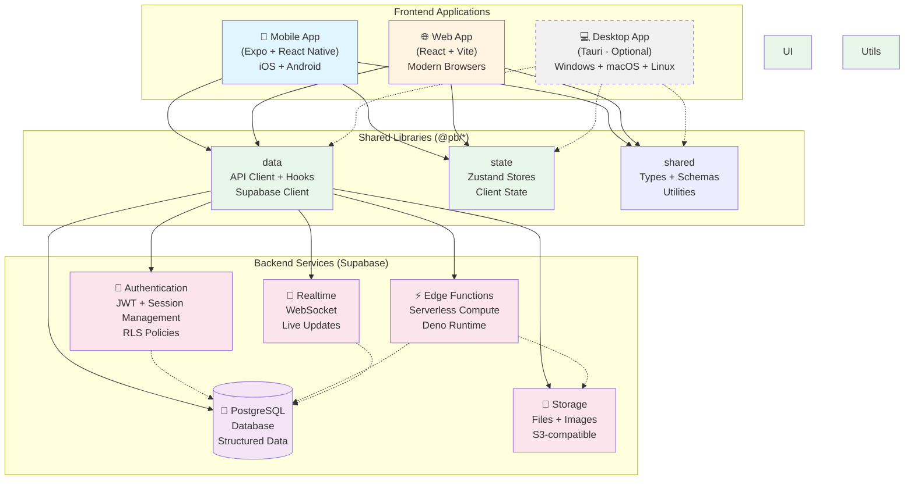
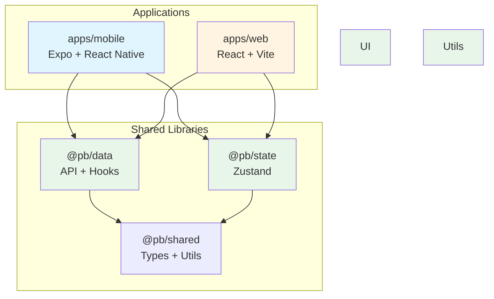
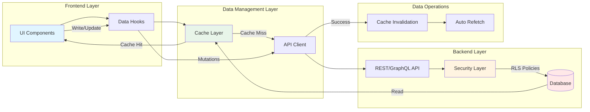
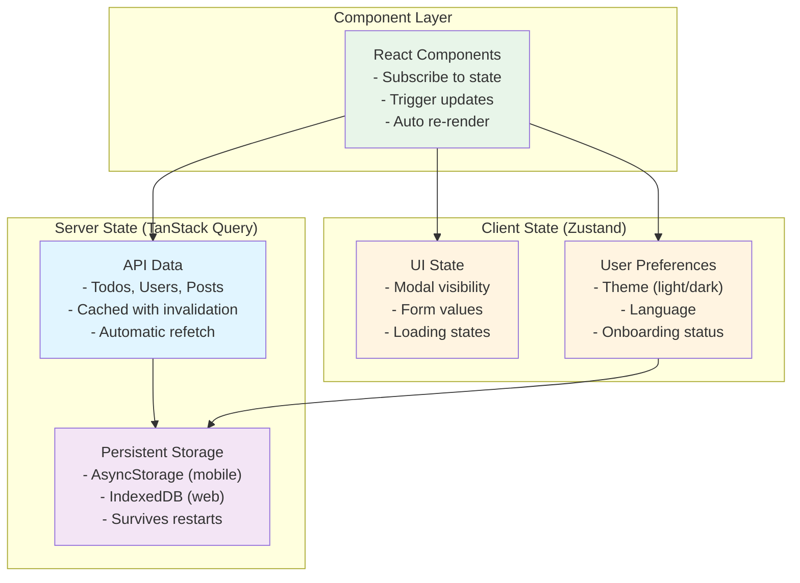

# Architecture Overview

This document describes the system architecture, design decisions, and technical patterns used in this application template.

## Table of Contents

- [High-Level Architecture](#high-level-architecture)
- [Technology Stack](#technology-stack)
- [Monorepo Structure](#monorepo-structure)
- [Data Flow](#data-flow)
- [State Management](#state-management)
- [Authentication & Authorization](#authentication--authorization)
- [API Architecture](#api-architecture)
- [Styling & Theming](#styling--theming)
- [Offline-First Strategy](#offline-first-strategy)
- [Build & Deployment](#build--deployment)
- [Design Decisions](#design-decisions)

## High-Level Architecture



## Technology Stack

### Frontend Applications

#### Mobile (apps/mobile)
- **Framework:** React Native via Expo SDK 50+
- **Router:** Expo Router (file-based routing)
- **Styling:** NativeWind (Tailwind for RN)
- **Build:** EAS Build
- **Updates:** EAS Update (OTA)

**Why Expo?**
- Managed native dependencies
- OTA updates without app store approval
- Excellent developer experience
- Active community and ecosystem

#### Web (apps/web)
- **Framework:** React 18
- **Bundler:** Vite 5
- **Router:** TanStack Router v1
- **Styling:** Tailwind CSS
- **Build Target:** Modern browsers (ES2020+)

**Why Vite?**
- Lightning-fast HMR
- Optimized production builds
- Native ESM support
- Excellent TypeScript integration

### Shared Libraries

#### @pb/data
API clients, data fetching, and backend integration.

**Structure:**
```
libs/data/
├── src/
│   ├── supabase/        # Supabase client setup
│   │   ├── client.ts    # Platform-aware client factory
│   │   └── types.ts     # Database types
│   ├── api/             # API functions
│   │   └── auth.ts      # Auth API
│   ├── hooks/           # TanStack Query hooks
│   │   └── useSession.ts
│   └── index.ts         # Public exports
├── package.json
└── tsconfig.json
```

#### @pb/state
Global state management with Zustand.

**Structure:**
```
libs/state/
├── src/
│   ├── stores/
│   │   └── auth.store.ts    # Unified auth store
│   └── index.ts
├── package.json
└── tsconfig.json
```

#### @pb/shared
Shared types, schemas, and utilities.

**Structure:**
```
libs/shared/
├── src/
│   ├── types.ts         # Shared TypeScript types
│   ├── schemas.ts       # Zod validation schemas
│   ├── utils.ts         # Utility functions
│   └── index.ts
├── package.json
└── tsconfig.json
```

### Backend (Supabase)

#### Database (PostgreSQL)
- **Version:** PostgreSQL 15+
- **Extensions:** pgcrypto, uuid-ossp, postgis (optional)
- **Features:** Row Level Security (RLS), triggers, functions

#### Authentication
- Email/password
- OAuth providers (Google, GitHub, Apple)
- Magic links
- JWT-based sessions

#### Storage
- S3-compatible object storage
- Image transformations
- Access control with RLS

#### Edge Functions
- Deno runtime
- Serverless compute
- TypeScript support
- Direct database access

#### Realtime
- PostgreSQL CDC (Change Data Capture)
- WebSocket subscriptions
- Presence tracking
- Broadcast channels

## Monorepo Structure

### Nx Workspace Benefits

1. **Computation Caching:** Build and test results are cached
2. **Affected Commands:** Only run tasks on changed code
3. **Dependency Graph:** Visualize project relationships
4. **Code Generators:** Scaffold consistent code
5. **Task Orchestration:** Parallel execution of tasks

### Project Graph Example



### Module Boundaries

Enforced via ESLint `@nx/enforce-module-boundaries`:

```typescript
// ✅ Allowed
import { useAuthStore } from '@pb/state';
import { signInWithEmail } from '@pb/data';

// ❌ Not allowed - apps can't import from each other
import { Screen } from '../../mobile/src/screens';
```

## Data Flow

### Complete Data Flow Architecture



> **Note**: This diagram shows the conceptual data flow. The actual implementation uses TanStack Query for caching and Supabase for the backend, but these patterns are framework-agnostic.

### 1. Data Fetching (TanStack Query)

```typescript
// In @app/data/src/hooks/useTodos.ts
export function useTodos() {
  return useQuery({
    queryKey: ['todos'],
    queryFn: async () => {
      const { data, error } = await supabase
        .from('todos')
        .select('*')
        .order('created_at', { ascending: false });

      if (error) throw error;
      return data;
    },
    staleTime: 1000 * 60, // 1 minute
  });
}
```

**Flow:**
1. Component calls `useTodos()`
2. TanStack Query checks cache
3. If stale/missing, fetches from Supabase
4. Updates cache and returns data
5. Component re-renders with data

### 2. Mutations

```typescript
export function useCreateTodo() {
  const queryClient = useQueryClient();

  return useMutation({
    mutationFn: async (newTodo: NewTodo) => {
      const { data, error } = await supabase
        .from('todos')
        .insert(newTodo)
        .select()
        .single();

      if (error) throw error;
      return data;
    },
    onSuccess: () => {
      // Invalidate and refetch todos
      queryClient.invalidateQueries({ queryKey: ['todos'] });
    },
  });
}
```

### 3. Optimistic Updates

```typescript
export function useToggleTodo() {
  const queryClient = useQueryClient();

  return useMutation({
    mutationFn: async ({ id, completed }: ToggleTodoInput) => {
      const { error } = await supabase
        .from('todos')
        .update({ completed })
        .eq('id', id);

      if (error) throw error;
    },
    onMutate: async ({ id, completed }) => {
      // Cancel outgoing refetches
      await queryClient.cancelQueries({ queryKey: ['todos'] });

      // Snapshot previous value
      const previous = queryClient.getQueryData(['todos']);

      // Optimistically update
      queryClient.setQueryData(['todos'], (old: Todo[]) =>
        old.map(todo =>
          todo.id === id ? { ...todo, completed } : todo
        )
      );

      return { previous };
    },
    onError: (err, variables, context) => {
      // Rollback on error
      queryClient.setQueryData(['todos'], context?.previous);
    },
  });
}
```

## State Management

### Architecture



**State Separation Strategy:**

| State Type | Library | Storage | Use Cases |
|-----------|---------|---------|-----------|
| **Server State** | TanStack Query | AsyncStorage/IndexedDB | API data, cached queries |
| **Client State** | Zustand | MMKV (mobile), localStorage (web) | UI state, preferences |
| **Form State** | React Hook Form | None | Form inputs, validation |
| **URL State** | React Router / Expo Router | None | Navigation, filters |

### Zustand Store Example

```typescript
// libs/@app/state/src/stores/app.store.ts
import { create } from 'zustand';
import { persist } from 'zustand/middleware';
import { storage } from '../persistence';

interface AppState {
  theme: 'light' | 'dark' | 'system';
  setTheme: (theme: AppState['theme']) => void;

  isOnboarded: boolean;
  setOnboarded: (value: boolean) => void;
}

export const useAppStore = create<AppState>()(
  persist(
    (set) => ({
      theme: 'system',
      setTheme: (theme) => set({ theme }),

      isOnboarded: false,
      setOnboarded: (isOnboarded) => set({ isOnboarded }),
    }),
    {
      name: 'app-storage',
      storage,
    }
  )
);
```

### Persistence Strategy

**Mobile (MMKV):**
- Synchronous storage
- Fast performance
- Used by Zustand persist

**Web (IndexedDB):**
- Asynchronous storage
- Large capacity
- Used by TanStack Query persist

## Authentication & Authorization

### Authentication Flow

```
1. User enters credentials
   ↓
2. Supabase.auth.signInWithPassword()
   ↓
3. Supabase returns JWT + refresh token
   ↓
4. Store session in Supabase client
   ↓
5. Auto-refresh before expiry
   ↓
6. On app restart, recover session from storage
```

### Authorization (Row Level Security)

```sql
-- Only users can read their own data
CREATE POLICY "Users can read own data"
ON profiles FOR SELECT
USING (auth.uid() = user_id);

-- Only users can update their own data
CREATE POLICY "Users can update own data"
ON profiles FOR UPDATE
USING (auth.uid() = user_id);
```

### Protected Routes

**Mobile (Expo Router):**
```typescript
// app/_layout.tsx
export default function RootLayout() {
  const session = useSession();

  if (!session) {
    return <Redirect href="/login" />;
  }

  return <Stack />;
}
```

**Web (React Router):**
```typescript
// ProtectedRoute.tsx
export function ProtectedRoute({ children }: PropsWithChildren) {
  const session = useSession();

  if (!session) {
    return <Navigate to="/login" replace />;
  }

  return <>{children}</>;
}
```

## API Architecture

### Type-Safe APIs with Supabase

```typescript
// Auto-generated types from database
import { Database } from './database.types';

type Todo = Database['public']['Tables']['todos']['Row'];
type NewTodo = Database['public']['Tables']['todos']['Insert'];
type UpdateTodo = Database['public']['Tables']['todos']['Update'];
```

### Optional tRPC Integration

For custom business logic not suited for direct database queries:

```typescript
// Edge Function with tRPC
import { initTRPC } from '@trpc/server';

const t = initTRPC.create();

export const appRouter = t.router({
  todo: {
    list: t.procedure.query(async () => {
      // Custom logic here
    }),
  },
});

export type AppRouter = typeof appRouter;
```

## Styling & Theming

### Design Token System

```typescript
// libs/@app/shared-ui/src/theme/colors.ts
export const colors = {
  primary: {
    50: '#f0f9ff',
    // ... 100-900
  },
  // ... other colors
};

// Consumed by:
// - Tailwind config (web)
// - NativeWind config (mobile)
```

### Cross-Platform Styling

**Mobile:**
```tsx
import { View, Text } from 'react-native';

export function Card({ children }) {
  return (
    <View className="bg-white dark:bg-gray-800 rounded-lg p-4 shadow-md">
      <Text className="text-lg font-semibold text-gray-900 dark:text-white">
        {children}
      </Text>
    </View>
  );
}
```

**Web:** (Same classes work!)
```tsx
export function Card({ children }) {
  return (
    <div className="bg-white dark:bg-gray-800 rounded-lg p-4 shadow-md">
      <h3 className="text-lg font-semibold text-gray-900 dark:text-white">
        {children}
      </h3>
    </div>
  );
}
```

## Offline-First Strategy

### Multi-Layer Caching

```
┌─────────────────────────────────┐
│  Component                       │
└────────────┬────────────────────┘
             │
┌────────────▼────────────────────┐
│  TanStack Query (Memory)        │
│  - Fast lookups                 │
│  - Automatic refetching         │
└────────────┬────────────────────┘
             │
┌────────────▼────────────────────┐
│  Persistent Storage             │
│  - MMKV (mobile)                │
│  - IndexedDB (web)              │
└────────────┬────────────────────┘
             │
┌────────────▼────────────────────┐
│  Supabase (Network)             │
└─────────────────────────────────┘
```

### Offline Mutation Queue

```typescript
// libs/@app/data/src/offline-queue.ts
export function useMutationWithQueue() {
  const isOnline = useNetworkStatus();

  return useMutation({
    mutationFn: async (data) => {
      if (!isOnline) {
        // Queue for later
        await queueMutation(data);
        return data;
      }

      // Execute immediately
      return await executeRemote(data);
    },
  });
}
```

## Build & Deployment

### Build Process

**Development:**
```
Source → TypeScript → Bundler → Dev Server
         (tsc)       (Vite/Metro)
```

**Production:**
```
Source → TypeScript → Bundler → Optimizer → Assets
         (tsc)       (Vite/Metro) (minify)
```

### Nx Task Pipeline

```json
{
  "targetDefaults": {
    "build": {
      "dependsOn": ["^build"],
      "cache": true
    },
    "test": {
      "dependsOn": ["build"],
      "cache": true
    }
  }
}
```

### Deployment Targets

**Mobile:**
- EAS Build → App Store / Play Store
- EAS Update → OTA to existing apps

**Web:**
- Vite build → Static assets
- Deploy to Netlify / Vercel / Cloudflare Pages

**Backend:**
- Supabase migrations → Cloud database
- Edge Functions → Deno Deploy

## Design Decisions

### Why Not a Shared Web/Mobile Codebase?

**Decision:** Separate apps, shared libraries

**Reasoning:**
- Different UX patterns (tabs vs. drawers vs. stack navigation)
- Platform-specific optimizations
- Easier to maintain and reason about
- Still share 70%+ of code via libraries

### Why Zustand Over Redux?

**Decision:** Zustand for client state

**Reasoning:**
- Simpler API, less boilerplate
- Great TypeScript support
- Easy to persist
- Smaller bundle size
- Redux is overkill for most apps

### Why TanStack Query Over SWR?

**Decision:** TanStack Query for server state

**Reasoning:**
- More features (prefetching, infinite queries, etc.)
- Better devtools
- Excellent TypeScript support
- Larger ecosystem
- Better documentation

### Why Supabase Over Firebase?

**Decision:** Supabase as Backend-as-a-Service

**Reasoning:**
- Open source
- PostgreSQL (standard SQL)
- Self-hostable
- Better pricing
- Row Level Security built-in
- Real-time subscriptions

### Why pnpm Over npm/yarn?

**Decision:** pnpm as package manager

**Reasoning:**
- Faster installs
- Strict dependency resolution
- Disk space efficient
- Better monorepo support
- Content-addressable storage

## Performance Considerations

### Bundle Size

- Code splitting by route
- Tree shaking unused exports
- Dynamic imports for heavy components
- Lazy loading images

### Network

- Request deduplication (TanStack Query)
- Prefetching on route transitions
- Optimistic updates
- Background refetching

### Rendering

- React.memo for expensive components
- useMemo/useCallback where needed
- Virtualized lists for long data
- Suspense boundaries for code splitting

## Security Considerations

### Frontend

- No secrets in client code
- XSS prevention (React default escaping)
- HTTPS only in production
- Content Security Policy headers

### Backend

- Row Level Security on all tables
- JWT validation on Edge Functions
- Rate limiting on sensitive endpoints
- SQL injection prevention (parameterized queries)

### Data

- Encrypted at rest (Supabase default)
- TLS in transit
- Environment variables for secrets
- No sensitive data in logs

## Monitoring & Observability

### Error Tracking
- Sentry for error reporting
- Source maps for stack traces
- Release tracking

### Analytics
- PostHog for product analytics
- Event tracking
- User consent required

### Performance
- Web Vitals (Core Web Vitals)
- React Native performance monitor
- Supabase query performance

## Future Considerations

- **Multi-tenancy:** Tenant isolation via RLS
- **i18n:** Internationalization with i18next
- **Push Notifications:** FCM + APNS integration
- **Background Sync:** Service Workers + Expo Task Manager
- **GraphQL:** If API complexity grows
- **Micro-frontends:** Module Federation for scale

---

For implementation details, see:
- [Libraries Guide](./docs/LIBRARIES.md)
- [API Documentation](./docs/API.md)
- [Mobile Development](./docs/MOBILE.md)
- [Web Development](./docs/WEB.md)
