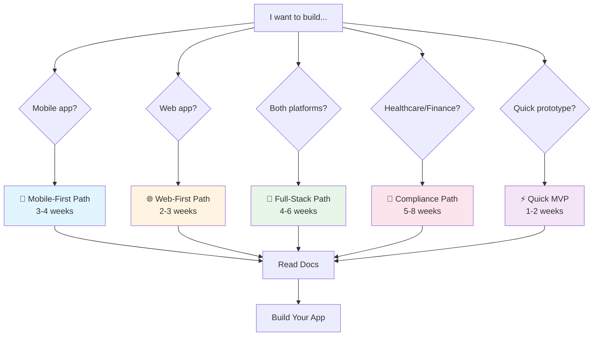
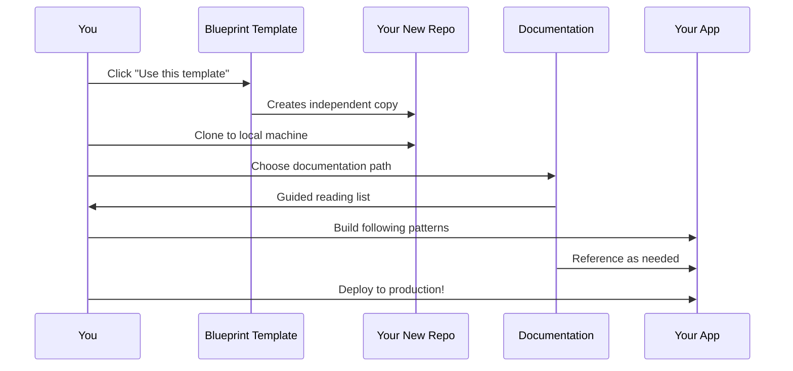
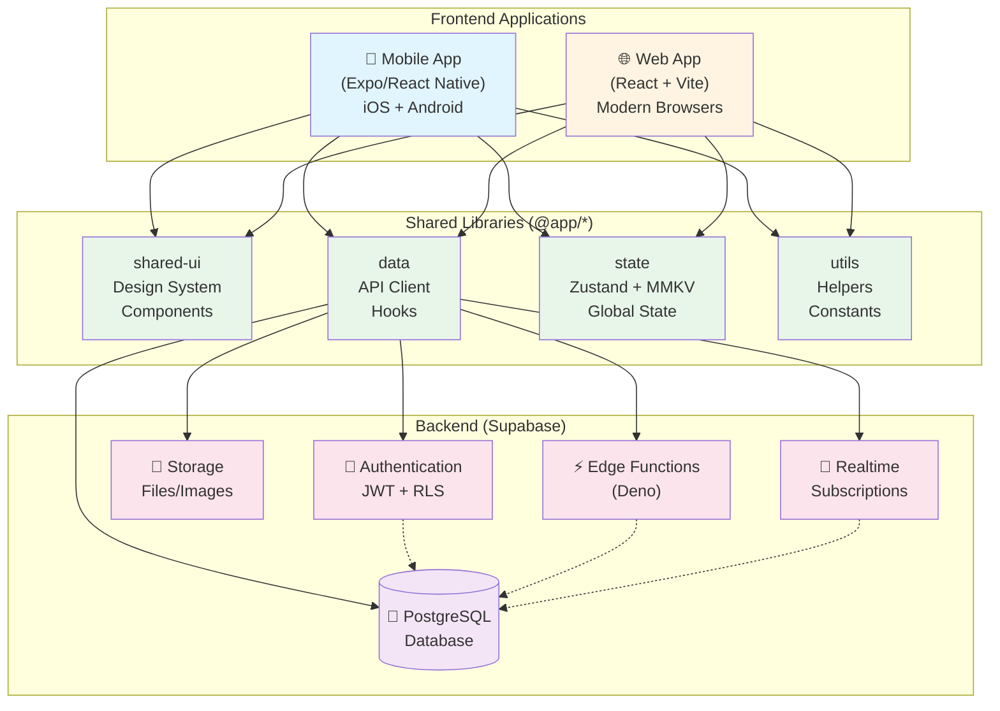

# 🚀 Full-Stack App Template Blueprint

> **v1.1.0 - Enhanced Developer Experience**
>
> Comprehensive architectural documentation and best practices for building production-ready, full-stack monorepo applications with Expo (mobile) and React (web), powered by Nx and Supabase.

> ✨ **New in v1.1:** Automated dependency updates (Renovate), Nx generators for PRD scaffolding, TypeScript path aliases, and interactive setup wizard.
>
> **v1.0.0 (Production Ready)** will include working code, runnable apps, and a complete Nx workspace. [See Roadmap](./ROADMAP.md)

[](./LICENSE)
[](./CHANGELOG.md)
[](https://nx.dev/)
[](https://expo.dev/)

## 📋 Table of Contents

- [Quick Start (Coming in v1.0.0)](#-quick-start-coming-in-v100)
- [PRD-First Workflow (Recommended)](#-prd-first-workflow-recommended)
- [What is This?](#-what-is-this)
- [What's Documented](#-whats-documented)
- [Tech Stack](#-tech-stack)
- [Project Structure](#-project-structure)
- [How to Use This Blueprint](#-how-to-use-this-blueprint)
- [Documentation](#-documentation)
- [Contributing](#-contributing)
- [License](#-license)

## 🎯 How to Use This Blueprint

This is a **GitHub Template Repository** - here's how to get started:

### Step 1: Create Your Repository

**Click the "Use this template" button** at the top of this repository, or:

👉 [Create from Template](https://github.com/willbnu/Product-Blueprint/generate)

This creates a **brand new repository** with a clean copy of the blueprint.

### Step 2: Choose Your Path

Based on what you're building, follow the appropriate documentation journey:



**📚 [View All Documentation Paths](./docs/paths/README.md)**

### Step 3: Reference the Documentation

Use this blueprint's documentation as your reference guide while building:

- **Planning:** [PRD Templates](./prd/)
- **Architecture:** [ARCHITECTURE.md](./ARCHITECTURE.md)
- **Security:** [SECURITY_IMPLEMENTATION.md](./docs/SECURITY_IMPLEMENTATION.md)
- **Mobile:** [MOBILE.md](./docs/MOBILE.md)
- **Web:** [WEB.md](./docs/WEB.md)
- **Backend:** [BACKEND.md](./docs/BACKEND.md)

### Blueprint → Your App Flow



---

## ⚡ Quick Start (Coming in v1.0.0)

> ⚠️ **Note:** The commands below are for the planned v1.0.0 release. Currently (v1.1.0), this is a documentation-only blueprint.
>
> **To use this blueprint now:** Review the documentation, PRD templates, and security patterns to guide your own implementation.

### Planned Quick Start (v1.0.0)

**When v1.0.0 is released with working code:**

```bash
# 1. After creating from template
git clone https://github.com/YOUR-ORG/YOUR-APP-NAME.git
cd YOUR-APP-NAME

# 2. Install dependencies
pnpm install

# 3. Copy environment variables and add your Supabase credentials
cp .env.example .env.local
# Edit .env.local with your Supabase keys

# 4. Start development
pnpm dev:mobile  # Start Expo (mobile)
pnpm dev:web     # Start Vite (web)
```

---

## 📝 PRD-First Workflow (Recommended)

**For larger projects, we strongly recommend starting with a Product Requirements Document (PRD).**

### Why PRD-First?

A well-written PRD is your blueprint for success, especially for complex projects. It ensures:
- ✅ Clear product vision and goals
- ✅ Aligned stakeholder expectations
- ✅ Well-defined requirements before coding
- ✅ Faster development with fewer pivots
- ✅ Better product-market fit

### Get Started with PRD

```bash
# 1. Explore PRD templates and examples
cd prd/

# 2. Copy the template for your app
cp prd/templates/prd-template.md prd/my-awesome-app.md

# 3. Fill out your PRD (use examples as reference)
# See: prd/examples/todo-app-prd.md

# 4. Get stakeholder approval

# 5. Use this template to build your app!
```

**📖 Complete PRD Guide:** [prd/README.md](./prd/README.md)

**🎯 Example PRDs:**
- [Todo App](./prd/examples/todo-app-prd.md) - Simple CRUD app (1-2 weeks)
- More examples coming soon!

---

## 🎯 What is This?

This is an **architectural blueprint and documentation repository** (v1.1.0) that provides comprehensive guidance for building production-ready, full-stack applications. It includes:

- ✅ **Complete architectural documentation** for mobile (iOS & Android) + web applications
- ✅ **Security implementation patterns** (RLS, audit logging, error handling)
- ✅ **PRD (Product Requirements Document) templates** and examples
- ✅ **Design system documentation** with Figma integration guide
- ✅ **Best practices** for authentication, state management, testing, deployment
- ✅ **Compliance guidance** (SOC 2, HIPAA, GDPR, PCI DSS, ISO 27001)
- ✅ **27+ comprehensive markdown files** covering all aspects

> **v1.0.0 (Production Ready - Planned)** will include working code, runnable apps, and a complete Nx monorepo with actual implementations.

## 📦 What's Documented

### Planned Application Architecture

| App | Documentation | Status |
|-----|---------------|--------|
| **apps/mobile** | React Native + Expo (iOS & Android) patterns | 📝 Documented |
| **apps/web** | React + Vite application patterns | 📝 Documented |

### Planned Shared Libraries

| Library | Documentation | Status |
|---------|---------------|--------|
| **@app/shared-ui** | Cross-platform UI component patterns | 📝 Documented |
| **@app/data** | Data fetching and Supabase patterns | 📝 Documented |
| **@app/state** | State management patterns | 📝 Documented |
| **@app/utils** | Utility patterns and examples | 📝 Documented |

### Documentation Coverage

- ✅ **Backend Patterns:** Supabase (PostgreSQL, Auth, Storage, Edge Functions)
- ✅ **CI/CD Guides:** GitHub Actions workflow examples
- ✅ **Testing Strategies:** Jest, Testing Library, Playwright, Detox
- ✅ **Code Quality:** ESLint, Prettier, Husky, lint-staged configurations
- ✅ **Tooling:** Nx monorepo architecture and pnpm workspace patterns

### System Architecture Overview



## 🛠️ Tech Stack

### Frontend

- **Mobile:** [Expo](https://expo.dev/) (SDK 50+) + [Expo Router](https://docs.expo.dev/router/introduction/)
- **Web:** [React](https://react.dev/) 18 + [Vite](https://vitejs.dev/) 5
- **Styling:** [NativeWind](https://www.nativewind.dev/) (mobile) + [Tailwind CSS](https://tailwindcss.com/) (web)
- **Navigation:** [Expo Router](https://docs.expo.dev/router/introduction/) (mobile) + [React Router](https://reactrouter.com/) (web)
- **State:** [Zustand](https://zustand-demo.pmnd.rs/) + [MMKV](https://github.com/mrousavy/react-native-mmkv)
- **Data Fetching:** [TanStack Query](https://tanstack.com/query) v5
- **Forms:** [React Hook Form](https://react-hook-form.com/) + [Zod](https://zod.dev/)

### Backend

- **Database:** [Supabase](https://supabase.com/) (PostgreSQL 15+)
- **Authentication:** Supabase Auth
- **Storage:** Supabase Storage
- **Serverless:** Supabase Edge Functions (Deno)
- **API Layer:** [tRPC](https://trpc.io/) for type-safe APIs

### DevOps & Tooling

- **Monorepo:** [Nx](https://nx.dev/) 18+
- **Package Manager:** [pnpm](https://pnpm.io/) 8+
- **Language:** [TypeScript](https://www.typescriptlang.org/) 5+
- **Linting:** [ESLint](https://eslint.org/) 8+
- **Formatting:** [Prettier](https://prettier.io/) 3+
- **Git Hooks:** [Husky](https://typicode.github.io/husky/) + [lint-staged](https://github.com/okonet/lint-staged)
- **Testing:** [Jest](https://jestjs.io/), [Playwright](https://playwright.dev/), [Detox](https://wix.github.io/Detox/)
- **CI/CD:** GitHub Actions

## 📁 Project Structure

```
.
├── prd/                    # 📝 START HERE - Product Requirements
│   ├── README.md          # PRD workflow guide
│   ├── templates/         # PRD templates
│   ├── examples/          # Example PRDs (todo app, etc.)
│   └── guides/            # How to write effective PRDs
│
├── apps/
│   ├── mobile/              # Expo mobile application
│   │   ├── app/            # Expo Router file-based routing
│   │   ├── components/     # Mobile-specific components
│   │   └── project.json    # Nx project configuration
│   └── web/                # React web application
│       ├── src/
│       │   ├── app/        # Application routes
│       │   ├── components/ # Web-specific components
│       │   └── main.tsx    # Entry point
│       └── project.json
│
├── libs/
│   └── @app/
│       ├── shared-ui/      # Shared UI components & design system
│       ├── data/           # API clients, data fetching hooks
│       ├── state/          # Global state management
│       └── utils/          # Shared utilities
│
├── supabase/
│   ├── migrations/         # Database migrations
│   ├── functions/          # Edge Functions
│   └── config.toml         # Supabase configuration
│
├── docs/                   # Detailed documentation
│   ├── ARCHITECTURE.md     # System architecture
│   ├── API.md             # API documentation
│   ├── LIBRARIES.md       # Library usage guides
│   ├── MOBILE.md          # Mobile development
│   ├── WEB.md             # Web development
│   ├── BACKEND.md         # Backend setup
│   ├── CICD.md            # CI/CD pipelines
│   └── ENVIRONMENT.md     # Environment variables
│
├── .github/
│   ├── workflows/          # CI/CD workflows
│   ├── ISSUE_TEMPLATE/     # Issue templates
│   └── PULL_REQUEST_TEMPLATE.md
│
├── scripts/                # Automation scripts
├── tools/                  # Custom Nx generators & executors
│
├── nx.json                 # Nx workspace configuration
├── tsconfig.base.json      # TypeScript base configuration
├── pnpm-workspace.yaml     # pnpm workspace configuration
├── .env.example            # Environment variable template
└── package.json            # Root package.json
```

## 📚 Documentation

### Getting Started
- **[Getting Started Guide](./GETTING_STARTED.md)** - Complete walkthrough (start here!)
- **[Setup Guide](./SETUP.md)** - Detailed installation and configuration
- **[Development Workflow](./DEVELOPMENT.md)** - Day-to-day development guide
- **[Environment Variables](./docs/ENVIRONMENT.md)** - All environment configuration

### PRD & Planning
- **[PRD Workflow](./prd/README.md)** - Product Requirements Document guide
- **[PRD Template](./prd/templates/prd-template.md)** - Copy this for your app
- **[PRD Examples](./prd/examples/)** - Example PRDs (todo app, etc.)

### Design System
- **[Design System Overview](./design-system/README.md)** - Complete design system guide
- **[Design Tokens](./design-system/DESIGN_TOKENS.md)** - Colors, typography, spacing
- **[Figma Templates](./design-system/FIGMA.md)** - Figma setup and usage
- **[Design Workflow](./design-system/WORKFLOW.md)** - Design-to-code process

### Architecture & Design
- **[Architecture Overview](./ARCHITECTURE.md)** - System design and decisions
- **[Project Libraries](./docs/LIBRARIES.md)** - Guide to shared libraries
- **[Security Implementation](./docs/SECURITY_IMPLEMENTATION.md)** - Complete security guide
- **[API Documentation](./docs/API.md)** - Backend API contracts

### Platform-Specific
- **[Mobile Development](./docs/MOBILE.md)** - Expo and React Native guide
- **[Web Development](./docs/WEB.md)** - React and Vite guide
- **[Backend Development](./docs/BACKEND.md)** - Supabase and Edge Functions

### Operations
- **[Testing Strategy](./TESTING.md)** - Unit, integration, and e2e tests
- **[Deployment Guide](./DEPLOYMENT.md)** - Deploy to production
- **[CI/CD Pipelines](./docs/CICD.md)** - Automated workflows
- **[Troubleshooting](./TROUBLESHOOTING.md)** - Common issues and solutions

### Contributing
- **[Contributing Guidelines](./CONTRIBUTING.md)** - How to contribute
- **[Code of Conduct](./CODE_OF_CONDUCT.md)** - Community standards
- **[Security Policy](./SECURITY.md)** - Security reporting

### Planning
- **[Roadmap](./ROADMAP.md)** - Future features and improvements
- **[Changelog](./CHANGELOG.md)** - Version history

## 🎨 Documented Patterns & Best Practices

### Cross-Platform UI Patterns
- Shared design system documentation with NativeWind (mobile) and Tailwind (web)
- Consistent theming and dark mode patterns
- Reusable component architecture

### Type-Safe Development Patterns
- End-to-end TypeScript patterns from database to UI
- Zod schema validation examples
- tRPC patterns for type-safe API contracts
- Supabase type generation guidance

### Offline-First Architecture
- TanStack Query with persistent cache patterns
- MMKV (mobile) and IndexedDB (web) storage examples
- Optimistic updates and conflict resolution patterns

### Developer Experience
- Hot reload configuration guidance
- Nx computation caching documentation
- Code generation patterns with Nx generators
- Pre-commit hooks configuration
- VS Code workspace setup

### Security & Compliance
- **Authentication patterns** with Supabase Auth
- **Row Level Security (RLS)** implementation examples
- **Audit logging** for SOC 2, HIPAA, GDPR compliance
- **Error handling** best practices
- **Secret management** guidance

## 📖 How to Use This Blueprint

Since this is v1.1.0 (documentation with tooling), here's how to use it effectively:

### 1. Review the Documentation

Start by exploring the comprehensive guides:
- Read [GETTING_STARTED.md](./GETTING_STARTED.md) for an overview
- Review [ARCHITECTURE.md](./ARCHITECTURE.md) to understand the system design
- Study [docs/SECURITY_IMPLEMENTATION.md](./docs/SECURITY_IMPLEMENTATION.md) for security patterns

### 2. Plan with PRD Templates

Use the PRD system to plan your application:
- Explore [prd/examples/todo-app-prd.md](./prd/examples/todo-app-prd.md) for a complete example
- Copy [prd/templates/prd-template.md](./prd/templates/prd-template.md) for your app
- Fill out your requirements before coding

### 3. Implement Using the Patterns

Copy the documented patterns into your own codebase:
- Use the SQL examples for database schema (RLS policies, audit logs)
- Adapt the TypeScript patterns for your application code
- Follow the security checklist
- Implement error handling using the provided examples

### 4. Customize for Your Needs

This blueprint is opinionated but flexible:
- Adapt the tech stack to your requirements
- Customize the design system
- Modify the PRD templates
- Extend the security patterns

## 🚀 Common Commands (Coming in v1.0.0)

> ⚠️ **Note:** The commands below are planned for v1.0.0. Currently, use this documentation to guide your own implementation.

```bash
# Development (v1.0.0)
pnpm dev:mobile          # Will start Expo mobile app
pnpm dev:web            # Will start Vite web app
pnpm dev:all            # Will start all apps

# Building (v1.0.0)
pnpm build              # Will build all apps
pnpm build:mobile       # Will build mobile app
pnpm build:web          # Will build web app

# Testing (v1.0.0)
pnpm test               # Will run all tests
pnpm test:watch         # Will run tests in watch mode
pnpm e2e               # Will run e2e tests

# Code Quality (v1.0.0)
pnpm lint              # Will lint all projects
pnpm format            # Will format all files
pnpm typecheck         # Will type check all projects
```

## 🤝 Contributing

We welcome contributions! Please see our [Contributing Guidelines](./CONTRIBUTING.md) for details.

### Quick Contribution Steps

1. Fork the repository
2. Create a feature branch (`git checkout -b feature/amazing-feature`)
3. Make your changes
4. Run tests (`pnpm test`)
5. Commit your changes (`git commit -m 'Add amazing feature'`)
6. Push to the branch (`git push origin feature/amazing-feature`)
7. Open a Pull Request

## 📄 License & Copyright

### License

This project is licensed under the **MIT License** - see the [LICENSE](./LICENSE) file for details.

### Copyright & Intellectual Property

**Copyright (c) 2025 William Finger. All rights reserved.**

This project contains original work including:
- Project architecture and documentation
- PRD templates and examples
- Custom implementation tools


**Important Legal Documents:**
- [LICENSE](./LICENSE) - MIT License terms
- [COPYRIGHT](./COPYRIGHT) - Copyright ownership details
- [NOTICE](./NOTICE) - Third-party attributions and CLA terms
- [CONTRIBUTING.md](./CONTRIBUTING.md) - Contributor License Agreement

### For Contributors

By contributing to this project, you accept the **Contributor License Agreement** which grants William Finger:
- Perpetual, royalty-free license to use your contributions
- Right to relicense if needed for project sustainability

See [CONTRIBUTING.md](./CONTRIBUTING.md#intellectual-property-and-contributor-license-agreement) for complete terms.

### Questions?

For licensing inquiries or questions:
- Open an [issue](https://github.com/willbnu/Product-Blueprint/issues)
- Contact: [William Finger](https://github.com/willbnu)

## 🙏 Acknowledgments

This blueprint documents architectural patterns using amazing open-source tools:

- [Nx](https://nx.dev/) - Smart monorepo tooling
- [Expo](https://expo.dev/) - Universal React applications
- [Supabase](https://supabase.com/) - Open-source Firebase alternative
- [TanStack Query](https://tanstack.com/query) - Powerful data synchronization
- [NativeWind](https://www.nativewind.dev/) - Tailwind for React Native

## 💬 Support

- 📖 [Complete Documentation](./docs/)
- 📝 [Release Notes](./CHANGELOG.md)
- 🐛 [Issue Tracker](https://github.com/willbnu/Product-Blueprint/issues)
- 💬 [Discussions](https://github.com/willbnu/Product-Blueprint/discussions)

## 🗺️ Roadmap

See our [Roadmap](./ROADMAP.md) for planned features and the path to v1.0.0 (Production Ready).

### Coming in v1.0.0
- ✅ Actual Nx workspace with working apps
- ✅ Runnable mobile application (Expo)
- ✅ Runnable web application (React + Vite)
- ✅ Implemented shared libraries
- ✅ Working Supabase backend integration
- ✅ Executable code that runs immediately

---

**⭐ If you find this blueprint useful, please consider giving it a star!**

Made with ❤️ by [William Finger](https://github.com/willbnu) for developers building production-ready applications
