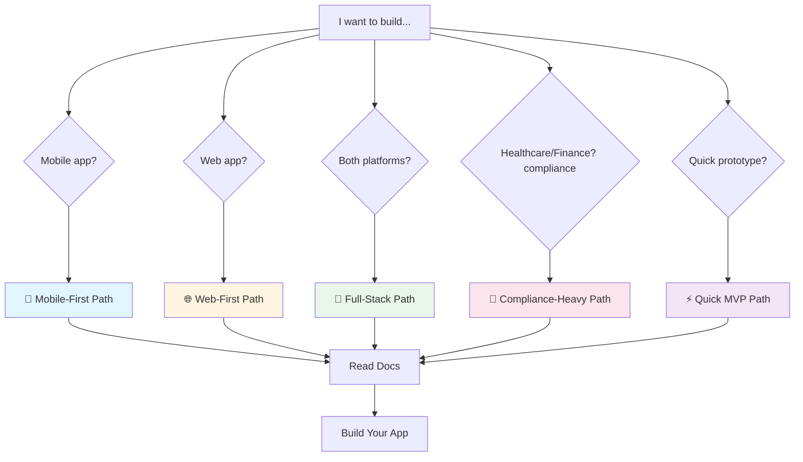
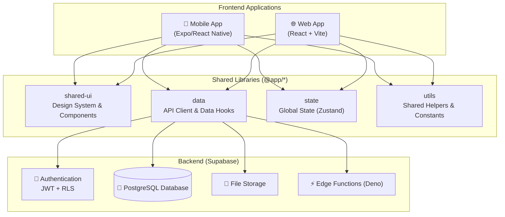

# 🚀 Product-Blueprint: Full-Stack Application Framework

[](./CHANGELOG.md)
[](./LICENSE)
[](https://nx.dev/)
[](https://expo.dev/)

> A comprehensive architectural blueprint for building production-ready, full-stack monorepo applications. This template includes working code for mobile (Expo) and web (React), powered by Nx and Supabase.

## 🎯 How to Use This Blueprint

This is a **GitHub Template Repository**. It's designed to be the starting point for your new projects.

### Step 1: Create Your Repository

**Click the "Use this template" button** at the top of this repository page, or use the direct link below:

👉 [**Create a new repository from this template**](https://github.com/willbnu/Product-Blueprint/generate)

This action creates a brand new, independent repository in your account, containing a clean copy of this blueprint.

### Step 2: Set Up Your Local Environment

Once your new repository is created, clone it to your local machine and install the dependencies.

```bash
# 1. Clone your new repository (replace with your repo's URL)
git clone https://github.com/YOUR-ORG/YOUR-APP-NAME.git
cd YOUR-APP-NAME

# 2. Install dependencies using pnpm
pnpm install

# 3. Copy the environment variable template
# (Add your Supabase credentials to this new file)
cp .env.example .env

# 4. Start the development servers
pnpm dev:web     # Starts the React web app
pnpm dev:mobile  # Starts the Expo mobile app
```

### Step 3: Choose Your Development Path

Based on what you're building, this blueprint provides guided documentation journeys.



**📚 [View All Documentation Paths](https://github.com/willbnu/Product-Blueprint/blob/main/docs/paths/README.md)**

---

## 📝 What is Product-Blueprint?

This repository is more than just a template; it's a collection of best practices, architectural patterns, and working code designed to accelerate the development of high-quality, scalable applications.

- ✅ **Working Code:** Includes a functional Expo mobile app and a React web app.
- ✅ **Production-Ready Patterns:** Security implementations (RLS), audit logging, and robust error handling.
- ✅ **PRD-First Workflow:** Includes templates and examples for writing effective Product Requirements Documents.
- ✅ **Comprehensive Documentation:** Over 27 detailed markdown files covering architecture, security, deployment, and more.
- ✅ **Compliance Guidance:** Patterns relevant for SOC 2, HIPAA, GDPR, PCI DSS, and ISO 27001.

### System Architecture Overview



---

## 🛠️ Tech Stack

### Frontend

| Area           | Technology                                            |
| -------------- | ----------------------------------------------------- |
| **Mobile**     | [Expo (SDK 52)](https://expo.dev/) + Expo Router v4   |
| **Web**        | [React 18](https://react.dev/) + [Vite 6](https://vitejs.dev/) |
| **Styling**    | [NativeWind](https://www.nativewind.dev/) / [Tailwind CSS](https://tailwindcss.com/) |
| **State**      | [Zustand](https://zustand-demo.pmnd.rs/)              |
| **Data Fetching**| [TanStack Query v5](https://tanstack.com/query)     |
| **Forms**      | [React Hook Form](https://react-hook-form.com/) + [Zod](https://zod.dev/) |

### Backend (Default: Supabase)

| Area          | Technology                                         |
| ------------- | -------------------------------------------------- |
| **Database**  | [Supabase](https://supabase.com/) (PostgreSQL 15+) |
| **Auth**      | Supabase Auth (JWT)                                |
| **Storage**   | Supabase Storage                                   |
| **Serverless**| Supabase Edge Functions (Deno)                     |

> 💡 **Want a different backend?** See our [**Alternative Databases Guide**](./docs/ALTERNATIVE_DATABASES.md) for patterns on using Convex, Firebase, Vercel Postgres, and more.

### DevOps & Tooling

| Area               | Technology                                 |
| ------------------ | ------------------------------------------ |
| **Monorepo**       | [Nx](https://nx.dev/) 19+                  |
| **Package Manager**| [pnpm](https://pnpm.io/) 9+                |
| **Language**       | [TypeScript](https://www.typescriptlang.org/) 5+ |
| **Testing**        | Jest, Playwright, Detox                    |
| **CI/CD**          | GitHub Actions                             |

---

## 📁 Project Structure

```
.
├── apps/
│   ├── mobile/              # Expo mobile application
│   └── web/                 # React web application
├── libs/@app/
│   ├── shared-ui/           # Shared UI components
│   ├── data/                # API clients and data fetching
│   ├── state/               # Global state management
│   └── utils/               # Shared utilities
├── prd/                     # 📝 START HERE: Product Requirements Docs
│   ├── templates/
│   └── examples/
├── docs/                    # 📚 All project documentation
│   ├── ARCHITECTURE.md
│   ├── DEVELOPMENT.md
│   ├── DEPLOYMENT.md
│   ├── SECURITY_IMPLEMENTATION.md
│   └── paths/               # Guided documentation paths
├── supabase/                # Supabase migrations and functions
└── tools/                   # Custom Nx generators and scripts
```

---

## 📚 Documentation

For a complete overview of all available documentation, please see the [**Documentation Hub**](./docs/README.md).

| Guide                                   | Description                                      |
| --------------------------------------- | ------------------------------------------------ |
| **[Getting Started](./GETTING_STARTED.md)** | Full setup and development walkthrough.          |
| **[PRD Workflow](./prd/README.md)**         | How to use the PRD-first planning process.       |
| **[Architecture](./ARCHITECTURE.md)**       | High-level system design and decisions.          |
| **[Security Guide](./docs/SECURITY_IMPLEMENTATION.md)** | RLS, audit logs, and other security patterns.    |
| **[Deployment](./DEPLOYMENT.md)**           | How to deploy your applications to production.   |

## 🤝 Contributing

We welcome contributions! Please read our [**Contributing Guidelines](./CONTRIBUTING.md)** to get started.

## 📄 License & Copyright

This project is licensed under the **MIT License**. See the [LICENSE](./LICENSE) file for details.

**Copyright (c) 2025 William Finger. All rights reserved.**

---

**⭐ If you find this blueprint useful, please consider giving it a star!**
