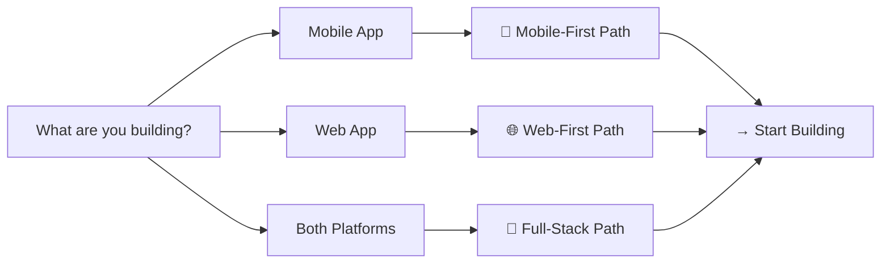
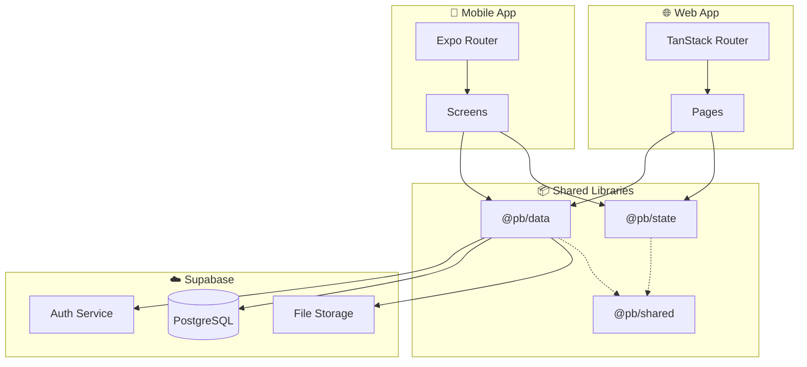

<div align="center">

# Product-Blueprint

**Enterprise-Grade Full-Stack Application Framework**

*A production-ready blueprint for building scalable mobile and web applications*

[](./CHANGELOG.md)
[](./LICENSE)
[](https://nx.dev/)
[](https://expo.dev/)
[](https://www.typescriptlang.org/)

[](https://github.com/willbnu/Product-Blueprint/stargazers)
[](https://github.com/willbnu/Product-Blueprint/network/members)
[](https://github.com/willbnu/Product-Blueprint/issues)

---

[**🚀 Quick Start**](#-quick-start) • [**📚 Documentation**](#-documentation) • [**🛠️ Tech Stack**](#%EF%B8%8F-tech-stack) • [**🤝 Contributing**](#-contributing)

</div>

---

## Why Product-Blueprint?

Building production-ready applications requires more than just code. You need:

| Challenge | Product-Blueprint Solution |
|-----------|---------------------------|
| 🔴 **Architecture decisions** | Pre-built monorepo structure with Nx |
| 🔴 **Authentication & Security** | Supabase Auth + RLS patterns ready to use |
| 🔴 **Code sharing between platforms** | Shared libraries (`@pb/*`) for data, state, utilities |
| 🔴 **Type safety across the stack** | End-to-end TypeScript with generated types |
| 🔴 **Routing complexity** | TanStack Router (web) + Expo Router (mobile) |
| 🔴 **Documentation overhead** | 30+ markdown files covering everything |
| 🔴 **Compliance requirements** | Built-in patterns for SOC 2, HIPAA, GDPR |

### What You Get

```
✅ Working Mobile App (Expo SDK 52)
✅ Working Web App (React 18 + Vite 6)
✅ Type-Safe Routing (TanStack Router)
✅ Shared Libraries (@pb/data, @pb/state, @pb/shared)
✅ Supabase Backend (Auth, Database, Storage)
✅ Comprehensive Documentation (30+ guides)
✅ PRD Templates & Examples
✅ Security & Compliance Patterns
```

---

## ✨ Features

<table>
<tr>
<td width="50%">

### 📱 Mobile App
- Expo SDK 52 with Expo Router v4
- NativeWind v4 (Tailwind for RN)
- Dark mode support
- Secure token storage
- Tab + stack navigation

</td>
<td width="50%">

### 🌐 Web App
- React 18 + Vite 6
- TanStack Router with loaders
- Type-safe routing
- Tailwind CSS styling
- Route-based code splitting

</td>
</tr>
<tr>
<td width="50%">

### 📦 Shared Libraries
- **@pb/data** - Supabase client, API, hooks
- **@pb/state** - Zustand stores
- **@pb/shared** - Types, schemas, utilities

</td>
<td width="50%">

### 🔒 Security Built-In
- Row Level Security (RLS) policies
- JWT authentication
- Audit logging patterns
- Input validation (Zod)

</td>
</tr>
</table>

---

## 🚀 Quick Start

### Use This Template

Click the **"Use this template"** button above, or:

```bash
# Create your repo from this template
gh repo create my-app --template willbnu/Product-Blueprint --private

# Clone and setup
cd my-app
pnpm install
cp .env.example .env
```

### Start Developing

```bash
# Start web app (http://localhost:3000)
pnpm --filter @pb/web dev

# Start mobile app (Expo Go)
pnpm --filter @pb/mobile start
```

### Environment Setup

```bash
# .env
VITE_SUPABASE_URL=https://your-project.supabase.co
VITE_SUPABASE_ANON_KEY=your-anon-key
```

> 💡 Get your Supabase credentials from [supabase.com](https://supabase.com/dashboard)

---

## 🗺️ Development Paths

Choose your path based on what you're building:



| Path | Best For | Guide |
|------|----------|-------|
| 📱 **Mobile-First** | iOS/Android apps | [Mobile-First Guide](./docs/paths/mobile-first-app.md) |
| 🌐 **Web-First** | Web applications | [Web-First Guide](./docs/paths/web-first-app.md) |
| 🚀 **Full-Stack** | Multi-platform products | [Full-Stack Guide](./docs/paths/full-stack-app.md) |
| ⚡ **Quick MVP** | Rapid prototyping | [Quick MVP Guide](./docs/paths/quick-mvp.md) |
| 🏥 **Compliance** | Healthcare/Finance | [Compliance Guide](./docs/paths/compliance-heavy-app.md) |

---

## 🏗️ Architecture



---

## 🛠️ Tech Stack

### Frontend

| Layer | Mobile | Web |
|-------|--------|-----|
| **Framework** | Expo SDK 52 + React Native | React 18 + Vite 6 |
| **Routing** | Expo Router v4 | TanStack Router v1 |
| **Styling** | NativeWind v4 | Tailwind CSS v3 |
| **State** | Zustand v5 | Zustand v5 |
| **Data** | TanStack Query v5 | TanStack Query v5 |
| **Forms** | React Hook Form + Zod | React Hook Form + Zod |

### Backend

| Service | Technology | Purpose |
|---------|-----------|---------|
| **Database** | Supabase (PostgreSQL 15+) | Primary data store |
| **Auth** | Supabase Auth | JWT authentication |
| **Storage** | Supabase Storage | File uploads |
| **Functions** | Supabase Edge Functions | Serverless compute |

### Development

| Tool | Version | Purpose |
|------|---------|---------|
| **Nx** | 22+ | Monorepo orchestration |
| **pnpm** | 9+ | Package management |
| **TypeScript** | 5+ | Type safety |
| **Jest** | 29+ | Unit testing |
| **Playwright** | 1.40+ | E2E testing (web) |
| **Detox** | 20+ | E2E testing (mobile) |

---

## 📁 Project Structure

```
Product-Blueprint/
├── apps/
│   ├── mobile/                 # 📱 Expo mobile application
│   │   ├── app/               # File-based routes (Expo Router)
│   │   ├── stores/            # Auth store
│   │   └── lib/               # Supabase client
│   ├── web/                    # 🌐 React web application
│   │   └── src/
│   │       ├── routes/        # File-based routes (TanStack Router)
│   │       └── router.tsx     # Router config
│   └── docs-site/              # 📚 Documentation website
├── libs/
│   ├── shared/                 # @pb/shared - Types, schemas, utils
│   ├── data/                   # @pb/data - API, hooks, Supabase
│   └── state/                  # @pb/state - Zustand stores
├── prd/                        # 📝 Product Requirements Documents
│   ├── templates/              # PRD templates
│   └── examples/               # Example PRDs
├── docs/                       # 📚 Comprehensive guides
│   ├── ARCHITECTURE.md
│   ├── SECURITY_IMPLEMENTATION.md
│   ├── paths/                  # Development path guides
│   └── ...
├── supabase/                   # ☁️ Database migrations
└── tools/                      # 🔧 Nx generators & scripts
```

---

## 📚 Documentation

### Essential Guides

| Guide | Description |
|-------|-------------|
| [**Getting Started**](./GETTING_STARTED.md) | Full setup walkthrough |
| [**Architecture**](./ARCHITECTURE.md) | System design decisions |
| [**Security**](./docs/SECURITY_IMPLEMENTATION.md) | RLS, auth, audit logs |
| [**Deployment**](./DEPLOYMENT.md) | Production deployment |
| [**Contributing**](./CONTRIBUTING.md) | How to contribute |

### PRD Resources

| Resource | Description |
|----------|-------------|
| [**PRD Template**](./prd/templates/prd-template.md) | Enterprise-grade template |
| [**Todo App Example**](./prd/examples/todo-app-prd.md) | Complete example PRD |

### All Documentation

> 📖 **[Browse all 30+ documentation files →](./docs/paths/README.md)**

---

## 🔒 Security

Product-Blueprint includes production-ready security patterns:

| Feature | Implementation |
|---------|----------------|
| **Authentication** | Supabase Auth (JWT) with secure storage |
| **Authorization** | Row Level Security (RLS) on all tables |
| **Input Validation** | Zod schemas on client and server |
| **Audit Logging** | Comprehensive audit trail |
| **Rate Limiting** | Edge function middleware |
| **Secrets Management** | Environment variables, never in code |

> 🔐 **[Read the Security Implementation Guide →](./docs/SECURITY_IMPLEMENTATION.md)**

---

## 🌍 Internationalization

Built with global products in mind:

- 🌐 i18n-ready architecture
- 📅 Locale-aware date/time formatting
- 💱 Currency formatting support
- 🔤 RTL layout preparation

---

## 📊 Compliance Patterns

Built-in patterns for regulated industries:

| Standard | Coverage |
|----------|----------|
| **SOC 2** | Audit logging, access controls |
| **HIPAA** | PHI handling patterns |
| **GDPR** | Data rights, consent management |
| **PCI DSS** | Payment data patterns |
| **ISO 27001** | Security controls |

> 🏥 **[Read the Compliance Guide →](./docs/paths/compliance-heavy-app.md)**

---

## 🤝 Contributing

We welcome contributions! By contributing, you agree to our Contributor License Agreement.

### Quick Links

- [Contributing Guidelines](./CONTRIBUTING.md)
- [Code of Conduct](./CODE_OF_CONDUCT.md)
- [Security Policy](./SECURITY.md)

### Development Setup

```bash
# Clone the repo
git clone https://github.com/willbnu/Product-Blueprint.git
cd Product-Blueprint

# Install dependencies
pnpm install

# Start development
pnpm --filter @pb/web dev
```

---

## 📄 License

This project is **proprietary software**. All rights reserved.

```
Copyright (c) 2025-2026 William Finger. All Rights Reserved.

Unauthorized copying, distribution, or use of this software
or its documentation is strictly prohibited.
```

For licensing inquiries, contact via [GitHub](https://github.com/willbnu).

---

## 🙏 Acknowledgments

Built with amazing open-source technologies:

- [React](https://react.dev/) - UI library
- [Expo](https://expo.dev/) - Mobile development platform
- [Supabase](https://supabase.com/) - Backend platform
- [TanStack](https://tanstack.com/) - Router & Query libraries
- [Nx](https://nx.dev/) - Monorepo tooling
- [Tailwind Labs](https://tailwindcss.com/) - Styling

---

<div align="center">

**[⭐ Star this repo](https://github.com/willbnu/Product-Blueprint/stargazers)** if you find it useful!

**[📢 Share on Twitter](https://twitter.com/intent/tweet?text=Check%20out%20Product-Blueprint%20-%20a%20production-ready%20full-stack%20application%20framework%20with%20Expo%2C%20React%2C%20and%20Supabase!&url=https%3A%2F%2Fgithub.com%2Fwillbnu%2FProduct-Blueprint)**

---

Made with ❤️ by [William Finger](https://github.com/willbnu)

</div>
