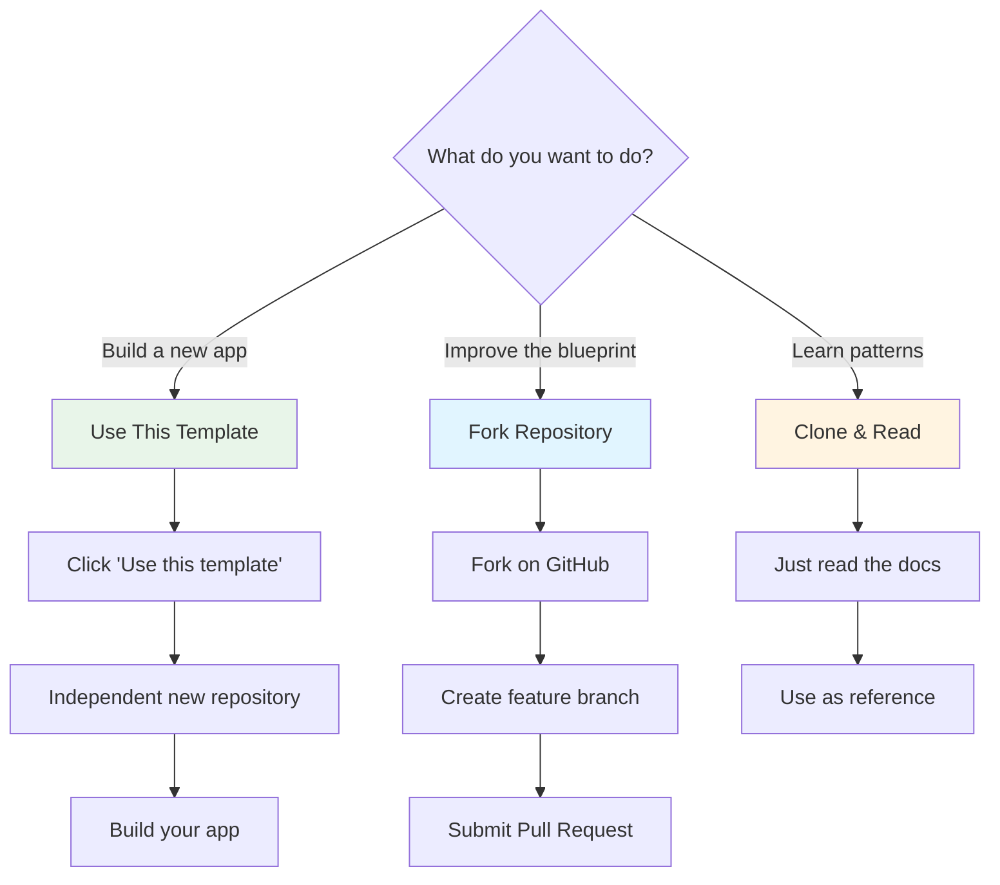

# Using This Template

Complete guide to using this GitHub Template Repository for your app.

---

## 🎯 Understanding the Template Model

This repository is a **GitHub Template Repository**, not a traditional fork.

### What This Means

**Template Repository (This is):**
- ✅ Creates a **brand new, independent repository**
- ✅ **No git connection** to original
- ✅ **Clean git history** (starts fresh)
- ✅ **Full ownership** of your copy
- ✅ **Cannot pull updates** from blueprint (by design)
- ✅ Perfect for starting new apps

**Fork (This is NOT):**
- ❌ Used for **contributing back** to the original project
- ❌ Maintains connection to upstream
- ❌ Can pull updates
- ❌ Includes full git history
- ❌ Better for open-source contributions

---

## 🚀 For App Developers (Using the Blueprint)

### How to Use This Template

#### Step 1: Create Your Repository

**Option A: Use Template Button (Recommended)**

1. Click the **"Use this template"** button at the top of this repository
2. Choose a repository name for your app
3. Select public or private
4. Click "Create repository from template"

**Option B: Direct Link**

Visit: https://github.com/willbnu/ChatGPT-Workspace/generate

#### Step 2: Clone Your New Repository

```bash
# Clone YOUR new repository (not the blueprint!)
git clone https://github.com/YOUR-USERNAME/YOUR-APP-NAME.git
cd YOUR-APP-NAME
```

#### Step 3: Customize for Your App

**Quick Customization Checklist:**

```bash
# 1. Update package.json
#    - Change "name" to your app name
#    - Update "description"
#    - Update "author"

# 2. Update README.md
#    - Replace title with your app name
#    - Update description
#    - Remove "Use this template" instructions
#    - Add your project-specific info

# 3. Update LICENSE (if needed)
#    - Update copyright holder if different
#    - Or replace with your preferred license

# 4. Commit your customizations
git add .
git commit -m "chore: customize for [Your App Name]"
git push
```

#### Step 4: Choose Your Documentation Path

Based on what you're building, follow the appropriate guide:

- **📱 Mobile App:** [docs/paths/mobile-first-app.md](./docs/paths/mobile-first-app.md)
- **🌐 Web App:** [docs/paths/web-first-app.md](./docs/paths/web-first-app.md)
- **🚀 Both Platforms:** [docs/paths/full-stack-app.md](./docs/paths/full-stack-app.md)
- **🏥 Compliance-Heavy:** [docs/paths/compliance-heavy-app.md](./docs/paths/compliance-heavy-app.md)
- **⚡ Quick Prototype:** [docs/paths/quick-mvp.md](./docs/paths/quick-mvp.md)

#### Step 5: Build Your App!

Use the blueprint documentation as your reference guide:

1. **Plan:** Fill out a PRD from [prd/templates/](./prd/templates/)
2. **Architect:** Reference [ARCHITECTURE.md](./ARCHITECTURE.md)
3. **Build:** Follow your chosen documentation path
4. **Secure:** Implement patterns from [SECURITY_IMPLEMENTATION.md](./docs/SECURITY_IMPLEMENTATION.md)
5. **Deploy:** Follow [DEPLOYMENT.md](./DEPLOYMENT.md)

---

## 🔄 Can I Get Updates from the Blueprint?

**Short answer:** No, and that's by design.

**Why not?**

When you use this template, you create an **independent repository**. This means:

- ✅ **Pro:** You have complete control and ownership
- ✅ **Pro:** No merge conflicts with blueprint changes
- ✅ **Pro:** Clean git history for your app
- ❌ **Con:** Cannot automatically pull blueprint updates

**How to stay updated:**

1. **Watch the blueprint repository** for major updates
2. **Manually apply relevant changes** if you want them
3. **Read the changelog** for new patterns/features
4. **Cherry-pick useful updates** into your app

### Manual Update Process (Optional)

If you see a useful update in the blueprint:

```bash
# 1. Add blueprint as a remote (one-time setup)
git remote add blueprint https://github.com/willbnu/ChatGPT-Workspace.git

# 2. Fetch blueprint changes
git fetch blueprint

# 3. Cherry-pick specific commits or manually copy changes
#    (Do NOT merge - will cause conflicts!)

# 4. Copy specific files you want
#    Example: copy updated documentation
cp ../blueprint-local-clone/docs/SOME_FILE.md ./docs/

# 5. Commit your manual updates
git add .
git commit -m "docs: update from blueprint v0.2.0"
```

**⚠️ Warning:** Only copy documentation or patterns. Never blindly merge code!

---

## 🤝 For Contributors (Improving the Blueprint)

If you want to **improve the blueprint itself** (not build an app):

### How to Contribute

#### Step 1: Fork (Don't Use Template!)

```bash
# Fork the repository on GitHub, then:
git clone https://github.com/YOUR-USERNAME/ChatGPT-Workspace.git
cd ChatGPT-Workspace

# Add upstream remote
git remote add upstream https://github.com/willbnu/ChatGPT-Workspace.git
```

#### Step 2: Create Feature Branch

```bash
git checkout -b feature/your-improvement
```

#### Step 3: Make Improvements

- Improve documentation
- Add new patterns
- Fix errors
- Add examples

#### Step 4: Submit Pull Request

```bash
# Commit your changes
git add .
git commit -m "feat: add new pattern for X"

# Push to your fork
git push origin feature/your-improvement

# Open PR on GitHub to willbnu/ChatGPT-Workspace
```

**See [CONTRIBUTING.md](./CONTRIBUTING.md) for complete guidelines.**

---

## 📊 Comparison: Template vs. Fork

| Aspect | Using Template<br/>(For Apps) | Forking<br/>(For Contributing) |
|--------|-------------------------------|--------------------------------|
| **Purpose** | Build your app | Improve blueprint |
| **Git History** | Clean (new) | Full history |
| **Connection** | None | Linked |
| **Updates** | Manual copy | Pull from upstream |
| **Ownership** | 100% yours | Still connected |
| **Best For** | Starting apps | Contributing back |
| **Use When** | Building products | Fixing docs, adding features |

---

## ❓ Common Questions

### Q: I used the template - can I still contribute to the blueprint?

**A:** Yes! You can:
1. Keep your app repository (from template)
2. Create a **separate fork** for contributions
3. Submit PRs from the fork

### Q: Should I keep all the blueprint documentation in my app repo?

**A:** Yes, recommended:
- ✅ Keep as reference while building
- ✅ Helps team members learn patterns
- ✅ No harm in keeping (it's just markdown)
- ⚠️ You can delete later if you want

Optional cleanup (if repo size matters):
```bash
# Remove blueprint-specific files (optional)
rm TEMPLATE_USAGE.md
rm -rf docs/paths/
rm prd/examples/todo-app-prd.md  # Keep your own PRD
```

### Q: The blueprint updated - should I update my app?

**A:** Only if the update is valuable to you:
- ✅ New security pattern → Consider adopting
- ✅ Bug fix in documentation → Update your copy
- ❌ New platform support → Not needed if you're not using it
- ❌ Refactoring examples → Your code is already different

### Q: Can I use this template for commercial apps?

**A:** Yes! MIT License allows:
- ✅ Commercial use
- ✅ Modification
- ✅ Distribution
- ✅ Private use

**Requirements:**
- ✅ Include MIT license copy
- ✅ Include copyright notice

**See [LICENSE](./LICENSE) for details.**

### Q: How do I know what version of the blueprint I started from?

**A:** Check the version at the time you created from template:

```bash
# In your app repo, check initial commit
git log --reverse --oneline | head -1

# Or check CHANGELOG.md to see what was current at that time
```

---

## 🎯 Quick Decision Tree



---

## ✅ Checklist for New Template Users

After creating from template:

### Immediate (First Hour)
- [ ] Created repository from template
- [ ] Cloned to local machine
- [ ] Updated package.json (name, description, author)
- [ ] Updated README.md title and description
- [ ] Committed initial customizations

### Planning (First Day)
- [ ] Chose documentation path from [docs/paths/](./docs/paths/)
- [ ] Copied PRD template to start planning
- [ ] Read relevant sections from chosen path
- [ ] Decided on platform (mobile/web/both)

### Development (First Week)
- [ ] Setup Supabase project
- [ ] Configured environment variables
- [ ] Implemented authentication
- [ ] Built first feature
- [ ] Referenced blueprint docs as needed

---

## 📚 Helpful Resources

- **Documentation Paths:** [docs/paths/README.md](./docs/paths/README.md)
- **PRD Templates:** [prd/templates/](./prd/templates/)
- **Architecture Guide:** [ARCHITECTURE.md](./ARCHITECTURE.md)
- **Security Patterns:** [docs/SECURITY_IMPLEMENTATION.md](./docs/SECURITY_IMPLEMENTATION.md)
- **Contributing:** [CONTRIBUTING.md](./CONTRIBUTING.md)

---

## 🆘 Need Help?

- **Template usage questions:** [Open a discussion](https://github.com/willbnu/ChatGPT-Workspace/discussions)
- **Found a bug in docs:** [Report an issue](https://github.com/willbnu/ChatGPT-Workspace/issues)
- **Want to contribute:** [See CONTRIBUTING.md](./CONTRIBUTING.md)

---

**Happy building!** 🚀
