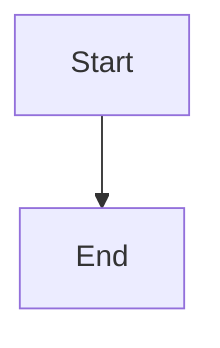

# Documentation Site

This is the VitePress-powered documentation website for the ChatGPT Workspace Blueprint.

## 🚀 Quick Start

### Prerequisites

- Node.js v20+
- pnpm 8+

### Development

```bash
# Install dependencies
cd docs-site
pnpm install

# Start development server
pnpm docs:dev

# The site will be available at http://localhost:5173
```

### Building

```bash
# Build for production
pnpm docs:build

# Preview production build
pnpm docs:preview
```

## 📁 Structure

```
docs-site/
├── .vitepress/
│   └── config.ts         # VitePress configuration
├── getting-started/
│   └── index.md          # Getting started guide
├── paths/
│   └── index.md          # Documentation paths overview
├── index.md              # Home page
├── package.json          # Dependencies and scripts
└── README.md             # This file
```

## 🎨 Features

- **Full-text search** - Search across all documentation
- **Dark mode** - Automatic dark/light theme
- **Mobile responsive** - Works on all devices
- **Mermaid diagrams** - Visual diagrams render beautifully
- **Code highlighting** - Syntax highlighting for all languages
- **Edit on GitHub** - Easy contributions

## 📚 Adding Content

### Creating a New Page

1. Create a markdown file in the appropriate directory
2. Add frontmatter if needed:

```markdown
---
title: Page Title
description: Page description
---

# Page Content
```

3. Update `.vitepress/config.ts` to add to navigation/sidebar

### Using Mermaid Diagrams

Mermaid diagrams are supported out of the box:

````markdown

````

### Custom Containers

VitePress supports custom containers:

```markdown
::: tip
This is a tip
:::

::: warning
This is a warning
:::

::: danger
This is a dangerous warning
:::
```

## 🚀 Deployment

### GitHub Pages

1. Build the site:
```bash
pnpm docs:build
```

2. The output is in `.vitepress/dist/`

3. Deploy to GitHub Pages (automatic via GitHub Actions - TODO)

### Netlify/Vercel

Both support VitePress out of the box:

**Build command:** `pnpm docs:build`

**Output directory:** `.vitepress/dist`

## 📖 Documentation

- [VitePress Documentation](https://vitepress.dev/)
- [Markdown Extensions](https://vitepress.dev/guide/markdown)
- [Theme Configuration](https://vitepress.dev/reference/default-theme-config)

## 🤝 Contributing

To improve the documentation site:

1. Make your changes
2. Test locally with `pnpm docs:dev`
3. Build to ensure no errors: `pnpm docs:build`
4. Submit a pull request

---

Built with [VitePress](https://vitepress.dev/) ⚡️
