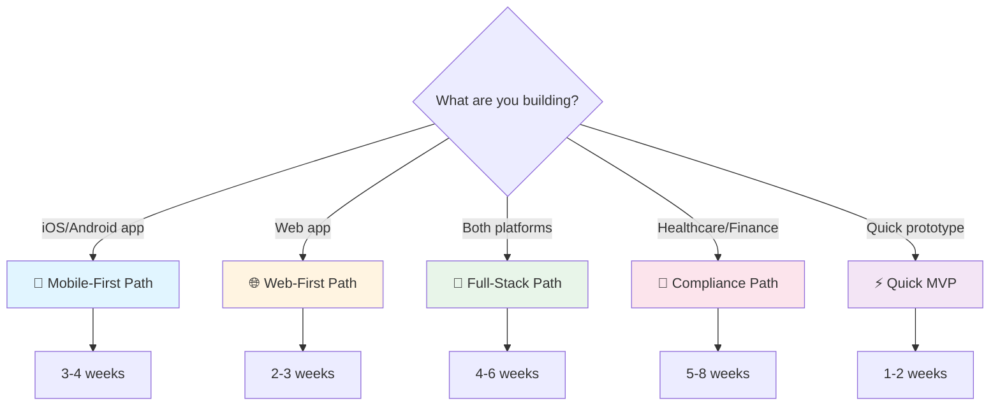

# Documentation Paths

Choose the guided documentation journey that matches your project type.

## 🗺️ Available Paths

Each path provides a week-by-week breakdown of what to read and build, with specific documentation sections to focus on.

### 📱 [Mobile-First Application](./mobile-first)

**Best for:** iOS and Android apps using Expo and React Native

**Time to MVP:** 3-4 weeks

**What you'll build:**
- Native mobile application
- Cross-platform iOS & Android
- Offline-first architecture
- App store deployment

**[Start Mobile-First Path →](./mobile-first)**

---

### 🌐 [Web-First Application](./web-first)

**Best for:** Web applications using React and Vite

**Time to MVP:** 2-3 weeks

**What you'll build:**
- Modern web application
- Optimized for browsers
- Fast, responsive UI
- Web deployment (Vercel/Netlify)

**[Start Web-First Path →](./web-first)**

---

### 🚀 [Full-Stack Application](./full-stack)

**Best for:** Both mobile and web platforms in a monorepo

**Time to MVP:** 4-6 weeks

**What you'll build:**
- Mobile app (iOS & Android)
- Web application
- Shared component library
- Unified backend

**[Start Full-Stack Path →](./full-stack)**

---

### 🏥 [Compliance-Heavy Application](./compliance-heavy)

**Best for:** Healthcare, finance, or regulated industries (HIPAA, GDPR, SOC 2)

**Time to Compliant MVP:** 5-8 weeks

**What you'll build:**
- Compliant architecture
- Audit logging system
- Data privacy controls
- Security-first design

**Compliance frameworks:**
- HIPAA (Healthcare)
- GDPR (EU Privacy)
- SOC 2 (Enterprise)
- PCI DSS (Payments)

**[Start Compliance Path →](./compliance-heavy)**

---

### ⚡ [Quick MVP](./quick-mvp)

**Best for:** Rapid prototyping and idea validation

**Time to Prototype:** 1-2 weeks

**What you'll build:**
- Working prototype
- One core feature
- Basic authentication
- Quick deployment

**[Start Quick MVP Path →](./quick-mvp)**

---

## 🧭 How Paths Work

Each path includes:

- **Weekly breakdown** - What to focus on each week
- **Reading list** - Docs to read in recommended order
- **Section highlights** - Specific sections to focus on
- **Implementation time** - How long each phase takes
- **Checkpoints** - Validate your progress
- **Quick reference** - Bookmark important sections

## 💡 Can I Switch Paths?

Yes! Paths are guides, not strict requirements. You can:

- Start with Quick MVP, then switch to Full-Stack
- Combine Mobile + Compliance paths
- Cherry-pick sections from different paths

## 📚 All Documentation

Don't want a guided path? Browse all documentation:

- [Architecture Overview](/architecture/)
- [Mobile Development](/mobile/)
- [Web Development](/web/)
- [Backend Development](/backend/)
- [Security Implementation](/security/)
- [PRD System](/prd/)
- [Design System](/design-system/)

## 🎯 Quick Decision Tree

## 🆘 Need Help Choosing?

**Not sure which path is right for you?**

Ask yourself:

1. **Platform:** Mobile only, web only, or both?
2. **Timeline:** How fast do you need to launch?
3. **Compliance:** Do you handle sensitive data (health, finance)?
4. **Purpose:** Validation (MVP) or production app?

**Still unsure?** [Ask in discussions](https://github.com/willbnu/ChatGPT-Workspace/discussions)

---

**Choose your path and start building!** 🚀
