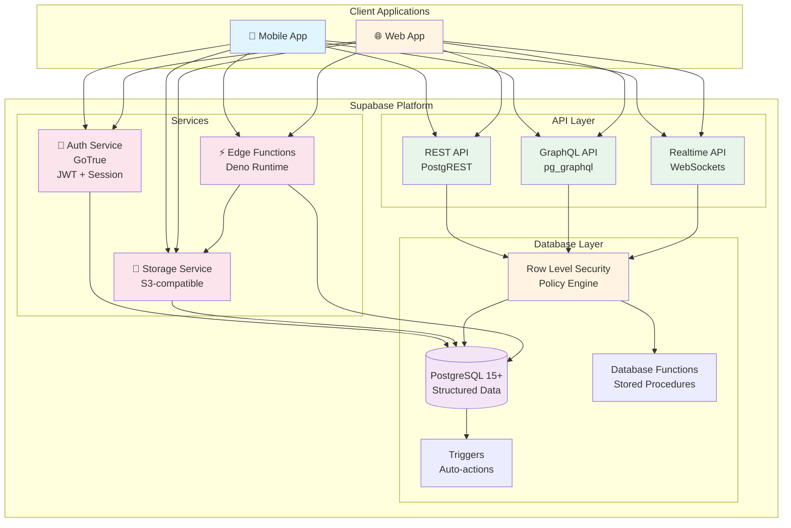
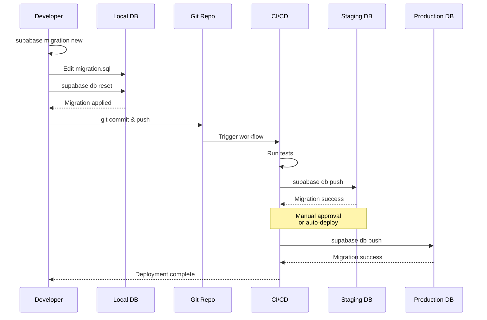

# Backend Development Guide (Supabase)

> **Status:** Documentation-only blueprint (v0.1.0)
>
> This guide provides comprehensive patterns and best practices for building production-ready backends with Supabase (PostgreSQL, Auth, Storage, Edge Functions).

---

## Table of Contents

- [Overview](#overview)
- [Supabase Setup](#supabase-setup)
- [Database Schema Design](#database-schema-design)
- [Row Level Security (RLS)](#row-level-security-rls)
- [Database Migrations](#database-migrations)
- [Authentication](#authentication)
- [Storage](#storage)
- [Edge Functions](#edge-functions)
- [Realtime Subscriptions](#realtime-subscriptions)
- [Database Functions](#database-functions)
- [Triggers](#triggers)
- [Full-Text Search](#full-text-search)
- [Database Indexes](#database-indexes)
- [Backup and Recovery](#backup-and-recovery)
- [Performance Optimization](#performance-optimization)
- [Monitoring and Logging](#monitoring-and-logging)
- [Security Best Practices](#security-best-practices)
- [Troubleshooting](#troubleshooting)

---

## Overview

This template uses **Supabase** as the backend platform, providing:

- **PostgreSQL 15+**: Powerful relational database
- **Built-in Authentication**: Email, OAuth, magic links, phone auth
- **Row Level Security (RLS)**: Database-level authorization
- **Storage**: S3-compatible object storage
- **Edge Functions**: Serverless Deno functions
- **Realtime**: WebSocket-based real-time subscriptions
- **Auto-generated APIs**: RESTful and GraphQL APIs

### Why Supabase?

✅ **Open Source**: Full control and transparency
✅ **PostgreSQL**: Industry-standard, battle-tested database
✅ **Built-in Auth**: No need for separate auth service
✅ **Row Level Security**: Database-level access control
✅ **Realtime**: Built-in WebSocket subscriptions
✅ **Developer Experience**: Excellent tooling and local development

### Supabase Architecture Overview



---

## Supabase Setup

### Local Development

```bash
# Install Supabase CLI
brew install supabase/tap/supabase

# Initialize Supabase in your project
cd your-project
supabase init

# Start local Supabase (Docker required)
supabase start

# This will start:
# - PostgreSQL database
# - Studio (dashboard) at http://localhost:54323
# - API Gateway at http://localhost:54321
# - Auth server
# - Storage server
# - Realtime server
```

### Project Structure

```
supabase/
├── config.toml           # Supabase configuration
├── migrations/           # Database migrations
│   ├── 20240101000000_initial_schema.sql
│   ├── 20240102000000_add_todos_table.sql
│   └── 20240103000000_enable_rls.sql
├── functions/            # Edge Functions
│   ├── hello-world/
│   │   └── index.ts
│   └── send-email/
│       └── index.ts
└── seed.sql             # Seed data for development
```

### Environment Variables

```bash
# .env.local
SUPABASE_URL=http://localhost:54321
SUPABASE_ANON_KEY=your-anon-key
SUPABASE_SERVICE_ROLE_KEY=your-service-role-key

# Production
SUPABASE_URL=https://your-project.supabase.co
SUPABASE_ANON_KEY=your-production-anon-key
```

---

## Database Schema Design

### Example Schema: Todo App

```sql
-- supabase/migrations/20240101000000_initial_schema.sql

-- Create todos table
CREATE TABLE todos (
  id uuid PRIMARY KEY DEFAULT gen_random_uuid(),
  user_id uuid REFERENCES auth.users(id) ON DELETE CASCADE NOT NULL,
  title text NOT NULL,
  description text,
  completed boolean DEFAULT false NOT NULL,
  due_date timestamptz,
  created_at timestamptz DEFAULT now() NOT NULL,
  updated_at timestamptz DEFAULT now() NOT NULL
);

-- Create index on user_id for faster queries
CREATE INDEX idx_todos_user_id ON todos(user_id);

-- Create index on completed status
CREATE INDEX idx_todos_completed ON todos(completed);

-- Create composite index for common query pattern
CREATE INDEX idx_todos_user_completed ON todos(user_id, completed);

-- Create updated_at trigger
CREATE OR REPLACE FUNCTION update_updated_at_column()
RETURNS TRIGGER AS $$
BEGIN
  NEW.updated_at = now();
  RETURN NEW;
END;
$$ LANGUAGE plpgsql;

CREATE TRIGGER update_todos_updated_at
  BEFORE UPDATE ON todos
  FOR EACH ROW
  EXECUTE FUNCTION update_updated_at_column();

-- Add table comments (documentation)
COMMENT ON TABLE todos IS 'User todo items with CRUD operations';
COMMENT ON COLUMN todos.user_id IS 'Foreign key to auth.users - owner of the todo';
COMMENT ON COLUMN todos.due_date IS 'Optional due date for the todo';
```

### Best Practices

✅ **Use UUIDs**: Better for distributed systems and security
✅ **Foreign Keys**: Enforce referential integrity
✅ **Timestamps**: Always include `created_at` and `updated_at`
✅ **Indexes**: Add indexes for frequently queried columns
✅ **Constraints**: Use CHECK constraints for data validation
✅ **Comments**: Document your schema

---

## Row Level Security (RLS)

### Enable RLS

```sql
-- Enable RLS on todos table
ALTER TABLE todos ENABLE ROW LEVEL SECURITY;
```

### Basic RLS Policies

```sql
-- Users can only see their own todos
CREATE POLICY "Users can view their own todos"
ON todos
FOR SELECT
USING (auth.uid() = user_id);

-- Users can insert their own todos
CREATE POLICY "Users can create their own todos"
ON todos
FOR INSERT
WITH CHECK (auth.uid() = user_id);

-- Users can update their own todos
CREATE POLICY "Users can update their own todos"
ON todos
FOR UPDATE
USING (auth.uid() = user_id)
WITH CHECK (auth.uid() = user_id);

-- Users can delete their own todos
CREATE POLICY "Users can delete their own todos"
ON todos
FOR DELETE
USING (auth.uid() = user_id);
```

### Advanced RLS Patterns

**Role-Based Access Control:**

```sql
-- Create user_roles table
CREATE TABLE user_roles (
  user_id uuid REFERENCES auth.users(id) ON DELETE CASCADE,
  role text NOT NULL CHECK (role IN ('admin', 'user', 'viewer')),
  PRIMARY KEY (user_id, role)
);

-- Admin can see all todos
CREATE POLICY "Admins can view all todos"
ON todos
FOR SELECT
USING (
  EXISTS (
    SELECT 1 FROM user_roles
    WHERE user_roles.user_id = auth.uid()
    AND user_roles.role = 'admin'
  )
);
```

**Shared Access:**

```sql
-- Create shared_todos table
CREATE TABLE shared_todos (
  todo_id uuid REFERENCES todos(id) ON DELETE CASCADE,
  shared_with_user_id uuid REFERENCES auth.users(id) ON DELETE CASCADE,
  permission text NOT NULL CHECK (permission IN ('view', 'edit')),
  PRIMARY KEY (todo_id, shared_with_user_id)
);

-- Users can view todos shared with them
CREATE POLICY "Users can view shared todos"
ON todos
FOR SELECT
USING (
  auth.uid() = user_id
  OR EXISTS (
    SELECT 1 FROM shared_todos
    WHERE shared_todos.todo_id = todos.id
    AND shared_todos.shared_with_user_id = auth.uid()
  )
);
```

### Testing RLS Policies

```sql
-- Test as a specific user
SELECT set_config('request.jwt.claims', '{"sub":"user-uuid-here"}', true);

-- Verify policy works
SELECT * FROM todos; -- Should only return user's todos

-- Reset
SELECT set_config('request.jwt.claims', NULL, true);
```

---

## Database Migrations

### Migration Workflow

```mermaid
graph LR
    subgraph "Development"
        Dev[Developer] --> Create[Create Migration<br/>supabase migration new]
        Create --> File[Migration File<br/>*.sql]
        File --> Write[Write SQL<br/>CREATE/ALTER/etc]
        Write --> Test[Test Locally<br/>supabase db reset]
    end

    subgraph "Version Control"
        Test --> Commit[Commit to Git]
        Commit --> PR[Pull Request]
        PR --> Review[Code Review]
    end

    subgraph "Deployment"
        Review --> Merge[Merge to Main]
        Merge --> CI[CI/CD Pipeline]
        CI --> Staging[Apply to Staging<br/>supabase db push]
        Staging --> Verify[Verify Migration]
        Verify --> Prod[Apply to Production<br/>supabase db push]
    end

    subgraph "Database State"
        Prod --> Schema[Schema Updated]
        Schema --> RLS[RLS Policies Applied]
        RLS --> Ready[Production Ready]
    end

    style Create fill:#e1f5ff
    style Test fill:#e8f5e9
    style Staging fill:#fff4e1
    style Prod fill:#fce4ec
    style Ready fill:#ccffcc
```



### Migration Execution Flow



### Creating Migrations

```bash
# Create a new migration
supabase migration new add_categories_table

# This creates: supabase/migrations/20240104000000_add_categories_table.sql
```

### Migration Example

```sql
-- supabase/migrations/20240104000000_add_categories_table.sql

-- Create categories table
CREATE TABLE categories (
  id uuid PRIMARY KEY DEFAULT gen_random_uuid(),
  user_id uuid REFERENCES auth.users(id) ON DELETE CASCADE NOT NULL,
  name text NOT NULL,
  color text,
  created_at timestamptz DEFAULT now() NOT NULL
);

-- Add category_id to todos
ALTER TABLE todos
ADD COLUMN category_id uuid REFERENCES categories(id) ON DELETE SET NULL;

-- Create index
CREATE INDEX idx_todos_category_id ON todos(category_id);

-- Enable RLS
ALTER TABLE categories ENABLE ROW LEVEL SECURITY;

-- Add RLS policies
CREATE POLICY "Users can view their own categories"
ON categories
FOR SELECT
USING (auth.uid() = user_id);

CREATE POLICY "Users can create their own categories"
ON categories
FOR INSERT
WITH CHECK (auth.uid() = user_id);
```

### Applying Migrations

```bash
# Apply migrations locally
supabase db reset

# Push to remote (production)
supabase db push

# Check migration status
supabase migration list
```

### Rollback Migrations

```sql
-- supabase/migrations/20240104000001_rollback_categories.sql

-- Remove category_id from todos
ALTER TABLE todos DROP COLUMN IF EXISTS category_id;

-- Drop categories table
DROP TABLE IF EXISTS categories CASCADE;
```

---

## Authentication

### Email/Password Authentication

```typescript
// Client-side signup
import { supabase } from '@/lib/supabase';

export async function signUp(email: string, password: string) {
  try {
    const { data, error } = await supabase.auth.signUp({
      email,
      password,
      options: {
        emailRedirectTo: `${window.location.origin}/auth/callback`,
      },
    });

    if (error) throw error;
    return { data, error: null };
  } catch (error) {
    console.error('Signup error:', error);
    return { data: null, error };
  }
}

export async function signIn(email: string, password: string) {
  try {
    const { data, error } = await supabase.auth.signInWithPassword({
      email,
      password,
    });

    if (error) throw error;
    return { data, error: null };
  } catch (error) {
    console.error('Sign in error:', error);
    return { data: null, error };
  }
}
```

### OAuth Authentication

```typescript
// Google OAuth
export async function signInWithGoogle() {
  try {
    const { data, error } = await supabase.auth.signInWithOAuth({
      provider: 'google',
      options: {
        redirectTo: `${window.location.origin}/auth/callback`,
        queryParams: {
          access_type: 'offline',
          prompt: 'consent',
        },
      },
    });

    if (error) throw error;
    return { data, error: null };
  } catch (error) {
    console.error('OAuth error:', error);
    return { data: null, error };
  }
}
```

### Server-Side Auth (Edge Functions)

```typescript
// supabase/functions/protected-function/index.ts
import { serve } from 'https://deno.land/std@0.168.0/http/server.ts';
import { createClient } from 'https://esm.sh/@supabase/supabase-js@2';

serve(async (req) => {
  try {
    // Get JWT from Authorization header
    const authHeader = req.headers.get('Authorization');
    if (!authHeader) {
      return new Response(
        JSON.stringify({ error: 'Missing authorization header' }),
        { status: 401, headers: { 'Content-Type': 'application/json' } }
      );
    }

    // Create Supabase client with user's JWT
    const supabaseClient = createClient(
      Deno.env.get('SUPABASE_URL') ?? '',
      Deno.env.get('SUPABASE_ANON_KEY') ?? '',
      {
        global: {
          headers: { Authorization: authHeader },
        },
      }
    );

    // Verify user
    const {
      data: { user },
      error: userError,
    } = await supabaseClient.auth.getUser();

    if (userError || !user) {
      return new Response(
        JSON.stringify({ error: 'Unauthorized' }),
        { status: 401, headers: { 'Content-Type': 'application/json' } }
      );
    }

    // User is authenticated - proceed with business logic
    return new Response(
      JSON.stringify({ message: 'Success', user }),
      { status: 200, headers: { 'Content-Type': 'application/json' } }
    );
  } catch (error) {
    return new Response(
      JSON.stringify({ error: error.message }),
      { status: 500, headers: { 'Content-Type': 'application/json' } }
    );
  }
});
```

---

## Storage

### Bucket Setup

```sql
-- Create a storage bucket
INSERT INTO storage.buckets (id, name, public)
VALUES ('avatars', 'avatars', true);

-- Create storage policies
CREATE POLICY "Users can upload their own avatar"
ON storage.objects
FOR INSERT
WITH CHECK (
  bucket_id = 'avatars'
  AND auth.uid()::text = (storage.foldername(name))[1]
);

CREATE POLICY "Anyone can view avatars"
ON storage.objects
FOR SELECT
USING (bucket_id = 'avatars');

CREATE POLICY "Users can update their own avatar"
ON storage.objects
FOR UPDATE
USING (
  bucket_id = 'avatars'
  AND auth.uid()::text = (storage.foldername(name))[1]
);
```

### Upload Files

```typescript
// Client-side file upload
export async function uploadAvatar(file: File, userId: string) {
  try {
    const fileExt = file.name.split('.').pop();
    const fileName = `${userId}/avatar.${fileExt}`;

    const { data, error } = await supabase.storage
      .from('avatars')
      .upload(fileName, file, {
        cacheControl: '3600',
        upsert: true,
      });

    if (error) throw error;

    // Get public URL
    const { data: { publicUrl } } = supabase.storage
      .from('avatars')
      .getPublicUrl(fileName);

    return { url: publicUrl, error: null };
  } catch (error) {
    console.error('Upload error:', error);
    return { url: null, error };
  }
}
```

### Image Transformations

```typescript
// Get resized/optimized image
export function getOptimizedImageUrl(path: string, width: number, height: number) {
  const { data } = supabase.storage
    .from('avatars')
    .getPublicUrl(path, {
      transform: {
        width,
        height,
        resize: 'cover',
        quality: 80,
      },
    });

  return data.publicUrl;
}
```

---

## Edge Functions

### Creating Edge Functions

```bash
# Create a new Edge Function
supabase functions new send-email

# Serve locally
supabase functions serve

# Deploy to production
supabase functions deploy send-email
```

### Edge Function Example

```typescript
// supabase/functions/send-email/index.ts
import { serve } from 'https://deno.land/std@0.168.0/http/server.ts';
import { createClient } from 'https://esm.sh/@supabase/supabase-js@2';

interface EmailRequest {
  to: string;
  subject: string;
  body: string;
}

serve(async (req) => {
  try {
    // CORS headers
    const corsHeaders = {
      'Access-Control-Allow-Origin': '*',
      'Access-Control-Allow-Headers': 'authorization, x-client-info, apikey, content-type',
    };

    // Handle CORS preflight
    if (req.method === 'OPTIONS') {
      return new Response('ok', { headers: corsHeaders });
    }

    // Verify authentication
    const authHeader = req.headers.get('Authorization');
    if (!authHeader) {
      return new Response(
        JSON.stringify({ error: 'Missing authorization header' }),
        { status: 401, headers: { ...corsHeaders, 'Content-Type': 'application/json' } }
      );
    }

    const supabaseClient = createClient(
      Deno.env.get('SUPABASE_URL') ?? '',
      Deno.env.get('SUPABASE_ANON_KEY') ?? '',
      {
        global: { headers: { Authorization: authHeader } },
      }
    );

    const {
      data: { user },
      error: userError,
    } = await supabaseClient.auth.getUser();

    if (userError || !user) {
      return new Response(
        JSON.stringify({ error: 'Unauthorized' }),
        { status: 401, headers: { ...corsHeaders, 'Content-Type': 'application/json' } }
      );
    }

    // Parse request body
    const { to, subject, body }: EmailRequest = await req.json();

    // Validate input
    if (!to || !subject || !body) {
      return new Response(
        JSON.stringify({ error: 'Missing required fields' }),
        { status: 400, headers: { ...corsHeaders, 'Content-Type': 'application/json' } }
      );
    }

    // Send email (example with Resend)
    const resendApiKey = Deno.env.get('RESEND_API_KEY');
    const response = await fetch('https://api.resend.com/emails', {
      method: 'POST',
      headers: {
        'Content-Type': 'application/json',
        Authorization: `Bearer ${resendApiKey}`,
      },
      body: JSON.stringify({
        from: 'noreply@example.com',
        to,
        subject,
        html: body,
      }),
    });

    if (!response.ok) {
      throw new Error('Failed to send email');
    }

    const data = await response.json();

    return new Response(
      JSON.stringify({ success: true, data }),
      { status: 200, headers: { ...corsHeaders, 'Content-Type': 'application/json' } }
    );
  } catch (error) {
    console.error('Send email error:', error);
    return new Response(
      JSON.stringify({ error: error.message }),
      { status: 500, headers: { 'Content-Type': 'application/json' } }
    );
  }
});
```

### Calling Edge Functions

```typescript
// Client-side invocation
export async function sendEmail(to: string, subject: string, body: string) {
  try {
    const { data, error } = await supabase.functions.invoke('send-email', {
      body: { to, subject, body },
    });

    if (error) throw error;
    return { data, error: null };
  } catch (error) {
    console.error('Invoke error:', error);
    return { data: null, error };
  }
}
```

---

## Realtime Subscriptions

### Subscribe to Database Changes

```typescript
// Subscribe to INSERT events
export function subscribeTodoInserts(callback: (payload: any) => void) {
  const subscription = supabase
    .channel('todos-insert')
    .on(
      'postgres_changes',
      {
        event: 'INSERT',
        schema: 'public',
        table: 'todos',
      },
      (payload) => {
        callback(payload.new);
      }
    )
    .subscribe();

  return subscription;
}

// Subscribe to all changes
export function subscribeTodoChanges(callback: (payload: any) => void) {
  const subscription = supabase
    .channel('todos-all')
    .on(
      'postgres_changes',
      {
        event: '*',
        schema: 'public',
        table: 'todos',
      },
      callback
    )
    .subscribe();

  return subscription;
}

// Unsubscribe
subscription.unsubscribe();
```

### Realtime Presence

```typescript
// Track online users
export function trackPresence(roomId: string, userId: string) {
  const channel = supabase.channel(roomId, {
    config: {
      presence: {
        key: userId,
      },
    },
  });

  channel
    .on('presence', { event: 'sync' }, () => {
      const state = channel.presenceState();
      console.log('Online users:', state);
    })
    .on('presence', { event: 'join' }, ({ key, newPresences }) => {
      console.log('User joined:', key, newPresences);
    })
    .on('presence', { event: 'leave' }, ({ key, leftPresences }) => {
      console.log('User left:', key, leftPresences);
    })
    .subscribe(async (status) => {
      if (status === 'SUBSCRIBED') {
        await channel.track({ online_at: new Date().toISOString() });
      }
    });

  return channel;
}
```

---

## Database Functions

### Creating Database Functions

```sql
-- Function to get user's todo count
CREATE OR REPLACE FUNCTION get_user_todo_count(user_uuid uuid)
RETURNS integer
LANGUAGE sql
SECURITY DEFINER
AS $$
  SELECT COUNT(*)::integer
  FROM todos
  WHERE user_id = user_uuid;
$$;

-- Function with multiple return values
CREATE OR REPLACE FUNCTION get_todo_stats(user_uuid uuid)
RETURNS TABLE (
  total_count integer,
  completed_count integer,
  pending_count integer
)
LANGUAGE sql
SECURITY DEFINER
AS $$
  SELECT
    COUNT(*)::integer AS total_count,
    COUNT(*) FILTER (WHERE completed = true)::integer AS completed_count,
    COUNT(*) FILTER (WHERE completed = false)::integer AS pending_count
  FROM todos
  WHERE user_id = user_uuid;
$$;
```

### Calling Database Functions

```typescript
// Call function from client
export async function getTodoStats() {
  try {
    const { data, error } = await supabase.rpc('get_todo_stats', {
      user_uuid: user.id,
    });

    if (error) throw error;
    return { data, error: null };
  } catch (error) {
    console.error('RPC error:', error);
    return { data: null, error };
  }
}
```

---

## Triggers

### Audit Log Trigger

```sql
-- Create audit log table
CREATE TABLE audit_logs (
  id uuid PRIMARY KEY DEFAULT gen_random_uuid(),
  table_name text NOT NULL,
  record_id uuid,
  action text NOT NULL,
  old_data jsonb,
  new_data jsonb,
  user_id uuid REFERENCES auth.users(id),
  created_at timestamptz DEFAULT now() NOT NULL
);

-- Create audit trigger function
CREATE OR REPLACE FUNCTION audit_trigger_function()
RETURNS TRIGGER AS $$
BEGIN
  INSERT INTO audit_logs (table_name, record_id, action, old_data, new_data, user_id)
  VALUES (
    TG_TABLE_NAME,
    COALESCE(NEW.id, OLD.id),
    TG_OP,
    CASE WHEN TG_OP IN ('UPDATE', 'DELETE') THEN row_to_json(OLD) ELSE NULL END,
    CASE WHEN TG_OP IN ('INSERT', 'UPDATE') THEN row_to_json(NEW) ELSE NULL END,
    auth.uid()
  );
  RETURN NEW;
END;
$$ LANGUAGE plpgsql SECURITY DEFINER;

-- Attach trigger to todos table
CREATE TRIGGER audit_todos
AFTER INSERT OR UPDATE OR DELETE ON todos
FOR EACH ROW EXECUTE FUNCTION audit_trigger_function();
```

---

## Full-Text Search

### Setup Full-Text Search

```sql
-- Add search column
ALTER TABLE todos
ADD COLUMN search_vector tsvector;

-- Create trigger to update search vector
CREATE OR REPLACE FUNCTION update_search_vector()
RETURNS TRIGGER AS $$
BEGIN
  NEW.search_vector :=
    setweight(to_tsvector('english', COALESCE(NEW.title, '')), 'A') ||
    setweight(to_tsvector('english', COALESCE(NEW.description, '')), 'B');
  RETURN NEW;
END;
$$ LANGUAGE plpgsql;

CREATE TRIGGER update_todos_search_vector
BEFORE INSERT OR UPDATE ON todos
FOR EACH ROW EXECUTE FUNCTION update_search_vector();

-- Create index
CREATE INDEX idx_todos_search_vector ON todos USING GIN(search_vector);

-- Update existing rows
UPDATE todos SET search_vector =
  setweight(to_tsvector('english', COALESCE(title, '')), 'A') ||
  setweight(to_tsvector('english', COALESCE(description, '')), 'B');
```

### Search Query

```typescript
// Client-side search
export async function searchTodos(query: string) {
  try {
    const { data, error } = await supabase
      .from('todos')
      .select('*')
      .textSearch('search_vector', query, {
        type: 'websearch',
        config: 'english',
      });

    if (error) throw error;
    return { data, error: null };
  } catch (error) {
    console.error('Search error:', error);
    return { data: null, error };
  }
}
```

---

## Database Indexes

### Common Index Patterns

```sql
-- B-tree index (default) - for exact matches and ranges
CREATE INDEX idx_todos_created_at ON todos(created_at);

-- Partial index - only index certain rows
CREATE INDEX idx_todos_incomplete ON todos(user_id)
WHERE completed = false;

-- Composite index - for multiple column queries
CREATE INDEX idx_todos_user_completed_date ON todos(user_id, completed, created_at DESC);

-- GIN index - for full-text search and JSONB
CREATE INDEX idx_todos_metadata ON todos USING GIN(metadata);

-- Unique index - enforce uniqueness
CREATE UNIQUE INDEX idx_categories_user_name ON categories(user_id, name);
```

---

## Backup and Recovery

### Automated Backups (Supabase)

Supabase provides automatic daily backups for all projects. Backups are retained for:
- **Free tier**: 7 days
- **Pro tier**: 30 days
- **Enterprise**: Custom retention

### Manual Backup

```bash
# Backup database
supabase db dump -f backup.sql

# Restore from backup
supabase db reset
psql -h localhost -p 54322 -U postgres -d postgres < backup.sql
```

---

## Performance Optimization

### Query Optimization

```sql
-- Use EXPLAIN ANALYZE to understand query performance
EXPLAIN ANALYZE
SELECT * FROM todos
WHERE user_id = 'user-uuid'
AND completed = false
ORDER BY created_at DESC;

-- Add appropriate indexes based on query patterns
CREATE INDEX idx_todos_user_completed_created ON todos(user_id, completed, created_at DESC);
```

### Connection Pooling

```typescript
// Use Supavisor for connection pooling (automatically enabled in Supabase)
const supabase = createClient(supabaseUrl, supabaseKey, {
  db: {
    schema: 'public',
  },
  auth: {
    persistSession: true,
  },
  global: {
    headers: { 'x-my-custom-header': 'my-app-name' },
  },
  realtime: {
    params: {
      eventsPerSecond: 10,
    },
  },
});
```

---

## Monitoring and Logging

### Enable Query Logging

```sql
-- Log slow queries (queries taking > 1 second)
ALTER DATABASE postgres SET log_min_duration_statement = 1000;
```

### Database Metrics

Monitor these key metrics in Supabase Dashboard:
- **Database size**: Track growth over time
- **Connection count**: Ensure not hitting limits
- **Query performance**: Identify slow queries
- **Cache hit rate**: Should be > 95%
- **Index usage**: Ensure indexes are being used

---

## Security Best Practices

### 1. Enable RLS on All Tables

```sql
-- Always enable RLS
ALTER TABLE todos ENABLE ROW LEVEL SECURITY;

-- Verify RLS is enabled
SELECT schemaname, tablename, rowsecurity
FROM pg_tables
WHERE schemaname = 'public';
```

### 2. Use Service Role Key Carefully

```typescript
// ❌ NEVER expose service role key to client
const supabase = createClient(url, serviceRoleKey); // INSECURE

// ✅ Use service role only in server-side code
// Edge Functions, API routes, backend services
```

### 3. Validate Input

```sql
-- Use CHECK constraints
ALTER TABLE todos
ADD CONSTRAINT check_title_length CHECK (length(title) >= 1 AND length(title) <= 500);
```

### 4. Sanitize Data

```typescript
// Use Zod for validation
import { z } from 'zod';

const todoSchema = z.object({
  title: z.string().min(1).max(500),
  description: z.string().max(2000).optional(),
  completed: z.boolean(),
});

// Validate before inserting
const result = todoSchema.safeParse(input);
if (!result.success) {
  throw new Error('Invalid input');
}
```

---

## Troubleshooting

### Common Issues

**"relation does not exist" error:**
```bash
# Ensure migrations are applied
supabase db reset
```

**RLS blocking queries:**
```sql
-- Check RLS policies
SELECT * FROM pg_policies WHERE tablename = 'todos';

-- Temporarily disable RLS for testing (DO NOT DO IN PRODUCTION)
ALTER TABLE todos DISABLE ROW LEVEL SECURITY;
```

**Connection pool exhausted:**
```typescript
// Use fewer concurrent connections
// Consider implementing request queuing
```

**Slow queries:**
```sql
-- Check for missing indexes
SELECT schemaname, tablename, indexname
FROM pg_indexes
WHERE schemaname = 'public';

-- Analyze query performance
EXPLAIN ANALYZE SELECT * FROM todos WHERE user_id = 'uuid';
```

---

## Next Steps

- **[API Documentation](./API.md)** - API integration patterns
- **[Mobile Development](./MOBILE.md)** - Mobile app integration
- **[Web Development](./WEB.md)** - Web app integration
- **[Security Implementation](./SECURITY_IMPLEMENTATION.md)** - Complete security guide
- **[Testing Strategy](../TESTING.md)** - Backend testing patterns

---

**Made with ❤️ by [William Finger](https://github.com/willbnu) for backend developers**
