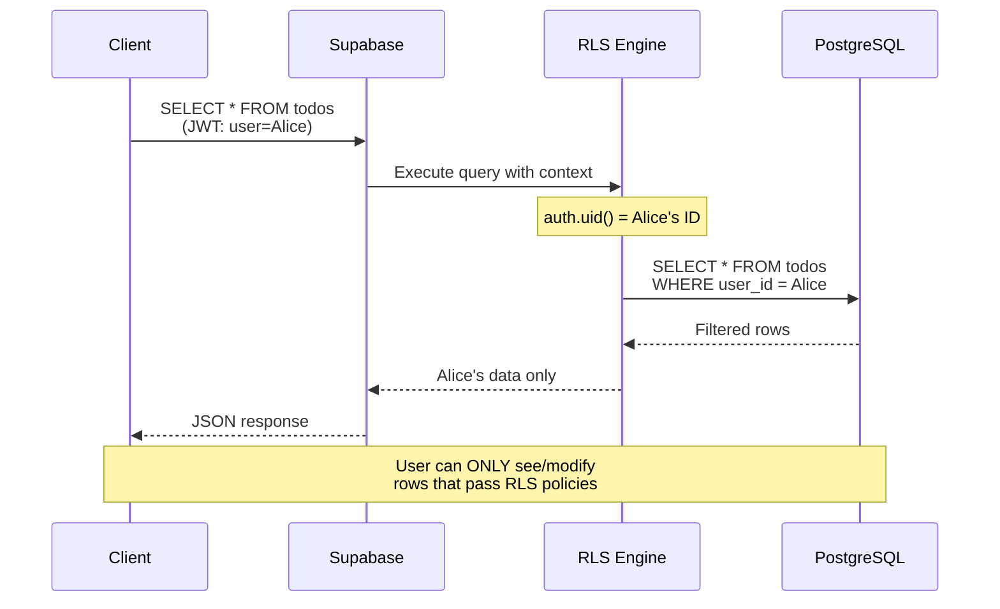
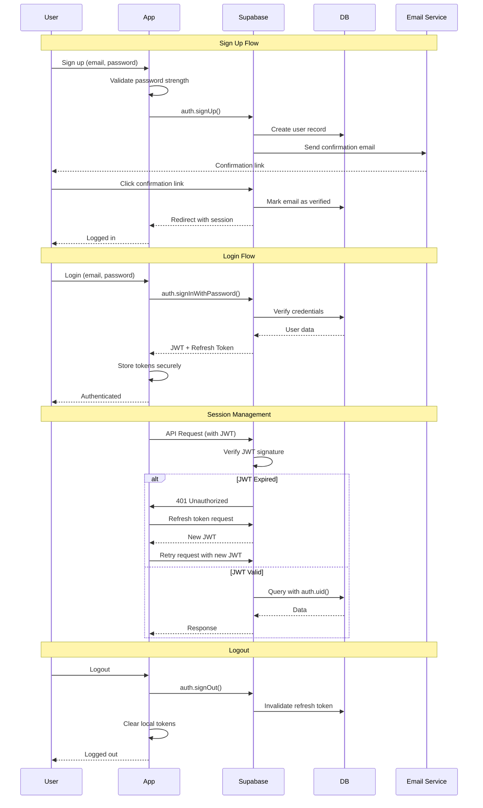
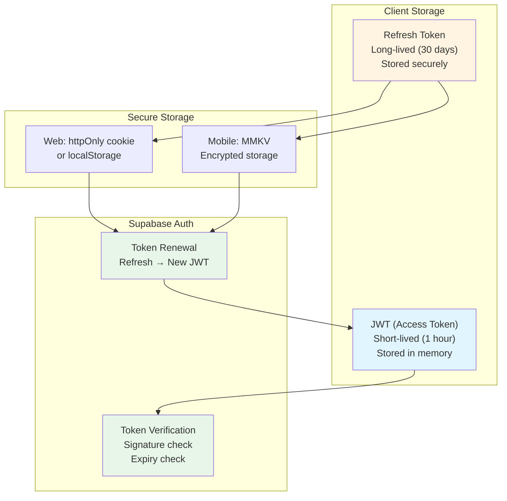
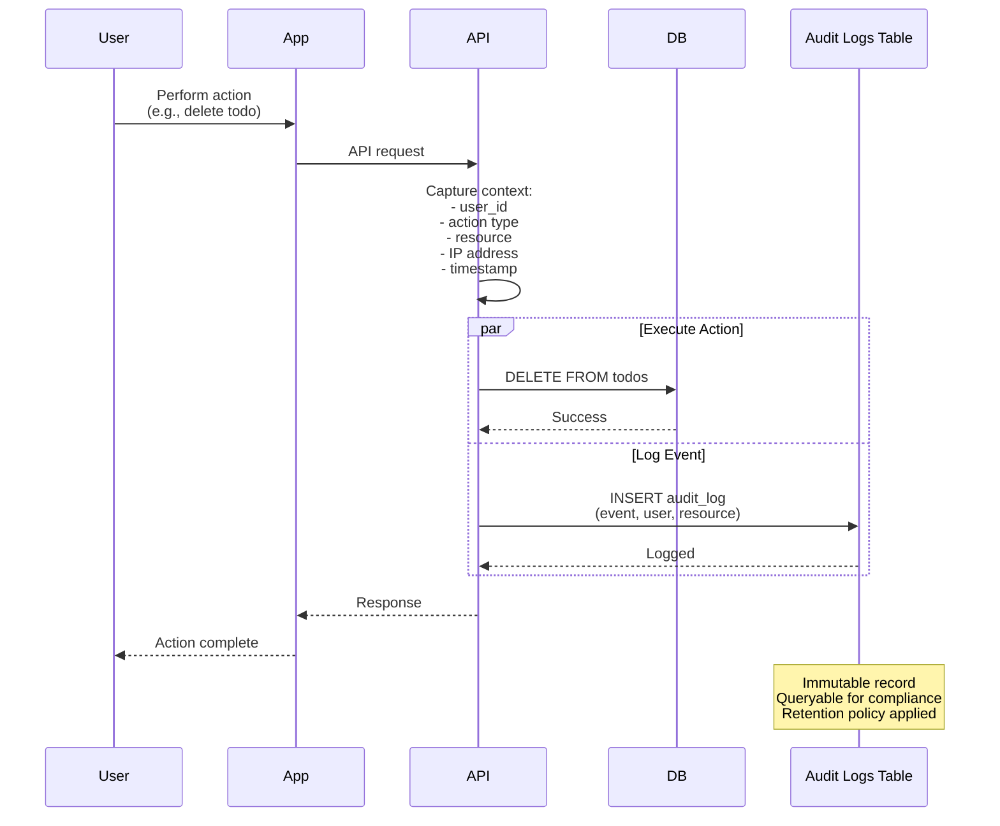
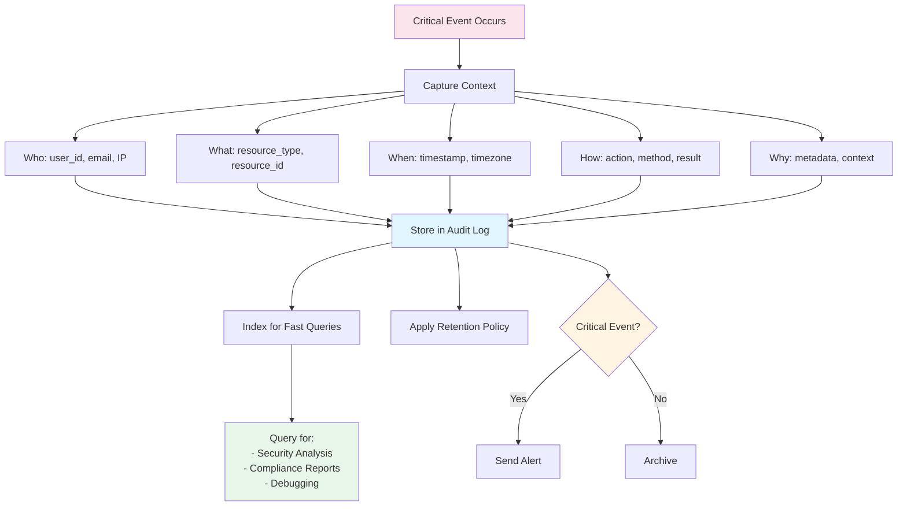

# Security Implementation Guide

Complete guide for implementing security best practices in your app.

---

## Table of Contents

- [Row Level Security (RLS)](#row-level-security-rls)
- [Authentication Security](#authentication-security)
- [Audit Logging](#audit-logging)
- [Secret Management](#secret-management)
- [API Security](#api-security)
- [Data Protection](#data-protection)
- [Frontend Security](#frontend-security)
- [CI/CD Security](#cicd-security)
- [Security Checklist](#security-checklist)

---

## Row Level Security (RLS)

### Why RLS is Critical

**Without RLS:** Any authenticated user can access all data in the database.

**With RLS:** Each user can only access their own data, enforced at the database level.

```mermaid
graph TB
    subgraph "Without RLS (INSECURE)"
        User1[User A] --> DB1[(Database)]
        User2[User B] --> DB1
        DB1 --> AllData1[ALL User Data<br/>❌ No isolation]
    end

    subgraph "With RLS (SECURE)"
        UserA[User A<br/>auth.uid()=111] --> DB2[(Database<br/>RLS Enabled)]
        UserB[User B<br/>auth.uid()=222] --> DB2

        DB2 --> |RLS Filter| DataA[User A's Data Only<br/>✅ Isolated]
        DB2 --> |RLS Filter| DataB[User B's Data Only<br/>✅ Isolated]

        UserA -.X.-> DataB
        UserB -.X.-> DataA
    end

    style AllData1 fill:#ffcccc
    style DataA fill:#ccffcc
    style DataB fill:#ccffcc
    style DB2 fill:#e1f5ff
```

### How RLS Works



### Implementing RLS on Supabase

#### Step 1: Enable RLS on All Tables

```sql
-- Enable RLS (do this for EVERY table)
ALTER TABLE profiles ENABLE ROW LEVEL SECURITY;
ALTER TABLE todos ENABLE ROW LEVEL SECURITY;
ALTER TABLE posts ENABLE ROW LEVEL SECURITY;
-- ... repeat for all tables
```

⚠️ **CRITICAL:** Tables without RLS enabled are accessible to ALL authenticated users!

#### Step 2: Create Policies for Each Operation

**Basic CRUD Policies:**

```sql
-- SELECT Policy (Read)
CREATE POLICY "Users can view own data"
  ON todos FOR SELECT
  USING (auth.uid() = user_id);

-- INSERT Policy (Create)
CREATE POLICY "Users can insert own data"
  ON todos FOR INSERT
  WITH CHECK (auth.uid() = user_id);

-- UPDATE Policy (Update)
CREATE POLICY "Users can update own data"
  ON todos FOR UPDATE
  USING (auth.uid() = user_id);

-- DELETE Policy (Delete)
CREATE POLICY "Users can delete own data"
  ON todos FOR DELETE
  USING (auth.uid() = user_id);
```

#### Step 3: Verify No Cross-Tenant Access

**Test with Two Different Users:**

```sql
-- User 1 (ID: user-111) creates a todo
INSERT INTO todos (id, user_id, title)
VALUES ('todo-1', 'user-111', 'User 1 Todo');

-- User 2 (ID: user-222) tries to access it
-- Switch to user-222's session
SELECT * FROM todos WHERE id = 'todo-1';
-- Should return ZERO rows (RLS blocks it)

-- User 2 tries to update it
UPDATE todos SET title = 'Hacked!' WHERE id = 'todo-1';
-- Should fail or affect ZERO rows

-- Verify user can only see their own data
SELECT * FROM todos;
-- Should only show todos where user_id = 'user-222'
```

### Advanced RLS Patterns

#### Public + Private Data

```sql
-- Posts table: Public for viewing, private for editing
CREATE POLICY "Anyone can view posts"
  ON posts FOR SELECT
  USING (true);  -- Public read

CREATE POLICY "Users can edit own posts"
  ON posts FOR UPDATE
  USING (auth.uid() = author_id);

CREATE POLICY "Users can delete own posts"
  ON posts FOR DELETE
  USING (auth.uid() = author_id);
```

#### Role-Based Access

```sql
-- Admins can see all data
CREATE POLICY "Admins can view all"
  ON todos FOR SELECT
  USING (
    auth.uid() = user_id
    OR (SELECT role FROM profiles WHERE id = auth.uid()) = 'admin'
  );
```

#### Shared Access

```sql
-- Team members can view shared todos
CREATE POLICY "View own or shared todos"
  ON todos FOR SELECT
  USING (
    auth.uid() = user_id
    OR EXISTS (
      SELECT 1 FROM todo_shares
      WHERE todo_id = todos.id
      AND user_id = auth.uid()
    )
  );
```

### RLS Testing Checklist

- [ ] RLS enabled on ALL tables
- [ ] Policies created for SELECT, INSERT, UPDATE, DELETE
- [ ] Tested with multiple user accounts
- [ ] Verified no cross-tenant data leakage
- [ ] Edge cases handled (null user_id, deleted users)
- [ ] Performance tested (policies use indexes)

---

## Authentication Security

### Complete Authentication Flow



### Token Security Architecture



### Password Requirements

```typescript
// Enforce on client side
const passwordSchema = z.string()
  .min(8, 'Minimum 8 characters')
  .regex(/[A-Z]/, 'Must contain uppercase letter')
  .regex(/[a-z]/, 'Must contain lowercase letter')
  .regex(/[0-9]/, 'Must contain number')
  .regex(/[^A-Za-z0-9]/, 'Must contain special character');

// Configure in Supabase Dashboard:
// Authentication → Providers → Email → Password Policy
```

### Session Security

```typescript
// Configure session timeout
const { data, error } = await supabase.auth.signInWithPassword({
  email,
  password,
});

// Set secure cookie options
const supabase = createClient(supabaseUrl, supabaseAnonKey, {
  auth: {
    persistSession: true,
    autoRefreshToken: true,
    detectSessionInUrl: true,
    flowType: 'pkce', // Use PKCE flow for enhanced security
  },
  global: {
    headers: {
      'X-Client-Info': 'your-app/1.0.0',
    },
  },
});
```

### Multi-Factor Authentication (MFA)

```typescript
// Enable MFA for high-value accounts
const { data, error } = await supabase.auth.mfa.enroll({
  factorType: 'totp',
  friendlyName: 'My Authenticator App',
});

// Verify MFA code
const { data, error } = await supabase.auth.mfa.verify({
  factorId: data.id,
  challengeId: challenge.id,
  code: userEnteredCode,
});
```

---

## Audit Logging

### Why Audit Logs are Critical

Audit logs provide a **reliable record of critical actions** for:
- 🔍 **Security analysis** - Detect unauthorized access attempts
- 📊 **Compliance** - Meet regulatory requirements (SOC 2, HIPAA, GDPR)
- 🐛 **Debugging** - Trace actions leading to issues
- 📈 **Analytics** - Understand user behavior patterns

### Audit Logging Architecture



### Audit Log Event Flow



### What to Log

**Critical Events to Audit:**
- ✅ Authentication events (login, logout, failed attempts)
- ✅ Authorization failures (access denied)
- ✅ Data modifications (create, update, delete)
- ✅ Privilege escalations (role changes)
- ✅ Configuration changes (settings updates)
- ✅ Sensitive data access (PII views/exports)
- ✅ Security events (password resets, MFA changes)

**What NOT to Log:**
- ❌ Passwords or credentials
- ❌ Full credit card numbers
- ❌ Social security numbers
- ❌ Other sensitive PII in plain text

### Implementing Audit Logs

#### Step 1: Create Audit Log Table

```sql
-- Audit logs table
CREATE TABLE audit_logs (
  id uuid PRIMARY KEY DEFAULT gen_random_uuid(),

  -- Event details
  event_type text NOT NULL,  -- 'auth.login', 'data.create', 'data.update', etc.
  event_action text NOT NULL, -- 'success', 'failure', 'attempt'
  severity text NOT NULL,     -- 'info', 'warning', 'error', 'critical'

  -- Actor (who did it)
  user_id uuid REFERENCES auth.users(id),
  user_email text,
  ip_address inet,
  user_agent text,

  -- Target (what was affected)
  resource_type text,  -- 'todo', 'user', 'post', etc.
  resource_id uuid,

  -- Context
  metadata jsonb,      -- Additional context
  error_message text,  -- If action failed

  -- Timestamps
  created_at timestamptz DEFAULT now(),

  -- Retention
  expires_at timestamptz  -- Auto-delete old logs
);

-- Index for fast queries
CREATE INDEX idx_audit_logs_user_id ON audit_logs(user_id);
CREATE INDEX idx_audit_logs_event_type ON audit_logs(event_type);
CREATE INDEX idx_audit_logs_created_at ON audit_logs(created_at);
CREATE INDEX idx_audit_logs_resource ON audit_logs(resource_type, resource_id);

-- Enable RLS (admins only can read)
ALTER TABLE audit_logs ENABLE ROW LEVEL SECURITY;

CREATE POLICY "Admins can view audit logs"
  ON audit_logs FOR SELECT
  USING (
    EXISTS (
      SELECT 1 FROM profiles
      WHERE id = auth.uid()
      AND role = 'admin'
    )
  );

-- No INSERT/UPDATE/DELETE policies - logs are append-only via triggers
```

#### Step 2: Create Audit Logging Functions

```sql
-- Generic audit log function
CREATE OR REPLACE FUNCTION log_audit_event(
  p_event_type text,
  p_event_action text,
  p_severity text,
  p_user_id uuid,
  p_resource_type text DEFAULT NULL,
  p_resource_id uuid DEFAULT NULL,
  p_metadata jsonb DEFAULT '{}'::jsonb,
  p_error_message text DEFAULT NULL
)
RETURNS void AS $$
BEGIN
  INSERT INTO audit_logs (
    event_type,
    event_action,
    severity,
    user_id,
    user_email,
    resource_type,
    resource_id,
    metadata,
    error_message,
    expires_at
  )
  VALUES (
    p_event_type,
    p_event_action,
    p_severity,
    p_user_id,
    (SELECT email FROM auth.users WHERE id = p_user_id),
    p_resource_type,
    p_resource_id,
    p_metadata,
    p_error_message,
    now() + interval '90 days'  -- Retain logs for 90 days
  );
END;
$$ LANGUAGE plpgsql SECURITY DEFINER;
```

#### Step 3: Automatic Triggers for Data Changes

```sql
-- Trigger function for todo table changes
CREATE OR REPLACE FUNCTION audit_todo_changes()
RETURNS TRIGGER AS $$
BEGIN
  IF (TG_OP = 'INSERT') THEN
    PERFORM log_audit_event(
      'data.create',
      'success',
      'info',
      auth.uid(),
      'todo',
      NEW.id,
      jsonb_build_object(
        'title', NEW.title,
        'completed', NEW.completed
      )
    );
    RETURN NEW;

  ELSIF (TG_OP = 'UPDATE') THEN
    PERFORM log_audit_event(
      'data.update',
      'success',
      'info',
      auth.uid(),
      'todo',
      NEW.id,
      jsonb_build_object(
        'old_values', jsonb_build_object(
          'title', OLD.title,
          'completed', OLD.completed
        ),
        'new_values', jsonb_build_object(
          'title', NEW.title,
          'completed', NEW.completed
        )
      )
    );
    RETURN NEW;

  ELSIF (TG_OP = 'DELETE') THEN
    PERFORM log_audit_event(
      'data.delete',
      'success',
      'warning',
      auth.uid(),
      'todo',
      OLD.id,
      jsonb_build_object(
        'deleted_title', OLD.title
      )
    );
    RETURN OLD;
  END IF;
END;
$$ LANGUAGE plpgsql SECURITY DEFINER;

-- Attach trigger to table
CREATE TRIGGER audit_todos_trigger
  AFTER INSERT OR UPDATE OR DELETE ON todos
  FOR EACH ROW
  EXECUTE FUNCTION audit_todo_changes();
```

#### Step 4: Application-Level Logging

```typescript
// lib/audit.ts
import { supabase } from './supabase';

export type AuditEventType =
  | 'auth.login'
  | 'auth.logout'
  | 'auth.login_failed'
  | 'auth.password_reset'
  | 'auth.mfa_enabled'
  | 'data.create'
  | 'data.update'
  | 'data.delete'
  | 'data.export'
  | 'permission.denied';

export type AuditSeverity = 'info' | 'warning' | 'error' | 'critical';

interface AuditLogParams {
  eventType: AuditEventType;
  eventAction: 'success' | 'failure' | 'attempt';
  severity: AuditSeverity;
  resourceType?: string;
  resourceId?: string;
  metadata?: Record<string, any>;
  errorMessage?: string;
}

export async function logAuditEvent({
  eventType,
  eventAction,
  severity,
  resourceType,
  resourceId,
  metadata = {},
  errorMessage,
}: AuditLogParams): Promise<void> {
  try {
    const { data: { user } } = await supabase.auth.getUser();

    const { error } = await supabase.rpc('log_audit_event', {
      p_event_type: eventType,
      p_event_action: eventAction,
      p_severity: severity,
      p_user_id: user?.id || null,
      p_resource_type: resourceType || null,
      p_resource_id: resourceId || null,
      p_metadata: metadata,
      p_error_message: errorMessage || null,
    });

    if (error) {
      // If audit logging fails, log to console but don't block the operation
      console.error('Failed to log audit event:', error);
    }
  } catch (err) {
    // Never let audit logging failure break the app
    console.error('Audit logging error:', err);
  }
}

// Helper functions for common events
export const auditLog = {
  loginSuccess: (userId: string) =>
    logAuditEvent({
      eventType: 'auth.login',
      eventAction: 'success',
      severity: 'info',
      metadata: { userId },
    }),

  loginFailed: (email: string, reason: string) =>
    logAuditEvent({
      eventType: 'auth.login_failed',
      eventAction: 'failure',
      severity: 'warning',
      metadata: { email },
      errorMessage: reason,
    }),

  permissionDenied: (resourceType: string, resourceId: string, action: string) =>
    logAuditEvent({
      eventType: 'permission.denied',
      eventAction: 'failure',
      severity: 'warning',
      resourceType,
      resourceId,
      metadata: { attemptedAction: action },
    }),

  dataExport: (resourceType: string, recordCount: number) =>
    logAuditEvent({
      eventType: 'data.export',
      eventAction: 'success',
      severity: 'info',
      resourceType,
      metadata: { recordCount },
    }),
};
```

#### Step 5: Usage Examples

```typescript
// Login handler
async function handleLogin(email: string, password: string) {
  try {
    const { data, error } = await supabase.auth.signInWithPassword({
      email,
      password,
    });

    if (error) {
      // Log failed login
      await auditLog.loginFailed(email, error.message);
      throw error;
    }

    // Log successful login
    await auditLog.loginSuccess(data.user.id);

    return data;
  } catch (error) {
    console.error('Login error:', error);
    throw error;
  }
}

// Export user data (GDPR compliance)
async function exportUserData(userId: string) {
  try {
    // Check permission
    const { data: { user } } = await supabase.auth.getUser();
    if (user?.id !== userId) {
      await auditLog.permissionDenied('user_data', userId, 'export');
      throw new Error('Permission denied');
    }

    // Export data
    const { data, error } = await supabase
      .from('todos')
      .select('*')
      .eq('user_id', userId);

    if (error) throw error;

    // Log the export
    await auditLog.dataExport('user_data', data.length);

    return data;
  } catch (error) {
    console.error('Export error:', error);
    throw error;
  }
}
```

### Querying Audit Logs

```typescript
// Get recent failed login attempts
async function getFailedLogins(limit = 50) {
  const { data, error } = await supabase
    .from('audit_logs')
    .select('*')
    .eq('event_type', 'auth.login_failed')
    .order('created_at', { ascending: false })
    .limit(limit);

  return data;
}

// Get user activity timeline
async function getUserActivity(userId: string, days = 30) {
  const since = new Date();
  since.setDate(since.getDate() - days);

  const { data, error } = await supabase
    .from('audit_logs')
    .select('*')
    .eq('user_id', userId)
    .gte('created_at', since.toISOString())
    .order('created_at', { ascending: false });

  return data;
}

// Get security events (critical severity)
async function getSecurityEvents(hours = 24) {
  const since = new Date();
  since.setHours(since.getHours() - hours);

  const { data, error } = await supabase
    .from('audit_logs')
    .select('*')
    .in('severity', ['error', 'critical'])
    .gte('created_at', since.toISOString())
    .order('created_at', { ascending: false });

  return data;
}
```

### Audit Log Retention

```sql
-- Function to clean up old audit logs
CREATE OR REPLACE FUNCTION cleanup_expired_audit_logs()
RETURNS void AS $$
BEGIN
  DELETE FROM audit_logs
  WHERE expires_at < now();
END;
$$ LANGUAGE plpgsql;

-- Schedule with pg_cron (if available)
-- SELECT cron.schedule('cleanup-audit-logs', '0 2 * * *', 'SELECT cleanup_expired_audit_logs()');

-- Or run manually/via cron job:
-- SELECT cleanup_expired_audit_logs();
```

### Audit Logging Best Practices

✅ **DO:**
- Log all security-critical events
- Include sufficient context (user, time, resource)
- Use structured data (JSONB) for searchability
- Set appropriate retention periods
- Make logs tamper-proof (append-only)
- Monitor logs for suspicious patterns

❌ **DON'T:**
- Log passwords or secrets
- Log full PII (redact sensitive fields)
- Let audit logging failures break app functionality
- Store logs forever (define retention)
- Allow users to delete their own audit logs

### Compliance Mapping

| Requirement | Implementation |
|-------------|----------------|
| **SOC 2** | Audit all access to sensitive data |
| **HIPAA** | Log all access to health records |
| **GDPR** | Log data exports, deletions, consent changes |
| **PCI DSS** | Log all access to cardholder data |
| **ISO 27001** | Maintain audit trails for security events |

---

## Secret Management

### ⚠️ Critical: Never Commit Secrets

**Bad (DON'T DO THIS):**
```typescript
// ❌ Hardcoded secret in code
const API_KEY = 'sk_live_12345abcdef';
const supabaseUrl = 'https://myproject.supabase.co';
```

**Good:**
```typescript
// ✅ Use environment variables
const API_KEY = process.env.API_KEY;
const supabaseUrl = process.env.SUPABASE_URL;
```

### Secret Types

| Secret Type | Safe to Expose? | Where to Store |
|-------------|----------------|----------------|
| **Supabase URL** | ✅ Yes (public) | Client-side env var |
| **Supabase Anon Key** | ✅ Yes (protected by RLS) | Client-side env var |
| **Supabase Service Role Key** | ❌ NO! (full DB access) | Server-side only, never in client |
| **API Keys (Stripe, etc.)** | ❌ NO! | Server-side only |
| **JWT Secrets** | ❌ NO! | Server-side only |

### Environment Variable Security

#### Mobile (Expo)

```bash
# .env.local (gitignored)
EXPO_PUBLIC_SUPABASE_URL=https://xxx.supabase.co
EXPO_PUBLIC_SUPABASE_ANON_KEY=eyJhbGc...

# ⚠️ Variables with EXPO_PUBLIC_ prefix are embedded in the app
# Never put secrets here!
```

**Access in code:**
```typescript
const supabaseUrl = process.env.EXPO_PUBLIC_SUPABASE_URL;
```

#### Web (Vite)

```bash
# .env.local (gitignored)
VITE_SUPABASE_URL=https://xxx.supabase.co
VITE_SUPABASE_ANON_KEY=eyJhbGc...

# ⚠️ Variables with VITE_ prefix are in client bundle
# Never put secrets here!
```

**Access in code:**
```typescript
const supabaseUrl = import.meta.env.VITE_SUPABASE_URL;
```

### .gitignore Verification

```bash
# Verify secrets are ignored
cat .gitignore | grep -E "\.env\.local|\.env\.production"

# If not found, add them:
echo ".env.local" >> .gitignore
echo ".env*.local" >> .gitignore
echo ".env.production" >> .gitignore
```

### Secret Rotation

**If a secret is accidentally exposed:**

1. **Immediately revoke** the exposed secret
2. **Generate new** secret
3. **Update** all environments
4. **Notify** team members
5. **Monitor** for unauthorized access

```bash
# Rotate Supabase keys:
# 1. Go to Supabase Dashboard → Settings → API
# 2. Click "Regenerate" for anon key
# 3. Update .env.local in all environments
# 4. Redeploy all services
```

---

## API Security

### Rate Limiting

```typescript
// Supabase Edge Function with rate limiting and error handling
import { serve } from 'https://deno.land/std@0.168.0/http/server.ts';
import { createClient } from 'https://esm.sh/@supabase/supabase-js@2';

const corsHeaders = {
  'Access-Control-Allow-Origin': '*',
  'Access-Control-Allow-Headers': 'authorization, x-client-info, apikey, content-type',
};

serve(async (req) => {
  try {
    // Handle CORS preflight
    if (req.method === 'OPTIONS') {
      return new Response('ok', { headers: corsHeaders });
    }

    // Validate required headers
    const userId = req.headers.get('x-user-id');
    if (!userId) {
      return new Response(
        JSON.stringify({ error: 'Missing user ID' }),
        {
          status: 400,
          headers: { ...corsHeaders, 'Content-Type': 'application/json' },
        }
      );
    }

    // Initialize Supabase client with error handling
    const supabaseUrl = Deno.env.get('SUPABASE_URL');
    const supabaseServiceKey = Deno.env.get('SUPABASE_SERVICE_ROLE_KEY');

    if (!supabaseUrl || !supabaseServiceKey) {
      console.error('Missing Supabase configuration');
      return new Response(
        JSON.stringify({ error: 'Server configuration error' }),
        {
          status: 500,
          headers: { ...corsHeaders, 'Content-Type': 'application/json' },
        }
      );
    }

    const supabase = createClient(supabaseUrl, supabaseServiceKey);

    // Check rate limit with error handling
    const { data: rateLimitData, error: rateLimitError } = await supabase
      .from('rate_limits')
      .select('count, window_start')
      .eq('user_id', userId)
      .single();

    // If database error, log it but allow request (fail open for availability)
    // For stricter security, fail closed by returning 503
    if (rateLimitError && rateLimitError.code !== 'PGRST116') {
      // PGRST116 = no rows returned
      console.error('Rate limit check failed:', rateLimitError);
      // Option 1: Fail open (allow request)
      // Continue to business logic...
      // Option 2: Fail closed (deny request) - uncomment below
      // return new Response(
      //   JSON.stringify({ error: 'Rate limit check unavailable' }),
      //   { status: 503, headers: { ...corsHeaders, 'Content-Type': 'application/json' } }
      // );
    }

    const now = Date.now();
    const windowMs = 60 * 1000; // 1 minute
    const maxRequests = 100;

    // Check if rate limit exceeded
    if (rateLimitData) {
      const timeSinceWindow = now - new Date(rateLimitData.window_start).getTime();

      if (timeSinceWindow < windowMs && rateLimitData.count >= maxRequests) {
        const retryAfter = Math.ceil((windowMs - timeSinceWindow) / 1000);

        return new Response(
          JSON.stringify({
            error: 'Rate limit exceeded',
            retryAfter,
            limit: maxRequests,
            window: `${windowMs / 1000}s`,
          }),
          {
            status: 429,
            headers: {
              ...corsHeaders,
              'Content-Type': 'application/json',
              'Retry-After': String(retryAfter),
              'X-RateLimit-Limit': String(maxRequests),
              'X-RateLimit-Remaining': '0',
              'X-RateLimit-Reset': String(Math.ceil((now + windowMs - timeSinceWindow) / 1000)),
            },
          }
        );
      }
    }

    // Update rate limit counter
    const { error: updateError } = await supabase.rpc('increment_rate_limit', {
      p_user_id: userId,
      p_window_ms: windowMs,
    });

    if (updateError) {
      console.error('Failed to update rate limit:', updateError);
      // Continue anyway - we already checked the limit
    }

    // Continue with business logic...
    // Your actual endpoint logic here

    return new Response(
      JSON.stringify({ success: true, message: 'Request processed' }),
      {
        status: 200,
        headers: { ...corsHeaders, 'Content-Type': 'application/json' },
      }
    );
  } catch (error) {
    // Catch-all error handler
    console.error('Unhandled error:', error);

    return new Response(
      JSON.stringify({
        error: 'Internal server error',
        message: error instanceof Error ? error.message : 'Unknown error',
      }),
      {
        status: 500,
        headers: { ...corsHeaders, 'Content-Type': 'application/json' },
      }
    );
  }
});
```

**Supporting Database Function:**

```sql
-- Function to atomically increment rate limit counter
CREATE OR REPLACE FUNCTION increment_rate_limit(
  p_user_id uuid,
  p_window_ms integer
)
RETURNS void AS $$
DECLARE
  v_window_start timestamptz;
  v_current_window timestamptz;
BEGIN
  v_current_window := now();

  -- Insert or update rate limit
  INSERT INTO rate_limits (user_id, count, window_start)
  VALUES (p_user_id, 1, v_current_window)
  ON CONFLICT (user_id)
  DO UPDATE SET
    count = CASE
      WHEN (EXTRACT(EPOCH FROM (v_current_window - rate_limits.window_start)) * 1000) > p_window_ms
      THEN 1  -- Reset counter for new window
      ELSE rate_limits.count + 1  -- Increment counter
    END,
    window_start = CASE
      WHEN (EXTRACT(EPOCH FROM (v_current_window - rate_limits.window_start)) * 1000) > p_window_ms
      THEN v_current_window  -- New window
      ELSE rate_limits.window_start  -- Keep existing window
    END;
END;
$$ LANGUAGE plpgsql;
```

### Input Validation

```typescript
import { z } from 'zod';

// Define schema with comprehensive validation
const createTodoSchema = z.object({
  title: z.string()
    .min(1, 'Title required')
    .max(500, 'Title too long')
    .trim()
    .refine(
      (val) => val.length > 0 && /\S/.test(val),
      'Title cannot be only whitespace'
    ),
  description: z.string()
    .max(5000, 'Description too long')
    .trim()
    .optional(),
  due_date: z.string()
    .datetime({ message: 'Invalid date format' })
    .optional()
    .refine(
      (val) => !val || new Date(val) > new Date(),
      'Due date must be in the future'
    ),
  priority: z.enum(['high', 'medium', 'low'])
    .optional()
    .default('medium'),
  tags: z.array(z.string().max(50))
    .max(10, 'Maximum 10 tags allowed')
    .optional(),
});

// Validate input with comprehensive error handling
async function createTodo(input: unknown) {
  try {
    // Validate and sanitize input
    const validated = createTodoSchema.parse(input);

    // Additional business logic validation
    if (validated.tags && validated.tags.length > 0) {
      // Check for duplicate tags (case-insensitive)
      const uniqueTags = new Set(validated.tags.map((t) => t.toLowerCase()));
      if (uniqueTags.size !== validated.tags.length) {
        throw new Error('Duplicate tags are not allowed');
      }
    }

    // Use validated data (SQL injection safe)
    const { data, error } = await supabase
      .from('todos')
      .insert({
        ...validated,
        user_id: (await supabase.auth.getUser()).data.user?.id,
      })
      .select()
      .single();

    // Handle database errors
    if (error) {
      console.error('Database error creating todo:', error);

      // Map database errors to user-friendly messages
      if (error.code === '23505') {
        // Unique constraint violation
        throw new Error('A todo with this title already exists');
      } else if (error.code === '23503') {
        // Foreign key violation
        throw new Error('Invalid user reference');
      } else if (error.code === '42501') {
        // Insufficient privilege (RLS policy blocked)
        throw new Error('Permission denied');
      }

      throw new Error('Failed to create todo');
    }

    // Success - return created todo
    return {
      success: true,
      data,
    };
  } catch (error) {
    // Handle Zod validation errors
    if (error instanceof z.ZodError) {
      return {
        success: false,
        error: 'Validation failed',
        validationErrors: error.errors.map((err) => ({
          field: err.path.join('.'),
          message: err.message,
        })),
      };
    }

    // Handle custom errors
    if (error instanceof Error) {
      return {
        success: false,
        error: error.message,
      };
    }

    // Handle unknown errors
    console.error('Unexpected error:', error);
    return {
      success: false,
      error: 'An unexpected error occurred',
    };
  }
}

// Usage example with error handling
async function handleCreateTodoSubmit(formData: FormData) {
  const input = {
    title: formData.get('title'),
    description: formData.get('description'),
    due_date: formData.get('due_date'),
    priority: formData.get('priority'),
    tags: formData.getAll('tags'),
  };

  const result = await createTodo(input);

  if (!result.success) {
    // Display validation errors to user
    if (result.validationErrors) {
      result.validationErrors.forEach(({ field, message }) => {
        console.error(`${field}: ${message}`);
      });
    } else {
      console.error(result.error);
    }
    return;
  }

  // Success - show confirmation
  console.log('Todo created:', result.data);
}
```

**Edge Cases Handled:**
- ✅ Empty or whitespace-only input
- ✅ Input exceeding maximum lengths
- ✅ Invalid date formats
- ✅ Past due dates
- ✅ Duplicate tags
- ✅ Too many tags
- ✅ SQL injection attempts (via Zod validation + parameterized queries)
- ✅ Database constraint violations
- ✅ RLS policy violations

### CORS Configuration

```typescript
// Supabase Edge Function CORS
const corsHeaders = {
  'Access-Control-Allow-Origin': 'https://yourdomain.com', // ⚠️ Never use '*' in production
  'Access-Control-Allow-Headers': 'authorization, x-client-info, apikey, content-type',
};

serve(async (req) => {
  // Handle CORS preflight
  if (req.method === 'OPTIONS') {
    return new Response('ok', { headers: corsHeaders });
  }

  // Your logic here...

  return new Response(JSON.stringify(data), {
    headers: { ...corsHeaders, 'Content-Type': 'application/json' },
  });
});
```

---

## Data Protection

### Encryption

**In Transit:**
- ✅ HTTPS/TLS 1.3 enforced
- ✅ Certificate pinning (mobile apps)
- ✅ No unencrypted HTTP

**At Rest:**
- ✅ Database encrypted (Supabase default)
- ✅ File storage encrypted (Supabase Storage)
- ✅ Backups encrypted

### Sensitive Data Handling

```typescript
// ❌ Bad: Logging sensitive data
console.log('User password:', password);
console.log('Credit card:', creditCard);

// ✅ Good: Redact sensitive data
console.log('User authenticated:', { userId: user.id });
console.log('Payment processed:', { last4: card.last4 });
```

### PII Compliance (GDPR/CCPA)

```sql
-- Allow users to export their data
CREATE FUNCTION export_user_data(user_id UUID)
RETURNS JSON AS $$
  SELECT json_build_object(
    'profile', (SELECT * FROM profiles WHERE id = user_id),
    'todos', (SELECT json_agg(*) FROM todos WHERE user_id = user_id),
    'posts', (SELECT json_agg(*) FROM posts WHERE author_id = user_id)
  );
$$ LANGUAGE SQL;

-- Allow users to delete their data
CREATE FUNCTION delete_user_data(user_id UUID)
RETURNS VOID AS $$
  DELETE FROM profiles WHERE id = user_id;
  DELETE FROM todos WHERE user_id = user_id;
  DELETE FROM posts WHERE author_id = user_id;
  -- Cascade deletes handle related data
$$ LANGUAGE SQL;
```

---

## Frontend Security

### XSS Prevention

```tsx
// ✅ React escapes by default
<div>{userInput}</div>  // Safe

// ⚠️ Dangerous: dangerouslySetInnerHTML
<div dangerouslySetInnerHTML={{ __html: userInput }} />  // Unsafe!

// ✅ If you must render HTML, sanitize first
import DOMPurify from 'dompurify';

<div dangerouslySetInnerHTML={{
  __html: DOMPurify.sanitize(userInput)
}} />
```

### Content Security Policy

```typescript
// Add CSP headers (in your hosting config)
const cspHeader = [
  "default-src 'self'",
  "script-src 'self' 'unsafe-inline' 'unsafe-eval'",
  "style-src 'self' 'unsafe-inline'",
  "img-src 'self' data: https:",
  "font-src 'self'",
  "connect-src 'self' https://*.supabase.co",
  "frame-ancestors 'none'",
].join('; ');
```

---

## CI/CD Security

### GitHub Actions Secrets

```yaml
# .github/workflows/deploy.yml
name: Deploy

on:
  push:
    branches: [main]

jobs:
  deploy:
    runs-on: ubuntu-latest
    steps:
      - uses: actions/checkout@v3

      - name: Deploy
        env:
          SUPABASE_ACCESS_TOKEN: ${{ secrets.SUPABASE_ACCESS_TOKEN }}
          SUPABASE_PROJECT_ID: ${{ secrets.SUPABASE_PROJECT_ID }}
        run: |
          # Secrets are available as env vars
          # Never echo secrets in logs!
```

**Set secrets in GitHub:**
```
Settings → Secrets and variables → Actions → New repository secret
```

---

## Security Checklist

### Pre-Launch Security Audit

**Database:**
- [ ] RLS enabled on ALL tables
- [ ] RLS policies tested with multiple users
- [ ] No service role key in client code
- [ ] Database backups configured
- [ ] Sensitive columns encrypted if needed

**Authentication:**
- [ ] Strong password requirements enforced
- [ ] Session timeout configured
- [ ] MFA available for sensitive accounts
- [ ] Email verification enabled
- [ ] OAuth providers configured securely
- [ ] Failed login attempts logged

**Audit Logging:**
- [ ] Audit log table created with proper indexes
- [ ] All authentication events logged (login, logout, failures)
- [ ] Data modifications logged (create, update, delete)
- [ ] Authorization failures logged
- [ ] Sensitive data access logged (exports, admin actions)
- [ ] Log retention policy configured (90 days recommended)
- [ ] Audit logs are append-only (no user deletions)
- [ ] Admin-only access to audit logs (RLS policy)
- [ ] Automated cleanup of expired logs

**Secrets:**
- [ ] No secrets in git history
- [ ] `.env.local` in `.gitignore`
- [ ] Different credentials per environment
- [ ] Secrets stored in CI/CD secret manager
- [ ] Service keys never in client code

**API:**
- [ ] Rate limiting implemented with error handling
- [ ] Input validation on all endpoints
- [ ] CORS properly configured
- [ ] SQL injection prevention verified
- [ ] Error messages don't leak sensitive info
- [ ] All API errors handled gracefully
- [ ] Database errors mapped to user-friendly messages

**Error Handling:**
- [ ] Try-catch blocks around all async operations
- [ ] Database errors caught and logged
- [ ] Validation errors return helpful messages
- [ ] Edge cases handled (null, undefined, empty strings)
- [ ] Graceful degradation on service failures
- [ ] Error logging doesn't expose secrets
- [ ] User-friendly error messages (no stack traces to users)

**Frontend:**
- [ ] XSS prevention verified
- [ ] CSP headers configured
- [ ] No sensitive data in localStorage
- [ ] HTTPS enforced
- [ ] Dependencies security scanned

**CI/CD:**
- [ ] Branch protection enabled
- [ ] Required status checks
- [ ] Signed commits (optional)
- [ ] Dependabot enabled
- [ ] Security scanning in pipeline

---

## Tools & Resources

**Security Scanning:**
- [Dependabot](https://github.com/dependabot) - Dependency updates
- [Snyk](https://snyk.io/) - Vulnerability scanning
- [npm audit](https://docs.npmjs.com/cli/v8/commands/npm-audit) - Package security

**Penetration Testing:**
- [OWASP ZAP](https://www.zaproxy.org/) - Security testing
- [Burp Suite](https://portswigger.net/burp) - Web security testing

**Compliance:**
- [OWASP Top 10](https://owasp.org/www-project-top-ten/) - Security risks
- [CWE Top 25](https://cwe.mitre.org/top25/) - Dangerous weaknesses
- [GDPR Compliance](https://gdpr.eu/) - Privacy compliance

---

**Next Steps:**
1. Review this guide
2. Implement RLS policies
3. Audit secret management
4. Run security checklist
5. Schedule regular security reviews
