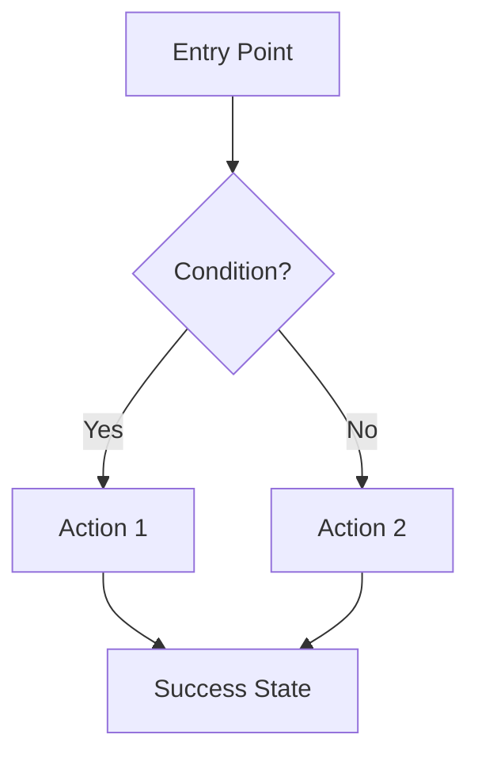

# Feature Specification

| Field | Value |
|-------|-------|
| **Feature Name** | |
| **Feature ID** | FEAT-XXX |
| **Related PRD** | [Link to parent PRD] |
| **Status** | `Draft` `Review` `Approved` `In Development` `Shipped` |
| **Owner** | |
| **Created** | YYYY-MM-DD |
| **Last Updated** | YYYY-MM-DD |

---

## Overview

### Problem Statement
> What user problem does this feature solve?

### Success Metric
> How will we know this feature is successful?

**Target:** `[Specific measurable goal]`

---

## User Stories

| ID | Story | Acceptance Criteria | Priority |
|----|-------|---------------------|----------|
| US-1 | As a [user], I want to [action] so that [benefit] | • Given [context]<br>• When [action]<br>• Then [outcome] | P0 |
| US-2 | | | P1 |

---

## User Flow



### Flow Description

1. **Entry Point:** How users access this feature
2. **Main Path:** Happy path steps
3. **Edge Cases:** Alternative flows
4. **Exit/Success:** What happens on completion

---

## Functional Requirements

### Must Have (P0)

**FR-1: [Requirement Name]**
- Description:
- Business Rule:
- Error Handling:

**FR-2: [Requirement Name]**
- Description:
- Business Rule:
- Error Handling:

### Should Have (P1)

**FR-3: [Requirement Name]**
- Description:

### Nice to Have (P2)

**FR-4: [Requirement Name]**
- Description:
- Defer Reason:

---

## Non-Functional Requirements

### Performance
- Response time target:
- Load time target:

### Security
- Auth required: `Yes` `No`
- RLS policy needed: `Yes` `No`
- Rate limiting:

### Accessibility
- [ ] Keyboard navigable
- [ ] Screen reader friendly
- [ ] Color contrast compliant

---

## Technical Design

### Data Model Changes

**New Tables:**
```sql
CREATE TABLE [table_name] (
    id UUID PRIMARY KEY DEFAULT gen_random_uuid(),
    -- fields
    created_at TIMESTAMPTZ DEFAULT NOW(),
    updated_at TIMESTAMPTZ DEFAULT NOW()
);

-- RLS Policies
ALTER TABLE [table_name] ENABLE ROW LEVEL SECURITY;
```

**Schema Changes:**
```sql
-- Add columns, indexes, etc.
```

### API Endpoints

| Method | Endpoint | Description | Auth |
|--------|----------|-------------|------|
| GET | /api/[resource] | | Required |
| POST | /api/[resource] | | Required |

### Component Structure

```
components/
├── FeatureName/
│   ├── index.tsx          # Main component
│   ├── FeatureName.test.tsx
│   ├── useFeatureName.ts  # Custom hook
│   └── types.ts           # TypeScript types
```

### State Management

**Zustand Store:**
```typescript
interface FeatureState {
  // State
  data: Item[] | null;
  isLoading: boolean;
  error: string | null;

  // Actions
  fetchData: () => Promise<void>;
  reset: () => void;
}
```

---

## UI/UX Specifications

### Wireframes
| Screen | Link | Status |
|--------|------|--------|
| Main | [Figma] | Draft |

### Design Tokens
- Primary action color:
- Spacing:
- Typography:

### Animations
- Entry animation:
- Transition:
- Loading state:

---

## Testing Requirements

### Unit Tests
- [ ] Core logic tested
- [ ] Edge cases covered
- [ ] Error states tested

### Integration Tests
- [ ] API integration tested
- [ ] Auth flow tested

### E2E Tests
```typescript
// Playwright/Detox test scenario
test('Feature happy path', async () => {
  // Steps
});
```

---

## Dependencies

| Dependency | Type | Owner | Status |
|------------|------|-------|--------|
| | `Internal` `External` | | |

---

## Rollout Plan

### Phase 1: Internal Testing
- Timeline:
- Success criteria:

### Phase 2: Beta
- Timeline:
- User group:
- Success criteria:

### Phase 3: General Availability
- Timeline:
- Feature flag removed:

---

## Rollback Plan

**Trigger conditions:**
- Error rate > X%
- Performance degradation

**Rollback steps:**
1. Disable feature flag
2. Notify stakeholders
3. Investigate root cause

---

## Documentation

- [ ] User documentation updated
- [ ] API documentation updated
- [ ] Changelog entry added

---

## Checklist

**Before Development:**
- [ ] PRD reviewed and approved
- [ ] Technical design reviewed
- [ ] Dependencies identified

**During Development:**
- [ ] Feature branch created
- [ ] Unit tests written
- [ ] Code reviewed

**Before Launch:**
- [ ] QA testing complete
- [ ] Documentation updated
- [ ] Feature flag configured
- [ ] Monitoring alerts set up

---

**Approved By:**

| Role | Name | Date |
|------|------|------|
| Product | | |
| Engineering | | |
| Design | | |
