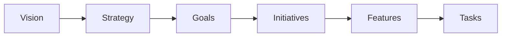
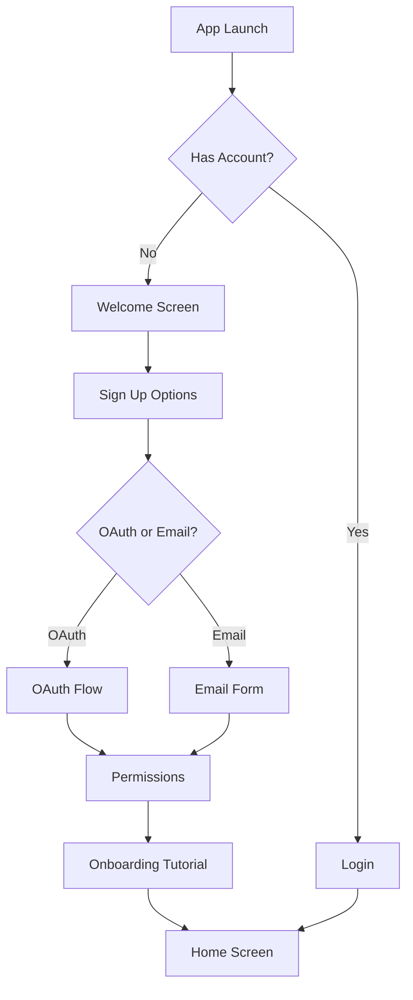
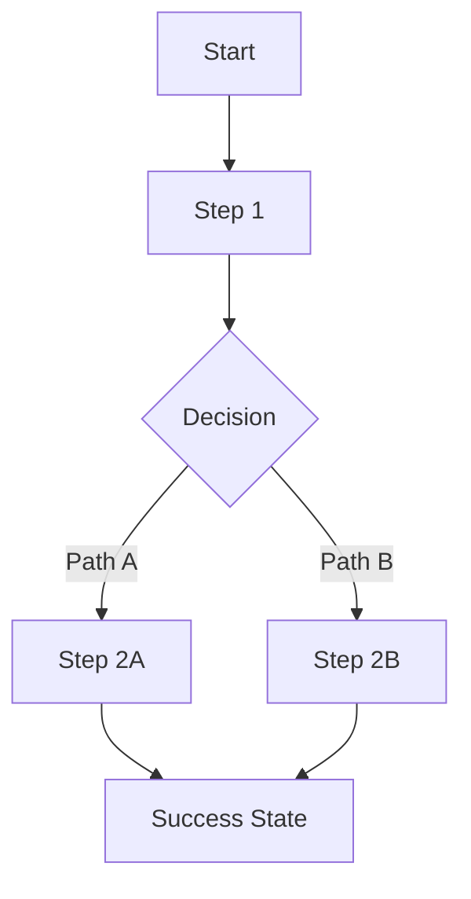
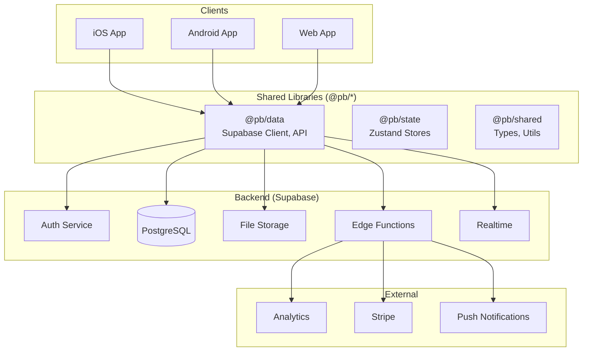
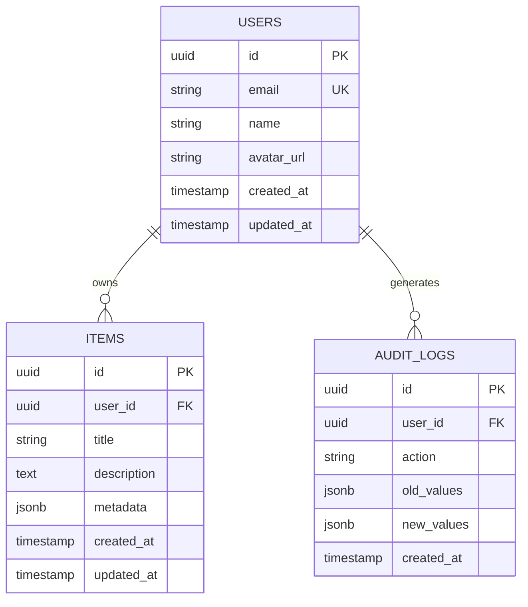
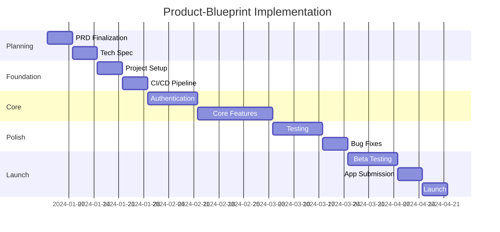

# Product Requirements Document (PRD)

| Field | Value |
|-------|-------|
| **Product Name** | [Your Product Name] |
| **Version** | 1.0.0 |
| **Document ID** | PRD-[PRODUCT]-001 |
| **Status** | `Draft` `Review` `Approved` `In Development` `Shipped` |
| **Created** | [YYYY-MM-DD] |
| **Last Updated** | [YYYY-MM-DD] |
| **Owner** | [Product Owner Name] |
| **Stakeholders** | [List key stakeholders] |

---

## Document Control

### Revision History

| Version | Date | Author | Changes | Status |
|---------|------|--------|---------|--------|
| 0.1 | [Date] | [Author] | Initial draft | Draft |
| 0.2 | [Date] | [Author] | Incorporated feedback | Review |
| 1.0 | [Date] | [Author] | Approved for development | Approved |

### Approval Signatures

| Role | Name | Signature | Date |
|------|------|-----------|------|
| Product Owner | | | |
| Engineering Lead | | | |
| Design Lead | | | |
| Stakeholder | | | |

---

## Table of Contents

1. [Executive Summary](#1-executive-summary)
2. [Product Vision & Strategy](#2-product-vision--strategy)
3. [Market Analysis](#3-market-analysis)
4. [Target Audience](#4-target-audience)
5. [Problem Statement](#5-problem-statement)
6. [Goals & Success Metrics](#6-goals--success-metrics)
7. [User Stories](#7-user-stories)
8. [Features & Requirements](#8-features--requirements)
9. [User Experience](#9-user-experience)
10. [Technical Architecture](#10-technical-architecture)
11. [Security & Compliance](#11-security--compliance)
12. [Scalability & Growth](#12-scalability--growth)
13. [Analytics & Monitoring](#13-analytics--monitoring)
14. [Quality Attributes](#14-quality-attributes)
15. [Constraints & Assumptions](#15-constraints--assumptions)
16. [Scope Management](#16-scope-management)
17. [Implementation Roadmap](#17-implementation-roadmap)
18. [Risk Management](#18-risk-management)
19. [Appendices](#19-appendices)

---

## 1. Executive Summary

### Product Overview

> _One compelling paragraph that captures the essence of the product, its target audience, and the core value proposition._

[Your product overview here - aim for 50-100 words that could be understood by an executive in 30 seconds.]

### Strategic Alignment

| Business Objective | Product Contribution | Priority |
|-------------------|---------------------|----------|
| [Objective 1] | [How product supports this] | High |
| [Objective 2] | [How product supports this] | Medium |
| [Objective 3] | [How product supports this] | Low |

### Key Facts

| Attribute | Value |
|-----------|-------|
| **Target Platforms** | iOS, Android, Web |
| **Target Markets** | [Geographic regions] |
| **Business Model** | [Subscription / Freemium / One-time / etc.] |
| **MVP Timeline** | [X weeks/months] |
| **Team Size** | [Estimated headcount] |
| **Budget Range** | [If applicable] |

### Success Snapshot

> _What does success look like in one year? Provide a vivid picture of the desired outcome._

[Describe the end state you're aiming for]

---

## 2. Product Vision & Strategy

### Vision Statement

> _A concise, aspirational statement describing the long-term impact of the product._

**Template:** "To [target audience], [product name] is the [category] that [key benefit] because [unique differentiator]."

**Your Vision:**
```
[Your vision statement here]
```

### Mission

> _What the product does day-to-day to achieve the vision._

**Your Mission:**
```
[Your mission statement here]
```

### Product Principles

_Core beliefs that guide product decisions:_

1. **[Principle 1]:** [Description and how it guides decisions]
2. **[Principle 2]:** [Description and how it guides decisions]
3. **[Principle 3]:** [Description and how it guides decisions]
4. **[Principle 4]:** [Description and how it guides decisions]
5. **[Principle 5]:** [Description and how it guides decisions]

### Product Strategy



**Strategic Pillars:**

| Pillar | Description | Key Initiatives |
|--------|-------------|-----------------|
| [Pillar 1] | [What this pillar means] | [Initiative 1.1, 1.2] |
| [Pillar 2] | [What this pillar means] | [Initiative 2.1, 2.2] |
| [Pillar 3] | [What this pillar means] | [Initiative 3.1, 3.2] |

---

## 3. Market Analysis

### Market Opportunity

**Total Addressable Market (TAM):** [Size and source]
**Serviceable Addressable Market (SAM):** [Size and source]
**Serviceable Obtainable Market (SOM):** [Size and source]

### Competitive Landscape

| Competitor | Strengths | Weaknesses | Our Advantage |
|------------|-----------|------------|---------------|
| [Competitor 1] | | | |
| [Competitor 2] | | | |
| [Competitor 3] | | | |

### Competitive Positioning Matrix

```
                        High Feature Richness
                              │
           [Competitor A]     │     [Competitor B]
                              │
    Low Price ────────────────┼──────────────── High Price
                              │
           [Competitor C]     │     ● [Our Product]
                              │
                        Low Feature Richness
```

### Differentiation Strategy

**What we do differently:**
1. [Differentiator 1]
2. [Differentiator 2]
3. [Differentiator 3]

**What we do better:**
1. [Advantage 1]
2. [Advantage 2]
3. [Advantage 3]

---

## 4. Target Audience

### Primary User Segment

| Attribute | Description |
|-----------|-------------|
| **Demographics** | Age, gender, income, education, location |
| **Psychographics** | Values, interests, lifestyle, personality |
| **Technographics** | Device usage, tech comfort, app preferences |
| **Behavioral** | Usage patterns, brand loyalty, purchasing habits |

### Secondary User Segments

| Segment | Description | Opportunity Size |
|---------|-------------|------------------|
| [Segment 2] | | |
| [Segment 3] | | |

### User Personas

#### Persona 1: [Name] - Primary

| Attribute | Details |
|-----------|---------|
| **Photo** | [Image placeholder] |
| **Tagline** | "[Catchy phrase that describes them]" |
| **Age/Occupation** | [e.g., 32, Product Manager at Tech Startup] |
| **Goals** | • Primary goal<br>• Secondary goal<br>• Tertiary goal |
| **Pain Points** | • Pain point 1<br>• Pain point 2<br>• Pain point 3 |
| **Current Solutions** | How they solve the problem today |
| **Tech Proficiency** | Beginner | Intermediate | Advanced |
| **Devices Used** | iPhone, MacBook, iPad, etc. |
| **Quote** | "A direct quote that captures their perspective" |

**A Day in the Life:**
```
[Describe a typical day for this persona, highlighting touchpoints with the problem space]
```

#### Persona 2: [Name] - Secondary

[Repeat persona template above]

---

## 5. Problem Statement

### The Core Problem

**Problem Framing (5 Whys):**

1. **Why is this a problem?** [Answer]
2. **Why does that matter?** [Answer]
3. **Why is that happening?** [Answer]
4. **Why hasn't it been solved?** [Answer]
5. **Why is now the right time?** [Answer]

### Problem Validation

| Evidence Type | Source | Key Finding |
|---------------|--------|-------------|
| User Interviews | [Number] interviews | [Key insight] |
| Survey Data | [Number] responses | [Key statistic] |
| Market Research | [Source] | [Key finding] |
| Competitor Analysis | [Analysis] | [Gap identified] |
| Internal Data | [Source] | [Key metric] |

### Impact Quantification

| Impact Area | Current State | Cost of Inaction |
|-------------|---------------|------------------|
| User Time | [Hours wasted] | [Annual cost] |
| Business Revenue | [Lost revenue] | [Annual impact] |
| User Satisfaction | [Current NPS] | [Churn rate] |
| Market Position | [Current share] | [Projected loss] |

---

## 6. Goals & Success Metrics

### North Star Metric

> _The single metric that best captures the core value your product delivers to customers._

**North Star:** `[Your North Star Metric]`

**Rationale:** [Why this metric represents product value]

### Objectives and Key Results (OKRs)

#### Objective 1: [High-level goal]

| Key Result | Target | Measurement Method | Owner |
|------------|--------|-------------------|-------|
| KR 1.1: [Specific outcome] | [Metric + Target] | [How measured] | [Name] |
| KR 1.2: [Specific outcome] | [Metric + Target] | [How measured] | [Name] |
| KR 1.3: [Specific outcome] | [Metric + Target] | [How measured] | [Name] |

#### Objective 2: [High-level goal]

| Key Result | Target | Measurement Method | Owner |
|------------|--------|-------------------|-------|
| KR 2.1: [Specific outcome] | [Metric + Target] | [How measured] | [Name] |
| KR 2.2: [Specific outcome] | [Metric + Target] | [How measured] | [Name] |

### Key Performance Indicators (KPIs)

#### Acquisition Metrics

| Metric | Current Baseline | Target (30d) | Target (90d) | Target (1y) |
|--------|-----------------|--------------|--------------|-------------|
| App Downloads | - | | | |
| Website Visitors | - | | | |
| Sign-up Rate | - | | | |
| CAC (Customer Acquisition Cost) | - | | | |

#### Engagement Metrics

| Metric | Current Baseline | Target (30d) | Target (90d) | Target (1y) |
|--------|-----------------|--------------|--------------|-------------|
| DAU (Daily Active Users) | - | | | |
| MAU (Monthly Active Users) | - | | | |
| DAU/MAU Ratio | - | | | |
| Session Duration | - | | | |
| Sessions per User per Day | - | | | |
| Feature Adoption Rate | - | | | |

#### Retention Metrics

| Metric | Current Baseline | Target (30d) | Target (90d) | Target (1y) |
|--------|-----------------|--------------|--------------|-------------|
| Day 1 Retention | - | | | |
| Day 7 Retention | - | | | |
| Day 30 Retention | - | | | |
| Churn Rate | - | | | |

#### Revenue Metrics (if applicable)

| Metric | Current Baseline | Target (30d) | Target (90d) | Target (1y) |
|--------|-----------------|--------------|--------------|-------------|
| MRR (Monthly Recurring Revenue) | - | | | |
| ARPU (Average Revenue Per User) | - | | | |
| LTV (Lifetime Value) | - | | | |
| LTV:CAC Ratio | - | | | |
| Conversion to Paid | - | | | |

### Success Criteria

**Launch Criteria (Must Meet All):**
- [ ] [Criterion 1]
- [ ] [Criterion 2]
- [ ] [Criterion 3]

**Success Thresholds (3 Months Post-Launch):**

| Outcome | Minimum | Target | Exceptional |
|---------|---------|--------|-------------|
| [Metric 1] | | | |
| [Metric 2] | | | |
| [Metric 3] | | | |

---

## 7. User Stories

### Story Map Overview

```
┌─────────────────────────────────────────────────────────────────┐
│                        USER ACTIVITIES                          │
├─────────────────┬─────────────────┬─────────────────────────────┤
│   Onboarding    │   Core Task 1   │      Core Task 2            │
├─────────────────┼─────────────────┼─────────────────────────────┤
│ MVP Stories     │ MVP Stories     │ MVP Stories                 │
├─────────────────┼─────────────────┼─────────────────────────────┤
│ Future Stories  │ Future Stories  │ Future Stories              │
└─────────────────┴─────────────────┴─────────────────────────────┘
```

### Epic 1: Authentication & Onboarding

**Epic Goal:** Enable users to create accounts and understand product value within 2 minutes.

| ID | Story | Acceptance Criteria | Priority | Estimate |
|----|-------|---------------------|----------|----------|
| US-1.1 | As a new user, I want to sign up with my email so I can create an account | • Email validation works<br>• Password strength enforced<br>• Confirmation email sent | P0 | 3pts |
| US-1.2 | As a new user, I want to sign up with Google/Apple so I can skip form filling | • OAuth flow completes<br>• Profile data pre-filled<br>• Error handling | P0 | 3pts |
| US-1.3 | As a returning user, I want to log in quickly so I can access my data | • Email/password login<br>• "Remember me" option<br>• Biometric auth on mobile | P0 | 2pts |
| US-1.4 | As a new user, I want a guided tour so I understand key features | • 3-5 step onboarding<br>• Skippable<br>• Progress indicator | P1 | 3pts |

### Epic 2: [Core Feature Area]

**Epic Goal:** [What this epic accomplishes for the user]

| ID | Story | Acceptance Criteria | Priority | Estimate |
|----|-------|---------------------|----------|----------|
| US-2.1 | As a [user type], I want to [action] so that [benefit] | • [Criteria 1]<br>• [Criteria 2]<br>• [Criteria 3] | P0 | Xpts |
| US-2.2 | As a [user type], I want to [action] so that [benefit] | • [Criteria 1]<br>• [Criteria 2] | P1 | Xpts |

### Story Prioritization Matrix

```
                    High Value
                        │
    P1 (Schedule)       │       P0 (MVP)
                        │
    ────────────────────┼────────────────
                        │
    P2 (Backlog)        │       P1 (Schedule)
                        │
                    Low Value
         Low Effort ─────────────── High Effort
```

---

## 8. Features & Requirements

### Feature prioritization

| Feature | MoSCoW | Business Value | Effort | Risk | Score |
|---------|--------|----------------|--------|------|-------|
| [Feature 1] | Must | 10 | 5 | Low | 2.0 |
| [Feature 2] | Should | 8 | 3 | Low | 2.7 |
| [Feature 3] | Could | 6 | 8 | High | 0.75 |

### Phase 1: MVP (Minimum Viable Product)

#### Must Have (P0) - Non-negotiable for launch

**1. User Authentication**
- Description: Complete authentication system
- Business Value: Foundation for all user features
- Technical Notes: Use Supabase Auth
- Acceptance Criteria:
  - [ ] Email/password signup and login
  - [ ] OAuth providers (Google, Apple)
  - [ ] Password reset flow
  - [ ] Email verification
  - [ ] Session management
  - [ ] Secure token storage

**2. [Core Feature 1]**
- Description: [What it does]
- Business Value: [Why it matters]
- Technical Notes: [Implementation hints]
- Acceptance Criteria:
  - [ ] [Criterion 1]
  - [ ] [Criterion 2]
  - [ ] [Criterion 3]

#### Should Have (P1) - Important but not blocking

**3. [Feature Name]**
- Description: [What it does]
- Business Value: [Why it matters]
- Acceptance Criteria:
  - [ ] [Criterion 1]
  - [ ] [Criterion 2]

#### Could Have (P2) - Nice to have if time permits

**4. [Feature Name]**
- Description: [What it does]
- Defer Reason: [Why it's lower priority]

### Phase 2: Growth (3-6 months post-launch)

| Feature | Description | Dependencies | Estimated Effort |
|---------|-------------|--------------|------------------|
| | | | |

### Phase 3: Scale (6-12 months post-launch)

| Feature | Description | Dependencies | Estimated Effort |
|---------|-------------|--------------|------------------|
| | | | |

---

## 9. User Experience

### User Journey Maps

#### Primary Journey: [Journey Name]

```
┌──────────────────────────────────────────────────────────────────────────┐
│ STAGE      │ Awareness │ Consideration │ Conversion  │ Retention        │
├────────────┼───────────┼───────────────┼─────────────┼──────────────────┤
│ ACTIONS    │           │               │             │                  │
├────────────┼───────────┼───────────────┼─────────────┼──────────────────┤
│ THINKING   │           │               │             │                  │
├────────────┼───────────┼───────────────┼─────────────┼──────────────────┤
│ EMOTIONS   │           │               │             │                  │
├────────────┼───────────┼───────────────┼─────────────┼──────────────────┤
│ PAIN PTS   │           │               │             │                  │
├────────────┼───────────┼───────────────┼─────────────┼──────────────────┤
│ OPPORTUNITIES│         │               │             │                  │
└────────────┴───────────┴───────────────┴─────────────┴──────────────────┘
```

### Critical User Flows

#### Flow 1: First-Time User Experience (FTUE)



#### Flow 2: [Primary Task Flow]



### Wireframes & Mockups

| Screen | Figma Link | Status | Notes |
|--------|-----------|--------|-------|
| Welcome | [Link] | Draft | |
| Sign Up | [Link] | Review | |
| Home | [Link] | Approved | |
| [Screen 4] | [Link] | | |

### Design System Requirements

**Typography:**
- Primary Font: [Font name, weights used]
- Heading Scale: [H1-H6 sizes]
- Body Text: [Size, line-height]

**Color Palette:**
- Primary: [#hex] - Used for CTAs, active states
- Secondary: [#hex] - Used for accents
- Success: [#hex] - Positive feedback
- Warning: [#hex] - Caution states
- Error: [#hex] - Error states
- Neutral: [Range from #hex to #hex]

**Spacing System:**
- Base unit: [4px/8px]
- Scale: [List spacing values]

**Component Library:**
- Reference: [Link to design system]
- Shared Components: [List key components]

---

## 10. Technical Architecture

### System Architecture



### Technology Stack

| Layer | Technology | Version | Rationale |
|-------|-----------|---------|-----------|
| **Mobile Framework** | Expo | SDK 52+ | Cross-platform, OTA updates |
| **Mobile Navigation** | Expo Router | v4+ | File-based routing |
| **Web Framework** | React | 18.x | Component model |
| **Web Bundler** | Vite | 6.x | Fast HMR, optimized builds |
| **Web Router** | TanStack Router | 1.90+ | Type-safe, loaders |
| **Styling** | NativeWind / Tailwind | 4.x / 3.4 | Utility-first CSS |
| **State Management** | Zustand | 5.x | Simple, performant |
| **Server State** | TanStack Query | 5.x | Caching, synchronization |
| **Backend** | Supabase | 2.45+ | PostgreSQL, Auth, Storage |
| **Language** | TypeScript | 5.x | Type safety |
| **Monorepo** | Nx | 22.x | Code sharing, caching |
| **Package Manager** | pnpm | 9+ | Fast, efficient |

### Data Model

#### Entity Relationship Diagram



#### Database Schemas

**Users Table:**
```sql
CREATE TABLE users (
    id UUID PRIMARY KEY DEFAULT gen_random_uuid(),
    email VARCHAR(255) UNIQUE NOT NULL,
    name VARCHAR(100),
    avatar_url TEXT,
    created_at TIMESTAMPTZ DEFAULT NOW(),
    updated_at TIMESTAMPTZ DEFAULT NOW()
);

-- Enable RLS
ALTER TABLE users ENABLE ROW LEVEL SECURITY;

-- Policies
CREATE POLICY "Users can view own profile"
    ON users FOR SELECT
    USING (auth.uid() = id);

CREATE POLICY "Users can update own profile"
    ON users FOR UPDATE
    USING (auth.uid() = id);
```

**[Primary Entity] Table:**
```sql
CREATE TABLE [table_name] (
    id UUID PRIMARY KEY DEFAULT gen_random_uuid(),
    user_id UUID REFERENCES users(id) ON DELETE CASCADE,
    -- Add entity-specific fields
    created_at TIMESTAMPTZ DEFAULT NOW(),
    updated_at TIMESTAMPTZ DEFAULT NOW()
);

-- Indexes for performance
CREATE INDEX idx_[table]_user_id ON [table_name](user_id);
CREATE INDEX idx_[table]_created_at ON [table_name](created_at DESC);

-- Enable RLS
ALTER TABLE [table_name] ENABLE ROW LEVEL SECURITY;
```

### API Design

#### RESTful Endpoints

| Method | Endpoint | Description | Auth |
|--------|----------|-------------|------|
| POST | /auth/signup | Create account | Public |
| POST | /auth/login | Authenticate | Public |
| POST | /auth/logout | End session | Required |
| GET | /api/[resource] | List all | Required |
| GET | /api/[resource]/:id | Get one | Required |
| POST | /api/[resource] | Create | Required |
| PUT | /api/[resource]/:id | Update | Required |
| DELETE | /api/[resource]/:id | Delete | Required |

#### Supabase Client Usage

```typescript
// Using @pb/data library
import { getSupabase, signInWithEmail, useSession } from '@pb/data';
import { useAuthStore } from '@pb/state';

// Initialize session in app root
function AppRoot() {
  useSession(); // Handles session init and auth state changes
  return <Outlet />;
}

// Use in components
function Component() {
  const user = useAuthStore((state) => state.user);
  const supabase = getSupabase();

  const handleSubmit = async () => {
    const { data, error } = await supabase
      .from('items')
      .select('*')
      .eq('user_id', user.id);
  };
}
```

### Third-Party Integrations

| Service | Purpose | Tier | Cost Est. |
|---------|---------|------|-----------|
| Supabase | Backend | Pro | $25/mo |
| Sentry | Error tracking | Team | $26/mo |
| PostHog | Analytics | Open Source | Free |
| Expo EAS | Build/Submit | Production | $29/mo |
| Stripe | Payments | Standard | 2.9% + $0.30 |

---

## 11. Security & Compliance

### Security Requirements

| Requirement | Implementation | Priority |
|-------------|----------------|----------|
| Authentication | Supabase Auth with JWT | P0 |
| Authorization | Row Level Security (RLS) | P0 |
| Data Encryption | TLS in transit, AES-256 at rest | P0 |
| Input Validation | Zod schemas, server-side validation | P0 |
| Rate Limiting | Supabase + Edge Functions | P1 |
| Audit Logging | Custom audit_logs table | P1 |
| Session Management | Secure token storage, refresh tokens | P0 |

### Security Checklist

**Authentication & Authorization:**
- [ ] All routes protected by default
- [ ] JWT tokens stored securely (expo-secure-store on mobile)
- [ ] Session timeout implemented
- [ ] Password requirements enforced (min 8 chars, complexity)
- [ ] MFA available for sensitive operations

**Data Protection:**
- [ ] RLS enabled on ALL tables
- [ ] RLS policies tested for cross-tenant access
- [ ] Sensitive data encrypted at rest
- [ ] PII minimized in logs
- [ ] Data retention policies defined

**API Security:**
- [ ] Input validation on all endpoints
- [ ] SQL injection prevention (parameterized queries)
- [ ] XSS prevention (React escapes by default)
- [ ] CSRF protection (SameSite cookies)
- [ ] Rate limiting on sensitive endpoints

**Infrastructure:**
- [ ] HTTPS enforced everywhere
- [ ] Security headers configured
- [ ] Dependency scanning in CI
- [ ] Secret scanning enabled
- [ ] Regular security audits scheduled

### Compliance Requirements

| Regulation | Applicability | Key Requirements | Status |
|------------|---------------|------------------|--------|
| GDPR | EU users | Data rights, consent, DPO | Required |
| CCPA | CA users | Data rights, opt-out | Required |
| SOC 2 | B2B | Security controls | If B2B |
| HIPAA | Healthcare | PHI protection | If healthcare |

### Data Classification

| Data Type | Classification | Retention | Encryption |
|-----------|----------------|-----------|------------|
| Email | PII | Account lifetime | At rest + transit |
| Name | PII | Account lifetime | Transit |
| Usage Data | Anonymous | 90 days | Transit |
| Audit Logs | Confidential | 1 year | At rest + transit |

---

## 12. Scalability & Growth

### Scalability Strategy

**Phase 1 (0-10K users):**
- Supabase Pro tier
- Single region deployment
- Basic caching strategy

**Phase 2 (10K-100K users):**
- Connection pooling (Supavisor)
- Edge caching with CDN
- Database read replicas

**Phase 3 (100K-1M users):**
- Multi-region deployment
- Microservices extraction
- Dedicated infrastructure

### Internationalization (i18n)

**Phase 1 Languages:**
- English (en) - Default

**Phase 2 Languages:**
- Spanish (es)
- French (fr)
- German (de)

**Localization Requirements:**
- [ ] UI strings externalized
- [ ] RTL support planned
- [ ] Date/time formatting localized
- [ ] Number/currency formatting
- [ ] Content translation workflow

### Feature Flags

| Feature | Flag Name | Default | Notes |
|---------|-----------|---------|-------|
| New Onboarding | `feat_new_onboarding` | false | A/B test |
| Dark Mode | `feat_dark_mode` | true | |
| [Feature] | `feat_[name]` | | |

---

## 13. Analytics & Monitoring

### Analytics Strategy

**Event Tracking Plan:**

| Event Name | Trigger | Properties |
|------------|---------|------------|
| `app_opened` | App launch | platform, version |
| `user_signed_up` | Account created | method (email/oauth) |
| `user_logged_in` | Login success | method |
| `[action]_completed` | Key action | relevant context |
| `error_occurred` | Error caught | error_type, message |

**Conversion Funnels:**

```
Acquisition Funnel:
App Open → Sign Up Start → Sign Up Complete → First Action

Activation Funnel:
First Action → Core Feature Used → Second Session
```

### Monitoring Stack

| Layer | Tool | Purpose |
|-------|------|---------|
| Error Tracking | Sentry | Exception monitoring |
| Analytics | PostHog | Product analytics |
| Performance | Vitals + Sentry | Web Vitals, traces |
| Uptime | Better Uptime | Availability monitoring |
| Logs | Supabase Logs | Backend logging |

### Alerting Thresholds

| Metric | Warning | Critical | Response |
|--------|---------|----------|----------|
| Error Rate | > 0.1% | > 1% | Page on-call |
| API Latency (p95) | > 500ms | > 2s | Investigate |
| App Crash Rate | > 0.5% | > 2% | Hotfix |
| Uptime | < 99.5% | < 99% | Incident |

---

## 14. Quality Attributes

### Performance Requirements

| Metric | Target | Measurement |
|--------|--------|-------------|
| App Launch Time | < 3s | Time to interactive |
| API Response (p95) | < 500ms | Server timing |
| Time to First Byte | < 200ms | Web Vitals |
| Largest Contentful Paint | < 2.5s | Web Vitals |
| First Input Delay | < 100ms | Web Vitals |
| Cumulative Layout Shift | < 0.1 | Web Vitals |
| Bundle Size (initial) | < 500KB | Build output |

### Reliability Requirements

| Metric | Target |
|--------|--------|
| Uptime SLA | 99.9% |
| Data Durability | 99.999999999% (11 9s) |
| Error Budget | 43.2 min/month |
| Mean Time to Recovery | < 1 hour |

### Accessibility Requirements

- [ ] WCAG 2.1 AA compliance
- [ ] Screen reader support (VoiceOver, TalkBack)
- [ ] Keyboard navigation (web)
- [ ] Color contrast ratios met
- [ ] Focus indicators visible
- [ ] Touch targets 44x44px minimum
- [ ] No motion-triggered seizures

### Usability Requirements

| Attribute | Target |
|-----------|--------|
| Task Success Rate | > 90% |
| Time on Task | < [X] minutes |
| Error Rate per Task | < 5% |
| System Usability Scale | > 68 |

---

## 15. Constraints & Assumptions

### Technical Constraints

| Constraint | Impact | Mitigation |
|------------|--------|------------|
| [Constraint 1] | | |
| [Constraint 2] | | |

### Business Constraints

| Constraint | Impact | Mitigation |
|------------|--------|------------|
| [Constraint 1] | | |
| [Constraint 2] | | |

### Assumptions

| Assumption | Validation Method | Risk if Wrong |
|------------|-------------------|---------------|
| Users have smartphones | Market research | Low |
| [Assumption 2] | | |
| [Assumption 3] | | |

### Dependencies

| Dependency | Type | Owner | Risk |
|------------|------|-------|------|
| Supabase availability | External | Supabase | Low |
| App Store approval | External | Apple | Medium |
| [Dependency 3] | | | |

---

## 16. Scope Management

### In Scope (MVP)

**Must Include:**
- ✅ [Feature/Function 1]
- ✅ [Feature/Function 2]
- ✅ [Feature/Function 3]

### Out of Scope (MVP)

**Explicitly Excluded:**
- ❌ [Feature] - Reason: [Why excluded]
- ❌ [Feature] - Reason: [Why excluded]
- ❌ [Feature] - Reason: [Why excluded]

### Future Considerations

**Potential Phase 2+ Features:**
- [Feature idea 1]
- [Feature idea 2]
- [Feature idea 3]

### Scope Change Process

1. **Request:** Document proposed change
2. **Impact Analysis:** Assess effort, timeline, resources
3. **Approval:** Product Owner sign-off required
4. **Documentation:** Update PRD version
5. **Communication:** Notify stakeholders

---

## 17. Implementation Roadmap

### High-Level Timeline



### Detailed Milestones

| Phase | Milestone | Start | End | Owner | Status |
|-------|-----------|-------|-----|-------|--------|
| Planning | PRD Approved | | | | |
| Planning | Tech Spec Complete | | | | |
| Foundation | Repo Configured | | | | |
| Foundation | Supabase Setup | | | | |
| Foundation | CI/CD Running | | | | |
| Core | Auth Implemented | | | | |
| Core | [Feature 1] Done | | | | |
| Core | [Feature 2] Done | | | | |
| Polish | Tests Passing | | | | |
| Polish | Performance Optimized | | | | |
| Launch | Beta Ready | | | | |
| Launch | App Submitted | | | | |
| Launch | Public Launch | | | | |

### Resource Requirements

| Role | Allocation | Duration | Notes |
|------|------------|----------|-------|
| Product Manager | 50% | 12 weeks | |
| Frontend Developer | 100% | 10 weeks | |
| Backend Developer | 50% | 8 weeks | Supabase reduces need |
| Designer | 25% | 6 weeks | Using template |
| QA | 50% | 4 weeks | Testing phase |

---

## 18. Risk Management

### Risk Register

| ID | Risk | Probability | Impact | Score | Mitigation | Owner | Status |
|----|------|-------------|--------|-------|------------|-------|--------|
| R1 | Third-party API changes | Medium | High | 6 | Version pinning, fallbacks | | |
| R2 | App Store rejection | Low | High | 4 | Follow guidelines, test thoroughly | | |
| R3 | Performance issues at scale | Medium | Medium | 4 | Load testing, caching | | |
| R4 | Security vulnerability | Low | Critical | 5 | Security audits, dependency scanning | | |
| R5 | [Risk 5] | | | | | | |

### Risk Response Plan

**For R1 (Third-party API changes):**
1. Monitor API changelogs
2. Pin dependency versions
3. Implement adapter pattern for external APIs
4. Have backup provider identified

**For R2 (App Store rejection):**
1. Review guidelines before submission
2. Test on TestFlight/Internal Testing first
3. Prepare appeal documentation
4. Allow 2-week buffer for resubmission

### Contingency Plans

| Scenario | Trigger | Response |
|----------|---------|----------|
| Critical bug in production | Error rate > 5% | Rollback, hotfix process |
| Vendor outage | Downtime > 15 min | Status page update, fallback mode |
| Key team member unavailable | [Trigger] | [Response] |

---

## 19. Appendices

### Appendix A: Research Summary

**User Interviews:**
- Conducted: [Number] interviews
- Key Insights:
  1. [Insight 1]
  2. [Insight 2]
  3. [Insight 3]

**Survey Results:**
- Responses: [Number]
- Key Findings: [Summary]

**Competitor Analysis:**
- [Link to detailed analysis]

### Appendix B: Technical Specifications

- [Link to Tech Spec Document]
- [Link to API Documentation]
- [Link to Database Schema]

### Appendix C: Design Assets

| Asset | Link | Format |
|-------|------|--------|
| Figma File | [Link] | .fig |
| Design System | [Link] | Documentation |
| Icon Set | [Link] | SVG |
| Illustrations | [Link] | SVG/PNG |

### Appendix D: Meeting Notes

| Date | Attendees | Key Decisions | Action Items |
|------|-----------|---------------|--------------|
| | | | |
| | | | |

### Appendix E: Glossary

| Term | Definition |
|------|------------|
| DAU | Daily Active Users |
| MAU | Monthly Active Users |
| LTV | Lifetime Value |
| CAC | Customer Acquisition Cost |
| RLS | Row Level Security |
| [Term] | [Definition] |

---

## Document Status

**Current State:** `Draft` | `Review` | `Approved` | `In Development` | `Shipped`

**Next Review Date:** [Date]

**Document Owners:** [Names]

---

_This PRD template is designed for scalable, professional product development. Customize as needed for your specific context._

**Version:** 2.0
**Last Updated:** 2026-03-01
**Template Source:** [Product-Blueprint](https://github.com/willbnu/Product-Blueprint)
