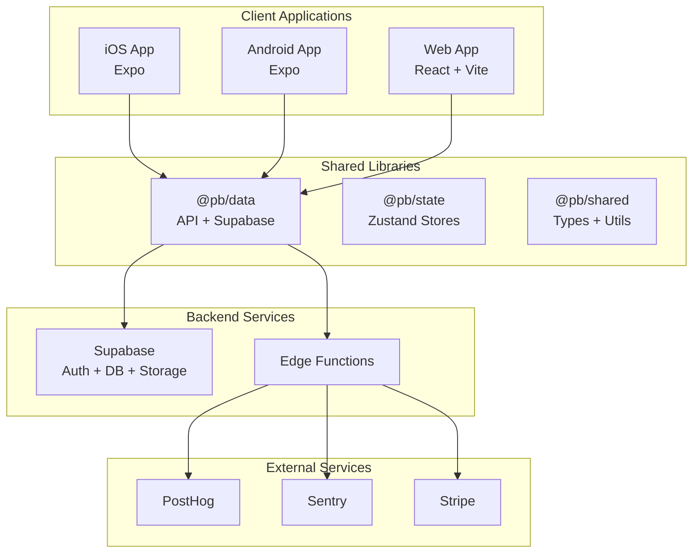
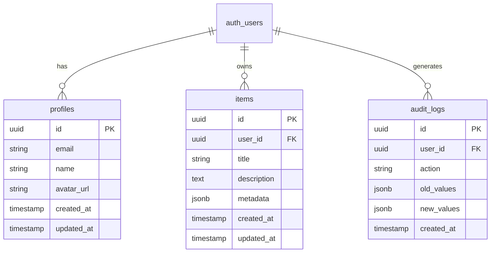
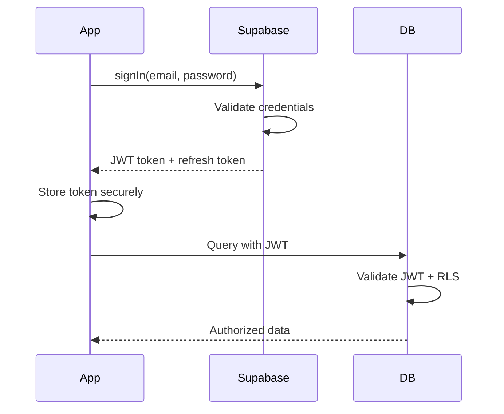
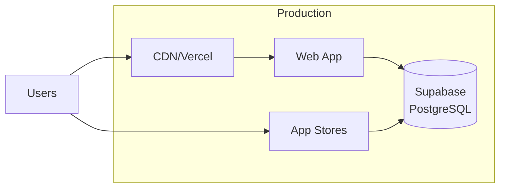
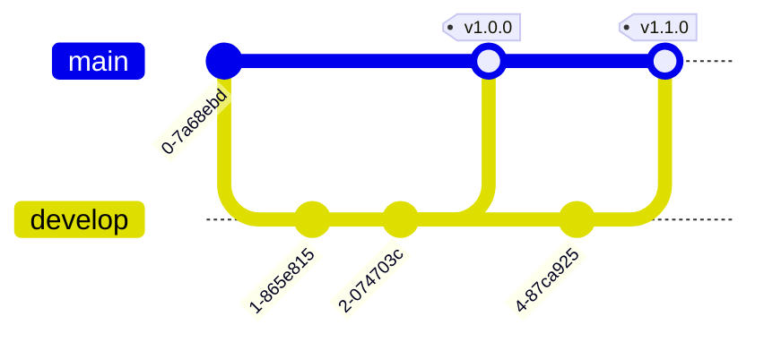

# Technical Specification

| Field | Value |
|-------|-------|
| **Project Name** | |
| **Spec Version** | 1.0 |
| **Related PRD** | [Link to PRD] |
| **Status** | `Draft` `Review` `Approved` `Implemented` |
| **Author** | |
| **Created** | YYYY-MM-DD |
| **Last Updated** | YYYY-MM-DD |

---

## Table of Contents

1. [Architecture Overview](#1-architecture-overview)
2. [Technology Stack](#2-technology-stack)
3. [Data Architecture](#3-data-architecture)
4. [API Design](#4-api-design)
5. [Security Architecture](#5-security-architecture)
6. [Infrastructure](#6-infrastructure)
7. [Third-Party Integrations](#7-third-party-integrations)
8. [Performance Strategy](#8-performance-strategy)
9. [Testing Strategy](#9-testing-strategy)
10. [Deployment & CI/CD](#10-deployment--cicd)

---

## 1. Architecture Overview

### High-Level Architecture



### Key Architectural Decisions

| Decision | Choice | Rationale |
|----------|--------|-----------|
| Monorepo | Nx + pnpm | Code sharing, unified tooling |
| Backend | Supabase | Rapid development, PostgreSQL |
| State | Zustand + TanStack Query | Simple, performant |
| Styling | NativeWind / Tailwind | Utility-first, consistent |

---

## 2. Technology Stack

### Frontend - Mobile

| Layer | Technology | Version | Purpose |
|-------|-----------|---------|---------|
| Framework | Expo | SDK 52+ | Cross-platform development |
| Navigation | Expo Router | v4 | File-based routing |
| Styling | NativeWind | v4 | Tailwind for React Native |
| State | Zustand | v5 | Global state management |
| Data Fetching | TanStack Query | v5 | Server state management |
| Forms | React Hook Form | v7 | Form handling |
| Validation | Zod | v3 | Schema validation |

### Frontend - Web

| Layer | Technology | Version | Purpose |
|-------|-----------|---------|---------|
| Framework | React | 18.x | UI library |
| Build | Vite | 6.x | Fast bundling |
| Router | TanStack Router | v1.90+ | Type-safe routing |
| Styling | Tailwind CSS | v3.4 | Utility-first CSS |
| State | Zustand | v5 | Global state |
| Data | TanStack Query | v5 | Server state |

### Backend

| Service | Technology | Purpose |
|---------|-----------|---------|
| Database | PostgreSQL 15+ | Primary data store |
| Auth | Supabase Auth | JWT authentication |
| Storage | Supabase Storage | File uploads |
| Functions | Supabase Edge | Serverless compute |
| Realtime | Supabase Realtime | Live updates |

### Development Tools

| Tool | Purpose |
|------|---------|
| TypeScript 5.x | Type safety |
| Nx 22.x | Monorepo orchestration |
| pnpm 9+ | Package management |
| ESLint + Prettier | Code quality |
| Jest + Playwright | Testing |

---

## 3. Data Architecture

### Entity Relationship Diagram



### Database Schema

**Profiles Table:**
```sql
CREATE TABLE profiles (
    id UUID PRIMARY KEY REFERENCES auth.users(id) ON DELETE CASCADE,
    email VARCHAR(255) NOT NULL,
    name VARCHAR(100),
    avatar_url TEXT,
    created_at TIMESTAMPTZ DEFAULT NOW(),
    updated_at TIMESTAMPTZ DEFAULT NOW()
);

-- Enable RLS
ALTER TABLE profiles ENABLE ROW LEVEL SECURITY;

-- Policies
CREATE POLICY "Users can view own profile"
    ON profiles FOR SELECT
    USING (auth.uid() = id);

CREATE POLICY "Users can update own profile"
    ON profiles FOR UPDATE
    USING (auth.uid() = id);
```

**Items Table (Template):**
```sql
CREATE TABLE items (
    id UUID PRIMARY KEY DEFAULT gen_random_uuid(),
    user_id UUID NOT NULL REFERENCES profiles(id) ON DELETE CASCADE,
    title VARCHAR(255) NOT NULL,
    description TEXT,
    metadata JSONB DEFAULT '{}',
    created_at TIMESTAMPTZ DEFAULT NOW(),
    updated_at TIMESTAMPTZ DEFAULT NOW()
);

-- Indexes
CREATE INDEX idx_items_user_id ON items(user_id);
CREATE INDEX idx_items_created_at ON items(created_at DESC);

-- Enable RLS
ALTER TABLE items ENABLE ROW LEVEL SECURITY;

CREATE POLICY "Users can view own items"
    ON items FOR SELECT
    USING (auth.uid() = user_id);

CREATE POLICY "Users can insert own items"
    ON items FOR INSERT
    WITH CHECK (auth.uid() = user_id);

CREATE POLICY "Users can update own items"
    ON items FOR UPDATE
    USING (auth.uid() = user_id);

CREATE POLICY "Users can delete own items"
    ON items FOR DELETE
    USING (auth.uid() = user_id);

-- Updated at trigger
CREATE OR REPLACE FUNCTION update_updated_at()
RETURNS TRIGGER AS $$
BEGIN
    NEW.updated_at = NOW();
    RETURN NEW;
END;
$$ LANGUAGE plpgsql;

CREATE TRIGGER items_updated_at
    BEFORE UPDATE ON items
    FOR EACH ROW
    EXECUTE FUNCTION update_updated_at();
```

### Data Access Patterns

| Pattern | Description | Implementation |
|---------|-------------|----------------|
| User-scoped queries | Users only see their data | RLS policies |
| Optimistic updates | UI updates before server | TanStack Query |
| Offline support | Queue mutations offline | AsyncStorage + sync |
| Real-time sync | Live data updates | Supabase Realtime |

---

## 4. API Design

### RESTful Conventions

| Method | Endpoint | Description | Auth |
|--------|----------|-------------|------|
| GET | /api/v1/[resource] | List with pagination | Required |
| GET | /api/v1/[resource]/:id | Get single item | Required |
| POST | /api/v1/[resource] | Create | Required |
| PATCH | /api/v1/[resource]/:id | Partial update | Required |
| DELETE | /api/v1/[resource]/:id | Delete | Required |

### Supabase Client Usage

```typescript
// libs/data/src/supabase/client.ts
import { createClient } from '@supabase/supabase-js';
import type { Database } from './types';

const getUrl = () =>
  import.meta.env?.VITE_SUPABASE_URL ||
  process.env.EXPO_PUBLIC_SUPABASE_URL;

const getKey = () =>
  import.meta.env?.VITE_SUPABASE_ANON_KEY ||
  process.env.EXPO_PUBLIC_SUPABASE_ANON_KEY;

export const supabase = createClient<Database>(getUrl(), getKey(), {
  auth: {
    autoRefreshToken: true,
    persistSession: true,
  },
});
```

### Query Hooks Pattern

```typescript
// libs/data/src/hooks/useItems.ts
import { useQuery, useMutation, useQueryClient } from '@tanstack/react-query';
import { supabase } from '../supabase/client';

export function useItems(userId: string) {
  return useQuery({
    queryKey: ['items', userId],
    queryFn: async () => {
      const { data, error } = await supabase
        .from('items')
        .select('*')
        .eq('user_id', userId)
        .order('created_at', { ascending: false });

      if (error) throw error;
      return data;
    },
    enabled: !!userId,
  });
}

export function useCreateItem() {
  const queryClient = useQueryClient();

  return useMutation({
    mutationFn: async (item: CreateItemInput) => {
      const { data, error } = await supabase
        .from('items')
        .insert(item)
        .select()
        .single();

      if (error) throw error;
      return data;
    },
    onSuccess: () => {
      queryClient.invalidateQueries({ queryKey: ['items'] });
    },
  });
}
```

---

## 5. Security Architecture

### Authentication Flow



### Row Level Security (RLS)

**Every table MUST have RLS enabled:**
```sql
-- Check all tables have RLS
SELECT schemaname, tablename, rowsecurity
FROM pg_tables
WHERE schemaname = 'public';

-- Expected: rowsecurity = true for all
```

### Token Storage

| Platform | Storage | Implementation |
|----------|---------|----------------|
| iOS/Android | Secure Storage | `expo-secure-store` |
| Web | Secure Cookie | HttpOnly, SameSite=Strict |

### Security Checklist

- [ ] All tables have RLS enabled
- [ ] RLS policies tested for cross-tenant access
- [ ] No service role key in client code
- [ ] Input validation with Zod on all forms
- [ ] Rate limiting on auth endpoints
- [ ] CORS configured correctly
- [ ] Security headers in place

---

## 6. Infrastructure

### Cloud Architecture



### Environments

| Environment | Purpose | URL Pattern |
|-------------|---------|-------------|
| Development | Local dev | localhost:3000 |
| Preview | PR reviews | pr-XXX.preview.app.dev |
| Staging | Pre-production | staging.app.com |
| Production | Live | app.com |

### Environment Variables

```bash
# Required
VITE_SUPABASE_URL=
VITE_SUPABASE_ANON_KEY=

# Optional
VITE_SENTRY_DSN=
VITE_POSTHOG_KEY=
VITE_STRIPE_PUBLISHABLE_KEY=
```

---

## 7. Third-Party Integrations

### Service Dependencies

| Service | Purpose | Tier | Cost | Fallback |
|---------|---------|------|------|----------|
| Supabase | Backend | Pro | $25/mo | None (critical) |
| Sentry | Errors | Team | $26/mo | Logs only |
| PostHog | Analytics | OSS | Free | None |
| Stripe | Payments | Standard | 2.9% + $0.30 | Manual |

### Integration Patterns

**Error Tracking:**
```typescript
import * as Sentry from '@sentry/react';

Sentry.init({
  dsn: import.meta.env.VITE_SENTRY_DSN,
  environment: import.meta.env.MODE,
  tracesSampleRate: 0.1,
});
```

**Analytics:**
```typescript
import posthog from 'posthog-js';

posthog.init(import.meta.env.VITE_POSTHOG_KEY, {
  api_host: 'https://app.posthog.com',
});
```

---

## 8. Performance Strategy

### Targets

| Metric | Target | Tool |
|--------|--------|------|
| App Launch | < 3s | Performance monitor |
| Time to Interactive | < 5s | Lighthouse |
| API Response (p95) | < 500ms | Supabase logs |
| Bundle Size (initial) | < 500KB | Build analysis |

### Optimization Strategies

**Code Splitting:**
```typescript
// Lazy load routes
const Dashboard = lazy(() => import('./Dashboard'));
```

**Image Optimization:**
- Use WebP format
- Lazy load below fold
- Responsive images

**Caching:**
- TanStack Query for server state
- Service Worker for offline
- CDN for static assets

---

## 9. Testing Strategy

### Test Pyramid

```
        ▲
       / \        E2E Tests (Playwright/Detox)
      /   \       - Critical user flows
     /─────\      - 10-20 tests
    /       \
   /  Integration\
  /     Tests     \ - API integration
 /  (Jest + MSW)   \ - Component integration
/───────────────────\ - 50-100 tests
/     Unit Tests     \
/   (Jest + RTL)      \ - Business logic
/______________________\ - Utilities
      200-500 tests
```

### Coverage Targets

| Type | Target |
|------|--------|
| Unit | 80% |
| Integration | 60% |
| E2E | Critical paths |

### Test Commands

```bash
# Unit tests
pnpm test

# E2E tests (web)
pnpm --filter @pb/web test:e2e

# E2E tests (mobile)
pnpm --filter @pb/mobile test:e2e
```

---

## 10. Deployment & CI/CD

### Branch Strategy



### CI/CD Pipeline

```yaml
# .github/workflows/ci.yml
name: CI

on: [push, pull_request]

jobs:
  test:
    runs-on: ubuntu-latest
    steps:
      - uses: actions/checkout@v4
      - uses: pnpm/action-setup@v3
      - run: pnpm install
      - run: pnpm lint
      - run: pnpm test
      - run: pnpm build

  deploy:
    needs: test
    if: github.ref == 'refs/heads/main'
    runs-on: ubuntu-latest
    steps:
      - run: pnpm deploy:prod
```

### Deployment Checklist

**Pre-Deploy:**
- [ ] All tests passing
- [ ] Lighthouse score > 90
- [ ] No security vulnerabilities
- [ ] Changelog updated

**Post-Deploy:**
- [ ] Smoke tests pass
- [ ] Error rate < 0.1%
- [ ] Response times normal
- [ ] Monitoring alerts active

---

## Appendix

### A. File Structure

```
product-blueprint/
├── apps/
│   ├── mobile/          # Expo app
│   ├── web/             # React + Vite
│   └── docs-site/       # VitePress docs
├── libs/
│   ├── data/            # @pb/data
│   ├── state/           # @pb/state
│   └── shared/          # @pb/shared
├── prd/                 # Product docs
├── docs/                # Technical docs
└── supabase/            # Migrations
```

### B. Key Decisions Log

| Date | Decision | Rationale | Alternatives |
|------|----------|-----------|--------------|
| | | | |

### C. Glossary

| Term | Definition |
|------|------------|
| RLS | Row Level Security - Postgres feature for data isolation |
| OTA | Over-the-air updates via Expo |

---

**Document Status:** `Draft`

**Reviewers:**
- [ ] Tech Lead
- [ ] Security Review
- [ ] Architecture Review
